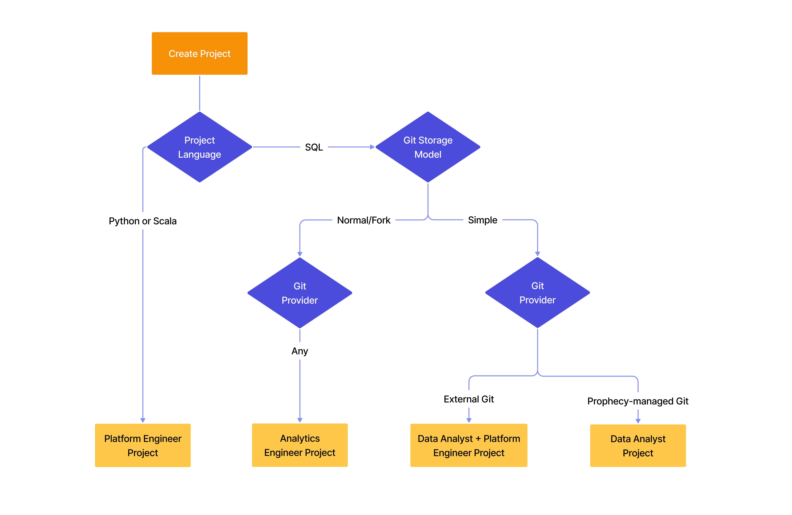

Choose the right project type based on your role and requirements. Each project type offers different capabilities designed for specific user personas.

| Feature                                                        | Data Analyst                                   | Data Analyst + Platform Engineer                                  | Analytics Engineer                                 | Platform Engineer                                  |
| -------------------------------------------------------------- | ---------------------------------------------- | ----------------------------------------------------------------- | -------------------------------------------------- | -------------------------------------------------- |
| Primary project language                                       | SQL                                            | SQL                                                               | SQL                                                | Python or Scala                                    |
| Main building blocks                                           | Pipelines                                      | Pipelines                                                         | Models                                             | Pipelines                                          |
| Version control                                                | [Simple](/analysts/versioning)                 | [Simple](/analysts/versioning) + [External CI/CD](/engineers/git) | [ Normal/Fork](/engineers/git)                     | [Normal/Fork](/engineers/git)                      |
| Collaboration mode                                             | [Single-player](/analysts/collaboration-modes) | [Single-player](/analysts/collaboration-modes)                    | [Git branching](/engineers/git-best-practices)     | [Git branching](/engineers/git-best-practices)     |
| Visual scheduling                                              | [Native scheduling](/analysts/scheduling)      | [Native scheduling](/analysts/scheduling)                         | [External orchestration](/engineers/orchestration) | [External orchestration](/engineers/orchestration) |
| External scheduling via APIs                                   | Yes                                            | Yes                                                               | Yes                                                | Yes                                                |
| [Business Apps](/analysts/business-applications)               | Yes                                            | Yes                                                               | No                                                 | No                                                 |
| [Execution](/administration/fabrics)                           | Databricks                                     | Databricks                                                        | Databricks, Snowflake                              | Spark clusters                                     |
| [Executable examples](/analysts/gems#interactive-gem-examples) | Yes                                            | Yes                                                               | Yes                                                | No                                                 |
| AI Agents                                                      | Yes                                            | Yes                                                               | Yes                                                | No                                                 |

### Project creation

Prophecy sets the project type based on the project language, Git storage model, and Git provider you select when creating the project.

:::tip
Create [templates](docs/administration/project-types/project-creation-template.md) to standardize project configurations for your team.
:::
