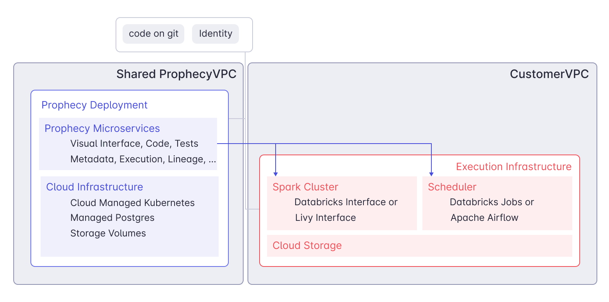

Learn about the different cloud deployment options for deploying Prophecy.

_Note: On rare occasions, Prophecy will deploy on-premise for large customers who will later move to the cloud._

## Cloud Deployment

Prophecy in the cloud connects to your existing Spark and Scheduler/Orchestrator. Prophecy does not store any data, however, it does store metadata about your Pipelines, Datasets and schedules. There are three types of Prophecy deployments:

| Feature                                                       | SaaS                    | Dedicated SaaS          | Self-hosted             |
| ------------------------------------------------------------- | ----------------------- | ----------------------- | ----------------------- |
| Suitable for enterprise                                       |  |  |  |
| Free trial                                                    |  |  |  |
| No installation required                                      |  |  |                         |
| Automatic upgrades every 2-4 weeks; access to latest features |  |  |                         |
| Managed infrastructure costs                                  |  |  |                         |
| Isolated data/environment                                     |                         |  |  |

### SaaS

The SaaS deployment option is entirely Prophecy-managed and has a multi-tenant architecture. Try out SaaS by directly going to the [Prophecy application](https://app.prophecy.io/).

### Dedicated SaaS

Like our SaaS deployment, the Dedicated SaaS deployment is Prophecy-managed. However, Dedicated SaaS provides the convenience of a Prophecy-managed environment, but also the privacy of an isolated space on Prophecy’s Virtual Private Cloud. This is also known as a single-tenant architecture.

You can choose your preferred cloud platform (AWS, Azure, or GCP), and Prophecy will manage installation, maintenance, resource allocation, and more.

### Self-hosted (formerly Private SaaS) {#self-hosted}

If you deal with very sensitive data, you may opt to get the self-hosted version of Prophecy. In this case, Prophecy runs within the **Customer VPC**, as well as the execution infrastructure. For more information, read about [installation and settings](./self-hosted) on a self-hosted deployment or [request a demo](https://www.prophecy.io/request-a-demo) from Prophecy.

