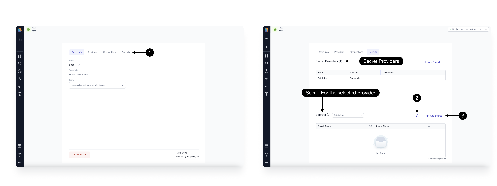

Prophecy seamlessly integrates with various data tools like data ingestion from sources like Salesforce, data enrichment through Rest APIs for data masking, and data egress to platforms like Snowflake.

To ensure robust security for enterprise customers, Prophecy provides secure authentication for all data tool connections. Users can securely store credentials using centralized secret providers like Databricks Secrets or HashiCorp Vault, following best practices such as encryption.

Users can connect these centralized secret providers to their Spark Fabrics and access the secrets via Prophecy.

:::info
Prophecy never accesses the value for any secrets, only scopes and keys to generate and execute correct code, keeping your secrets safe and out of your Pipeline code committed to Git.
:::

## Secret Provider

Users can create a **Secret Provider** in their Spark Fabrics. The secrets are accessed when a Pipeline is run on the cluster.
Users must ensure that their Spark clusters have proper access to the Secret Providers they are using.

You can access the Secret Providers and Secrets connected to the Fabric from the **(1)Secrets** tab in your Fabric.
This page shows the list of all Secret Providers and the Secrets for each provider. You can directly **(2)Refresh Secrets** to fetch all accessible secrets or **(3)Add** any secret from here. There are three types of Secret Providers supported:



| Secret Provider                            | Details                               |
| ------------------------------------------ | ------------------------------------- |
| [Databricks Secrets](./databricks-secrets) | Available for Databricks Fabrics Only |
| [HashiCorp Vault](./hashicorp-vault)       | Available for all Spark Fabrics       |
| [Environment Variables](./env-variable)    | Available for all Spark Fabrics       |

Once you have secrets created in Fabrics, you can [Use a secret](./using-secrets.md) in your Source and Target gems in your Pipelines directly.

## Using Secrets in Prophecy Managed Spark Fabrics

For POC and trial users exploring the product with Prophecy Managed Fabrics, [Databricks Secrets](./databricks-secrets.md#managing-secrets-for-prophecy-managed-databricks) are supported. Users can create secrets in Prophecy Managed Databricks Fabrics and use them for POC and trial purposes.

Any secrets created in Prophecy Managed Databricks Workspace will be automatically cleaned up after the POC expires.

:::caution
Prophecy ensures a separate scope for each Prophecy Managed Fabric, preventing access to your secrets by others during POC. However, it is not recommended to use your Production data tools for trials/POC and connect them to Prophecy Managed Fabric.
:::

Read [here](./databricks-secrets.md#managing-secrets-for-prophecy-managed-databricks) for managing secrets in Prophecy Managed Databricks Fabric.

## What's next

To learn more about secret management for Spark Fabrics, see the following pages:

```mdx-code-block
import DocCardList from '@theme/DocCardList';
import {useCurrentSidebarCategory} from '@docusaurus/theme-common';

<DocCardList items={useCurrentSidebarCategory().items}/>
```
