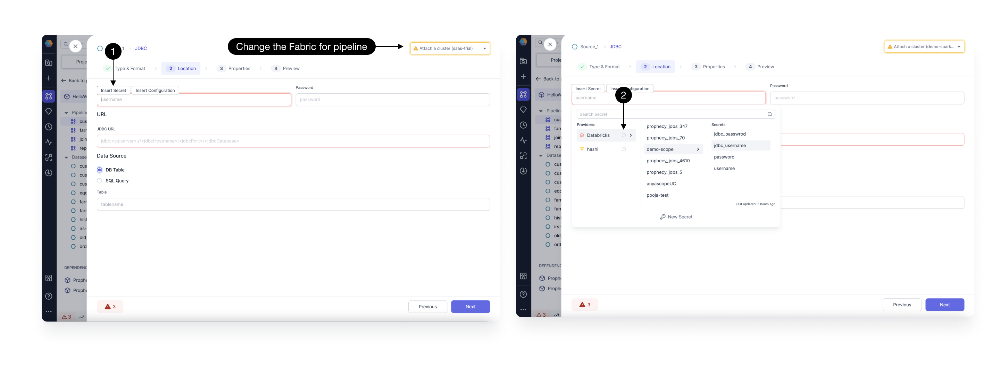

In some cases, you'll need to input credentials in Prophecy for authentication to external systems. This is why Prophecy lets you create **secrets** that securely encrypt your sensitive information. These secrets can be used in your connections or throughout your pipelines (in Source gems, for example).

We provide a Prophecy-hosted secret manager, as well as other [secret providers](docs/administration/secrets/secret-providers.md) such as Databricks.

## Usage

If any gem requires a authentication field like **username** or **password**, you will have the option to **Insert Secret** as shown below.

1. Click on **Insert Secret** to will open the dropdown for all secrets and providers available in your fabric. If you don't see your secrets, confirm you have correct fabric selected in the top right corner.
2. Attach a cluster from top right corner to be able to **Refresh Secrets** for any provider.

:::info
If you use plain text for username and password fields, you will see a warning diagnostic in your gem.
:::
