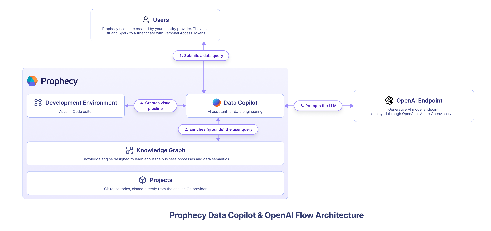

**Prophecy Data Copilot** is an AI-powered assistant that delivers intelligent suggestions and automates repetitive tasks for visual data transformations. You can read more about it at [Data Copilot](/docs/concepts/copilot/copilot.md).

Data Copilot leverages OpenAI's generative AI models to understand user intent, and enriched by the organizations' [knowledge graph](/docs/concepts/copilot/copilot.md#knowledge-graph), to automate repetitive data engineering tasks. By default, Data Copilot leverages **Prophecy's managed OpenAI subscription and is entirely free** for existing Prophecy customers. Prophecy uses user queries and metadata when communicating with OpenAI. Prophecy never sends any customer data to OpenAI.

However, for the most security conscious organizations, it is possible to configure Prophecy to use your own OpenAI endpoint. This page describes how to enable Prophecy Data Copilot for private VPC SaaS environments and configure it to use your own OpenAI or Azure OpenAI endpoint.

:::note

Prophecy also supports running Data Copilot from locally hosted private models such as Llama or Mistral. Additionally, you can configure Prophecy Data Copilot to use custom LLM endpoints provided by Anthropic, AWS Bedrock, Google Vertex AI, and Databricks Model Serving.

:::

## Installation

From the Kubernetes cluster where Prophecy services are running:

1. Check that the `prophecy-operator`, `edweb`, `metagraph`, and other Prophecy services are running version `3.3.8.0` or greater.
   1. The above services should all be running the same release-version as the `copilot` service defined in the image below, for example `3.3.8.0`.
2. Check that the `athena` Prophecy service is running version `3.3.8.0` or greater. This is only required if using the pipeline approach to the upgrade.
3. In the `ProphecyCluster` CR, do the following:

   - Add `copilot` to `enabledapps`.

4. Once deployed, wait for the `copilot-cm` to be created. Then edit the default values in the configmap to match the ENVs required.
5. Supply the API keys for the appropriate endpoint and ENV as below. Prophecy Copilot requires two types of models:

   1. **Smart LLM for complex tasks**

      - Recommended Model: `gpt-4o`
      - Supported Models: Any model from the gpt-4 family

   2. **Fast LLM for easy and fast tasks**

      - Recommended Model: `gpt-4o-mini`
      - Examples: `gpt-4o-mini`, `gpt-3.5-turbo`

   These models ensure optimal performance and efficiency for various tasks within Prophecy Copilot.

   OpenAI

   ```
   AI_MODEL_PROVIDERS_CREDS: "{ 'openai' : {'api_key': '___openai_api_key___'} }"
   AVAILABLE_AI_MODELS: "{ 'fast_model': {'provider': 'openai', 'model_name': 'gpt-4o-mini' }, 'smart_model': {'provider': 'openai', 'model_name': 'gpt-4o'} }"
   NUM_WORKERS: "< add value here >"
   PORT: "< add value here >"
   ```

   Azure's OpenAI

   ```
   AI_MODEL_PROVIDERS_CREDS: "{ 'azure_openai' : {'api_key': '___azure_openai_api_key___', 'api_endpoint': 'https://name.openai.azure.com/'} }"
   AVAILABLE_AI_MODELS: "{ 'fast_model': {'provider': 'azure_openai', 'model_name': 'gpt-4o-mini', 'deployment_name': '___4o_mini_deployment___' }, 'smart_model': {'provider': 'azure_openai', 'model_name': 'gpt-4o', 'deployment_name': '___4o_deployment___'} }"
   NUM_WORKERS: "< add value here >"
   PORT: "< add value here >"
   ```

6. Enable the following variable on the common CP config map:

   `COPILOT_ENABLED: "true"`

7. If the app pod, especially `copilot`, doesn't redeploy itself, restart the app pod.

## Architecture



## Additional installation options

### How to enable Data Copilot on my self-hosted or on-premise installation of Prophecy

Data Copilot is enabled or disabled at deployment time. If you run Prophecy within your [own VPC](../prophecy-deployment.md#self-hosted), set the flag in the deployment or upgrade configuration. To learn more about how to connect Prophecy Data Copilot to private OpenAI endpoints, speak to your Prophecy account owner.

### How to disable Data Copilot for my users

You have the option to disable Data Copilot if you run Prophecy within your [own VPC](../prophecy-deployment.md#self-hosted). You may choose to enable or disable Data Copilot across your Prophecy Platform at deployment time.
