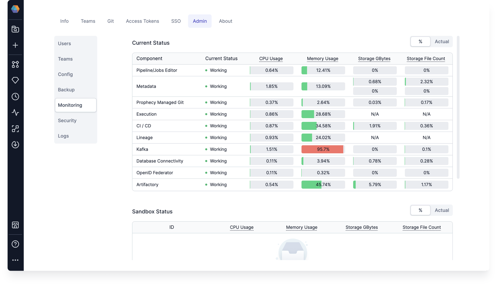

This page provides an overview of resource monitoring, alert configuration, and scaling recommendations for effectively managing Prophecy deployments.

## Monitoring

To better understand how Prophecy is using resources, you can find an overview in **Settings > Admin > Monitoring**. The different components correspond to the microservices that run on the Kubernetes cluster.

When usage levels reach yellow or red zones, you can choose whether to allocate additional resources. In most cases, temporary spikes in CPU and memory usage type do not necessitate action.

| Resource           | Usage                                  | Suggested action                                                                                        |
| ------------------ | -------------------------------------- | ------------------------------------------------------------------------------------------------------- |
| CPU                | Red zone persists for more than 1 hour | CPU allocated to the service is under-provisioned. Increase by 10%.                                     |
| Memory             | Red zone persists for more than 1 hour | Memory allocated to the service is under-provisioned. Increase by 10%.                                  |
| Storage GBytes     | Yellow zone is reached                 | Increase the storage capacity of the PVC in your Kubernetes deployment that corresponds to the service. |
| Storage File Count | Yellow zone is reached                 | Increase the storage capacity of the PVC in your Kubernetes deployment that corresponds to the service. |

 

:::note Getting help
If you need help increasing resources for a service in your Kubernetes deployment, reach out to [Prophecy support](/getting-help/).
:::

## Alerts

To set up automated alerts about your resource usage, visit the page on [Alerts Configuration](docs/administration/self-hosted/configurations/configure-alerts.md).

## Scaling

Scaling is taken care of by the **Autoscaler** component in our platform. Therefore, if something happens like the number of
users increases by 10 times, the Prophecy deployment can be scaled appropriately.

The following are estimated recommended cluster sizes depending on the number of concurrent users:

| Number of users           | 25       | 50       | 100       |
| ------------------------- | -------- | -------- | --------- |
| CPUs                      | 56 vCPUs | 96 vCPUs | 180 vCPUs |
| Memory                    | 128 GB   | 256 GB   | 440 GB    |
| Disk space (with backups) | 360 GB   | 720 GB   | 1440 GB   |

:::info
The recommended resource may vary based on the intensity of the usage of each developer. The numbers
presented above are based on the average recorded usage of Prophecy customers.
:::
