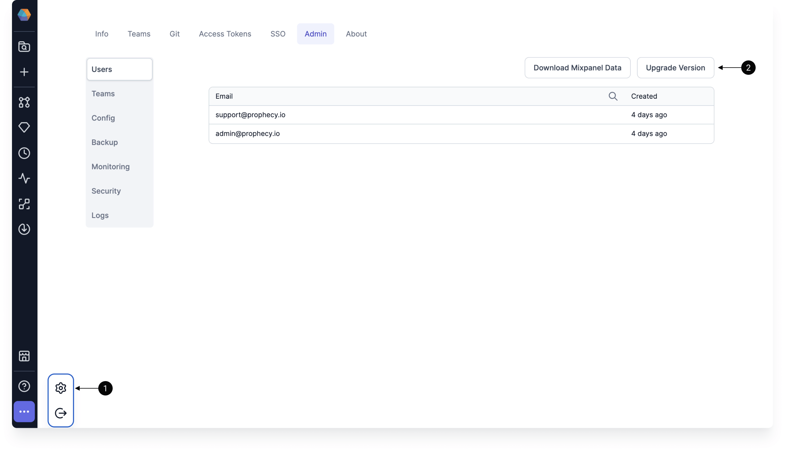

This page outlines different actions you may perform to maintain your Prophecy installation.

## Upgrade

:::note
You may want to back up Prophecy before you upgrade.
:::

To upgrade Prophecy, you can do so in **Settings > Admin**.

1. Navigate to the **Admin** tab of the Prophecy **Settings** page.
2. Click on **Upgrade Version**.
3. Choose the version you would like to upgrade to in the **Version** dropdown.
4. Make sure that **Disable Rollback** toggle is on.



## Backup

Backups can be triggered manually via the API, or they can be configured to run automatically.

:::info

Backup storage depends on [object store configurations](./configurations/configure-object-store.md). Make sure to configure these before proceeding below.

:::

### On-demand backups

You can use the Backup API to start a backup. See [Generate API Key](./generate-api-key/) if you need an API key.

Example:

```
curl --location --request POST 'https://{prophecy-url}/api/backup' \
--header 'Cookie: prophecy-token={api-key}' \
--header 'Content-Type: application/json' \
--data-raw '{}'
```

Response:

```
{
"code": 202,
"message": "Request Accepted with timestamp 2023-02-02t16-00-00"
}
```

### Regular automatic backups

You can configure regular backups in Prophecy in settings.

1. Log in to Prophecy as an admin user.
2. Click on the three dots at the bottom left corner.
3. Navigate to **Settings > Admin > Config > backupConfig**.
4. Make sure `enableRegularBackups` is set to true.
5. Edit other variables to fit your requirements.
6. Save your changes.

Below is a list of supported variables that you can change.

| Configuration variable name | Description                                                                                                                                                                               | Default value |
| --------------------------- | ----------------------------------------------------------------------------------------------------------------------------------------------------------------------------------------- | ------------- |
| `backupFrequency`           | How frequently to purge old user events from the internal database. Defaults to daily at 00:00. Uses [6-digit CRON](https://pkg.go.dev/github.com/robfig/cron#hdr-CRON_Expression_Format) | `0 0 0 * * *` |
| `backupRetentionCount`      | Number of last `N` backups to retain.                                                                                                                                                     | `30`          |
| `enableRegularBackups`      | State of automated backup creation.                                                                                                                                                       | `false`       |

You can also use the Backup Schedule API to schedule a backup.

Example:

```
curl -s 'https://<prophecy-env-url>/api/feature/getConfig?configType=backup' \
  -H 'cookie: prophecy-token=<prophecy-access-token>' \
  | jq -r '.data.backupConfig.backupFrequency'
```

Response:

```
0 0 0 * * *
```

### View past backups

You can view a history of backups in **Settings > Admin > Backup**.

### Additional backup APIs

Here is a list of additional APIs for backups. One sample call may look like:

```
 curl --location --request POST 'https://{prophecy-url}/api/backup' \
 --header 'Cookie: prophecy-token={api-key}' \
 --header 'Content-Type: application/json' \
 --data-raw '{}'
```

| API                                                | Description                                                                                                                                                                                                                                                                                 | Parameters    |
| -------------------------------------------------- | ------------------------------------------------------------------------------------------------------------------------------------------------------------------------------------------------------------------------------------------------------------------------------------------- | ------------- |
| **GET** `https://{prophecy-url}/api/backup/latest` | This API returns the status current/last backup operation triggered.                                                                                                                                                                                                                        | None expected |
| **GET** `https://{prophecy-url}/api/backup/status` | This API returns the status of the backup with a certain timestamp. If there is no timestamp passed and there is an ongoing backup, the status for ongoing backup is returned.                                                                                                              | `timestamp`   |
| **GET** `https://{prophecy-url}/api/backup/list`   | This API returns the list of available backups.                                                                                                                                                                                                                                             | None expected |
| **GET** `https://{prophecy-url}/api/backup/delete` | This API attempts the delete the backup data (local and upstream) and also the metadata (database entries) associated with it. Note that in case of `enableRegularBackups` set to true, backups are older than `backupRetentionCount` in reverse order are garbage collected automatically. | `timestamp`   |

:::tip
You can add `| jq '.data["backup-list"] | map(select(.status == "Success"))'` to your `backup/list` API request to retrieve a list of only usable backups. Conversely, use `| jq '.data["backup-list"] | map(select(.status != "Success"))'` to retrieve a list of failed backups.
:::

## Restore

Restore is an on-demand based overwrite of the whole Prophecy configuration to reflect the state of a particular backup.
The restore operation always assumes a running destination Prophecy cluster where the data and the configuration of source cluster will be restored.

:::note
If backup was taken in Athena's local Persistent Volume, it needs to be copied to Athena's Persistent Volume in the destination cluster before the restore operation can be performed.
:::

### On-demand restore

You can restore using the Restore API. See [Generate API Key](./generate-api-key/) if you need an API key.

:::danger
This API should be used with extreme caution as triggering this will lead to loss of current state/data.
:::

The below API is used to trigger a restore operation. It expects one parameter which is the `timestamp` of a successful backup.

```
curl --location --request POST 'https://{prophecy-url}/api/restore' \
--header 'Cookie: prophecy-token={api-key}' \
--header 'Content-Type: application/json' \
--data-raw '{
    "timestamp": "2022-11-22t10-00-00",
    "sourceNamespace": "{Source cluster controlplane namespace}"
}'
```

Sample API call with disable of gitserver restore. You may use similar options for `artifactory` / `edweb` / `metagraph` / `openidfederator`.

```
curl --location --request POST 'https://{prophecy-url}/api/restore' \
--header 'Cookie: prophecy-token={api-key}' \
--header 'Content-Type: application/json' \
--data-raw '{
    "timestamp": "2022-11-22t10-00-00",
    "sourceNamespace": "{Source cluster controlplane namespace}",
    "svcs": {
        "gitserver": {
            "disable": false
        },
    }
}'
```

In the above API:

- `timestamp` is the timestamp of the backup to use to perform the restore
- `sourceNamespace` is the namespace in which source cluster's control plane was installed.
- `svcs`: This JSON object needs to be set only when you wish to skip restore of any particular service by setting `disabled` as `true`. Otherwise, you can skip `svcs` field entirely.

Sample response

```
{
    "code": 202,
    "message": "Request Accepted"
}
```

### Additional restore APIs

Here is a list of additional APIs for restore. One sample call may look like:

```
curl --location --request POST 'https://{prophecy-url}/api/backup'
--header 'Cookie: prophecy-token={api-key}'
--header 'Content-Type: application/json'
--data-raw '{}'
```

| API                                                 | Description                                                                                                                                                                                     | Parameters  |
| --------------------------------------------------- | ----------------------------------------------------------------------------------------------------------------------------------------------------------------------------------------------- | ----------- |
| **GET** `https://{prophecy-url}/api/restore/status` | This API returns the status of the restore operation with a certain timestamp. If there is no timestamp passed and there is an ongoing restore, the status for the ongoing restore is returned. | `timestamp` |

## Backup and restore guidelines

1. Take backups regularly, preferably to cloud storage.
2. Create a Disaster Recovery Kubernetes in a different region.
3. Install Prophecy in the remote Kubernetes and keep it in standby. In other words, scale down all pods.
4. Disaster Recovery restore can be initiated from the remote region when the primary goes down.
5. Once the restore is done, the Disaster Recovery site is available for work to continue.

## Migrate to different cluster

If there is a requirement to migrate to a different Kubernetes cluster, you can leverage the backups for that:

1. Create a new Kubernetes cluster and install Prophecy based on Prophecy installation requirements.
2. Back up the source cluster.
3. Restore the backup into new cluster.
4. Check that everything works as expected.
5. Plan a downtime for the source cluster, initiate a fresh backup and restore it to the new cluster.
6. If the new cluster needs to use the old DNS, the DNS entry of old cluster should point to new cluster's `Loadbalancer` and the `Ingress` of the new cluster needs to be changed to use the old name. Contact support if you require assistance with these steps.
