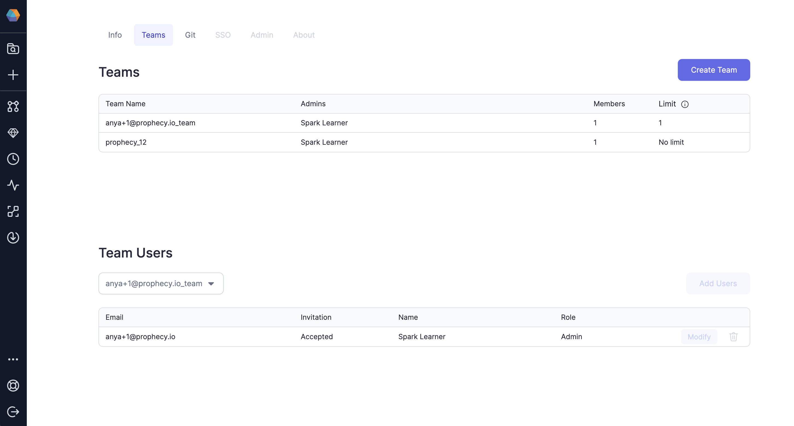
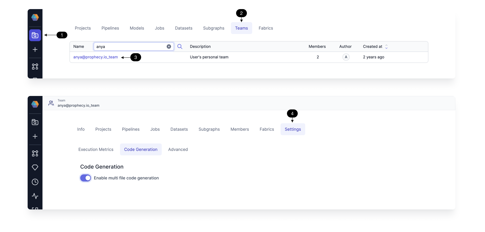

Teams represent a group of users who work together.

- Teams are the primary mechanism of ownership:
  - **Teams own projects** where pipelines, datasets, and jobs live
  - **Teams own execution Fabrics** that provide the execution and storage resources for execution including Spark clusters
- Users get access via teams:
  - **Personal Teams** For every user, a default team in created that only contains one user. If only one user is to be given access to a project, it can be done via this team
  - **Personal Projects** Users can put personal projects in their _personal team_ and not share it with others

## Settings Page

Teams, User, and Git [Settings](https://app.prophecy.io/metadata/settings) are accessed by clicking the `Settings` icon at the bottom left of the menu bar. The following image shows the page and the available functionality.

## Team Metadata

Manage the entities within a team by accessing the team's metadata page. Click **(1) Metadata**, **(2) Teams**, and select the **(3) team of interest**. Now you can see all the metadata for that team - including Info, which projects, pipelines, Jobs, etc are owned by that team. Also, team admins can manage **(4) Settings** for the team.

**[Execution Metrics](/docs/Spark/execution/execution-metrics.md)** - collect metrics and data samples for each execution.

**Code Generation** - enable multi-file code generation in the case of code payload size limitations.

**Advanced** - update the artifactid, generative AI settings, etc for the team's projects.
