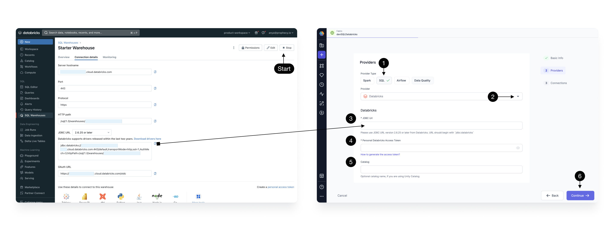

Databricks SQL Warehouse offers seamless integration into the Databricks ecosystem. Follow the steps below to create a fabric in Prophecy so that you can execute data transformations on your Databricks Warehouse.

## Create a fabric

Create an entity by clicking the **plus** icon. Click to **Create a Fabric**.
There are three steps to creating a fabric:

1. [Basic info](./databricks.md#basic-info)
2. [Providers](./databricks.md#provider)
3. [Connections](./databricks.md#connections) (optional)

### Basic Info

Each fabric requires some **Basic information**

| **Basic Info**                                                                                                                                                                                     |
| -------------------------------------------------------------------------------------------------------------------------------------------------------------------------------------------------- |
| **1 - Title** - Specify a title, like devDatabricks, for your fabric. “dev” or “prod” are helpful descriptors for this environment setup. Also specify a description (optional).                   |
| **2 - Team** - Select a team to own this fabric. Click the dropdown to list the teams your user is a member. If you don’t see the desired team, ask a Prophecy Administrator to add you to a team. |
| **3 - Continue** to the Provider step.                                                                                                                                                             |

### Provider

The SQL **provider** is both the storage warehouse and the execution environment where your SQL code will run. Be sure to **Start** the Databricks Warehouse before trying to setup the fabric.

| **Provider details**                                                                                                                                                                                                                                                                                                            |
| ------------------------------------------------------------------------------------------------------------------------------------------------------------------------------------------------------------------------------------------------------------------------------------------------------------------------------- |
| **1 - Provider Type** - Select SQL as the Provider type. (Alternatively, create a Spark type fabric using instructions [here](/docs/administration/Spark-fabrics/fabrics.md) or an Airflow type fabric following these [instructions](/docs/Orchestration/airflow/setup/setup.md).)                                             |
| **2 - Provider** - Click the dropdown menu for the list of supported Provider types. Select Databricks.                                                                                                                                                                                                                         |
| **3 - JDBC URL** - Copy the JDBC URL from the Databricks UI as shown. This is the URL that Prophecy will connect for SQL Warehouse data storage and execution.                                                                                                                                                                  |
| **4 - Personal Databricks Access Token ** - This is the token Prophecy will use to connect to Databricks. Each user will need to apply their own token. To generate a Databricks PAT follow [these instructions](https://docs.databricks.com/en/dev-tools/auth/pat.html#databricks-personal-access-tokens-for-workspace-users). |
| **5 - Catalog** - (Optional) Enter the Catalog name if you are using Unity Catalog                                                                                                                                                                                                                                              |
| **6 - Continue** to the optional Connections step.                                                                                                                                                                                                                                                                              |

Prophecy supports Databricks Volumes. When you run a Python or Scala pipeline via a job, you must bundle them as whl/jar artifacts. These artifacts must then be made accessible to the Databricks job in order to use them as a library installed on the cluster. You can designate a path to a Volume for uploading the whl/jar files under Artifacts.

### Connections

(Optional) Browsing data catalogs, tables, and schemas can be a time-intensive operation especially for Warehouses with hundreds or thousands of tables. To address this challenge, Prophecy offers a [Metadata Connection](/docs/get-started/concepts/fabrics/metadata-connections.md) to sync metadata from the data provider at regular intervals. These [steps](/docs/get-started/concepts/fabrics/metadata-connections.md#add-a-metadata-connection) describe how to setup a metadata connection once a Databricks SQL fabric is created.

## Using fabrics

Completed fabrics will appear on the Metadata page and can be managed by Team admins.

Each team member can attach completed fabrics to their projects and models.

| **Attach a fabric to a model**                                                                                                            |
| ----------------------------------------------------------------------------------------------------------------------------------------- |
| **1 Metadata** - Click the Prophecy Metadata and search for a SQL project or model of interest. Open the model.                           |
| **2 Model** - Here we have opened a model called "Customers."                                                                             |
| **3 Attach Cluster Menu** - This dropdown menu lists the fabrics and execution clusters available to this project, according to the Team. |
| **4 Databricks Fabric** - The available fabrics appear here. Only SQL fabrics are available to attach to SQL projects.                    |
| **5 Attach Cluster** - The Databricks Warehouse can be attached to the model for execution.                                               |
| **6 Run model** - Once a fabric and cluster are attached to the project, the model can be run interactively using the play button.        |

:::info
Remember, each user will be prompted to update the fabric with their own credentials. Prophecy respects these credentials when accessing Databricks catalogs, tables, databases, etc.
:::

Once a project is attached to a fabric, and the project is released, the project can be scheduled to run on a regular frequency using [Databricks jobs](/docs/get-started/tutorials/getting-started-with-low-code-sql.md#5-orchestrate-and-deploy)
