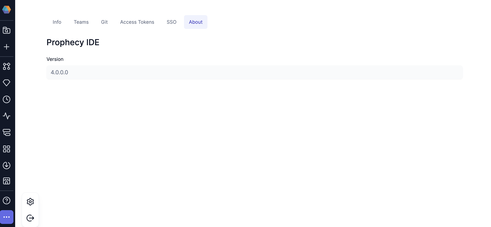
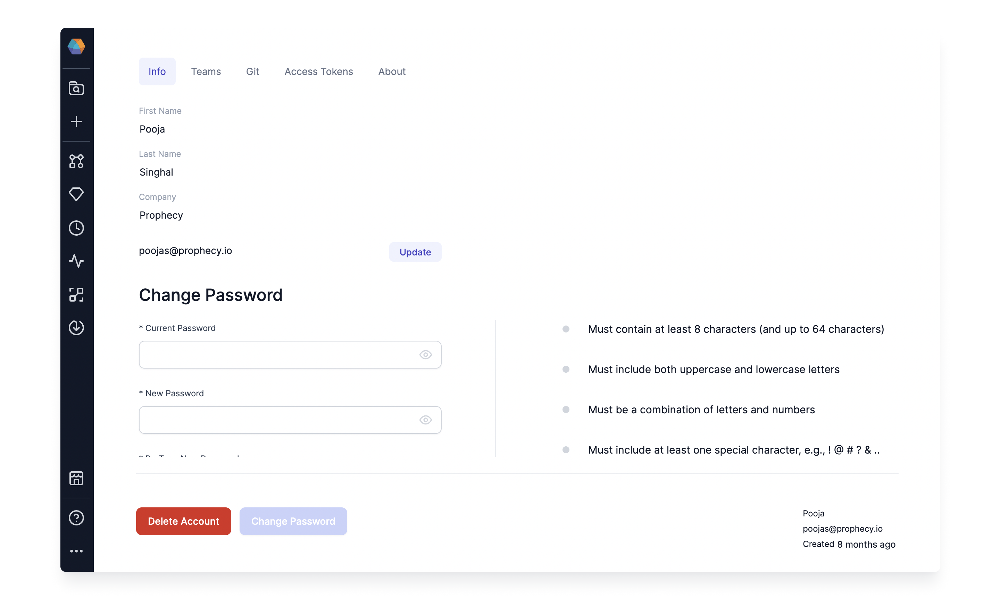
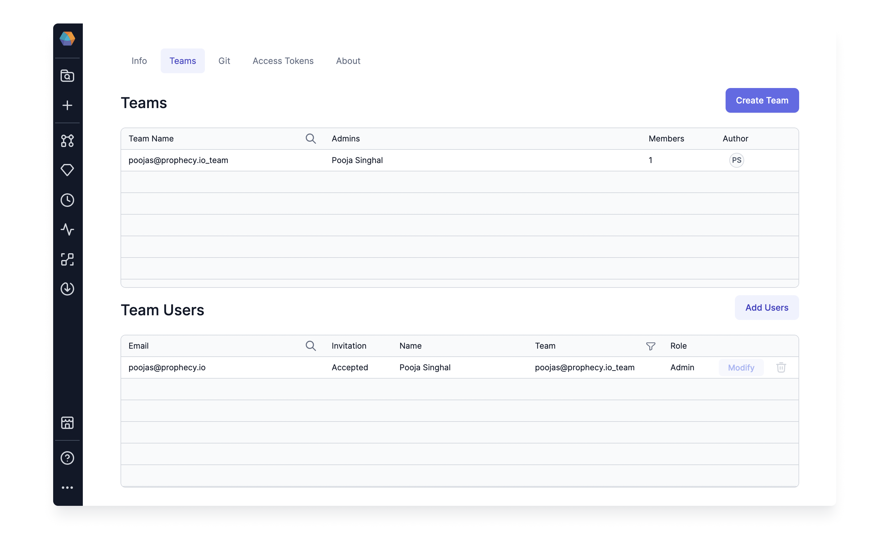
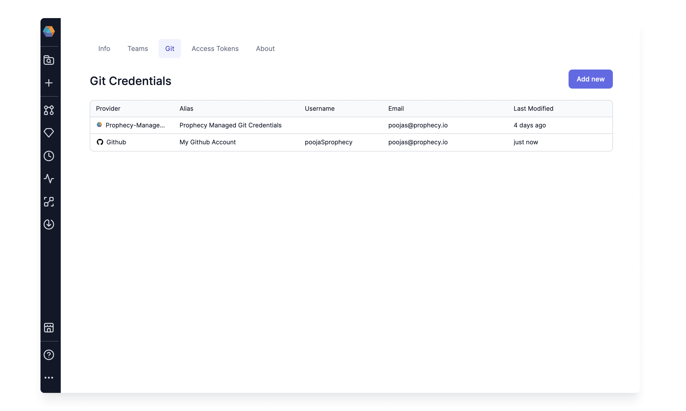
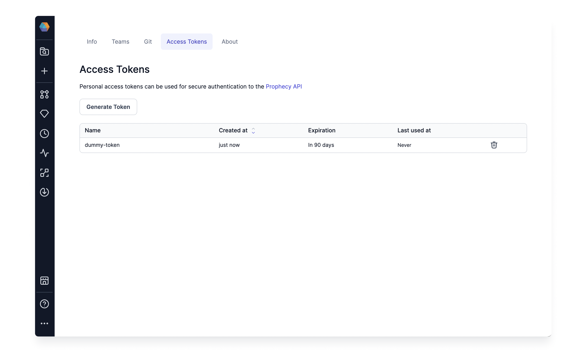
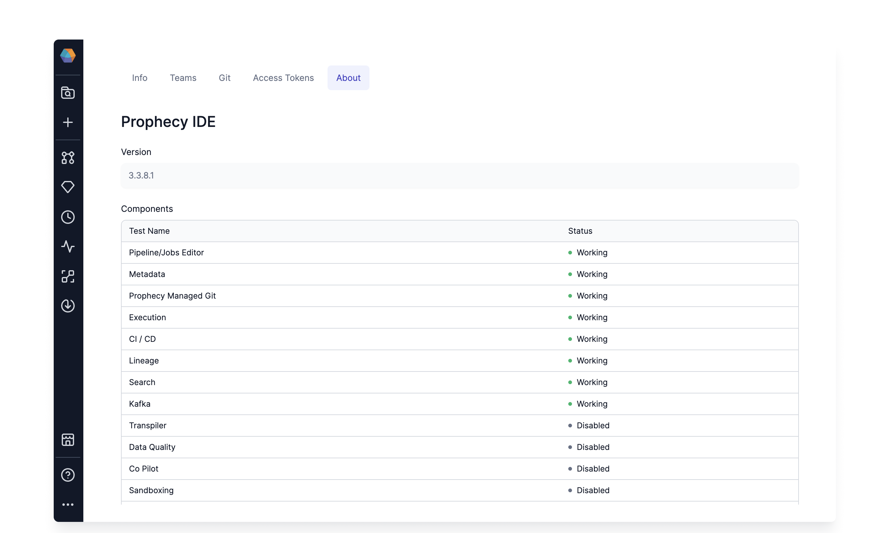

This page talks about the User's Settings and preferences.

To access Settings, click on the `...` at the bottom of the left-hand menu bar and then click the Settings icon, as shown below.

## Info

Users can manage their account Name, Email, and Password from the Info Tab. They can also delete their Account if needed.

:::caution Deleting an account
It's important to note that this action is irreversible. Once you delete an account, all associated data will be permanently removed from Prophecy.
Be aware that all personal teams, projects, and fabrics will be permanently deleted and cannot be recovered.
:::

## Teams

This page displays all the Teams the current user is a part of. From here, you can Create a new team or invite Users to your existing Teams.

## Git

This page displays the Git credentials created by the user. By default, a credential for Prophecy Managed Git is present. These tokens are linked to Prophecy projects each user accesses.

## Access Token

This page displays the Personal Access Tokens created to access Prophecy APIs securely.

## About

This page displays the current version and state of all services in Prophecy deployment.

## What's next

Learn more about our [settings for self-managed Prophecy administration](docs/administration/self-hosted/self-hosted.md).
