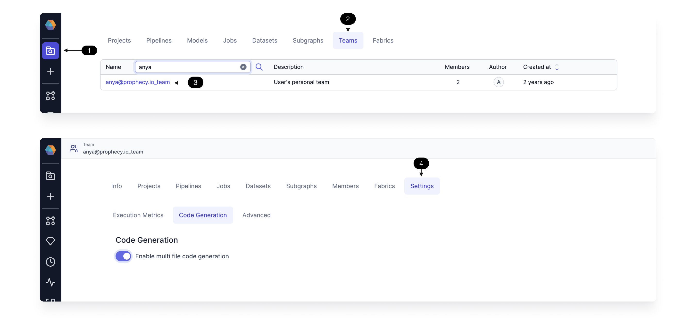

Teams represent groups of users who collaborate on projects and share access to resources. When you create a [project](docs/concepts/project/project.md) or a [fabric](docs/concepts/fabrics/fabrics.md), you assign it to a team. All users in that team will have access to the relevant project or fabric.

There are two types of teams:

- **Personal teams.** When you start using Prophecy, you are automatically assigned to your own one-person team. You are also the team admin of this team. If you want a project or fabric to be accessible only to yourself, you can assign it to your personal team and keep it private.
- **Shared teams.** Your team administrator typically creates additional team groupings. Team structures will vary across organizations.

Team, user, and Git [settings](docs/administration/settings/settings.md) can be accessed by clicking the **...** ellipses menu and the **gear** icon at the bottom of the left navigation bar.

## Team admins

Team admins manage teams in Prophecy. They usually create teams and fabrics. Team admins are different from Prophecy cluster admins who manage Prophecy installation and deployment.

## Team metadata

Manage the entities within a team by accessing the team's metadata page. Click **(1) Metadata**, **(2) Teams**, and select the **(3) team of interest**. Now you can see all the metadata for that team, including which projects, pipelines, and jobs are owned by that team.

In a team's metadata page, only the team admin can view and manage the **(4) Settings** for the team.

This table describes each tab within the team settings.

| Tab                                                             | Description                                                                         |
| --------------------------------------------------------------- | ----------------------------------------------------------------------------------- |
| [Execution Metrics](/docs/Spark/execution/execution-metrics.md) | Displays metrics and data samples for each execution.                               |
| Code Generation                                                 | Enables multi-file code generation in the case of code payload size limitations.    |
| Advanced                                                        | Lets you update the artifactid, generative AI settings, etc. for a team's projects. |
