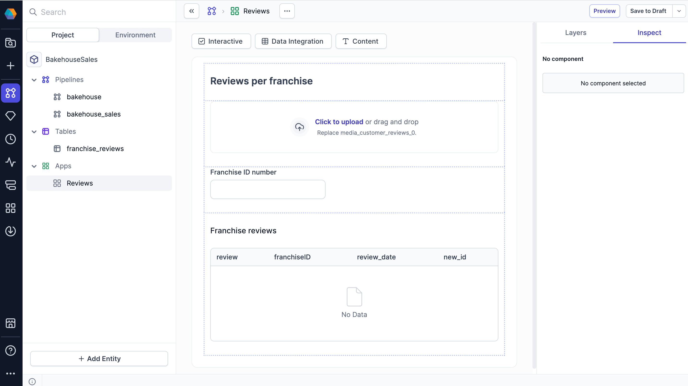

Use the App Builder to design the interface for a Prophecy App. This is the form that end users will interact with to provide input data and trigger pipeline runs. End users will not need access the pipeline itself.

## Get started

To use the App Builder, you must:

- Have a pipeline built and saved in your project
- Define pipeline parameters to make the pipeline configurable

:::caution
When you run a Prophecy App, the entire underlying pipeline is executed—not just the components visible in the app. This means any additional transformations, tables, or other components included in the pipeline will also run, even if they’re not exposed in the app interface. Be mindful of how you design the pipeline to ensure app users only trigger the intended logic.
:::

## Build the app interface

The App Builder is available inside any project. To get started, click **+** next to **Apps** in the left sidebar.

This opens a new app in the App Builder. Now, you can start to build the UI:

- Add and configure components like dropdowns, data previews, charts, and images
- Map interactive components to pipeline parameters. This makes your pipeline dynamic. Each app run uses values entered by the end user.

## Manage app components

As you add components to your app, note the following tabs in the right sidebar:

- The **Layers** tab defines the order and organization of your components.
- The **Inspect** tab lets you configure component settings. This determines how components will appear and behave in your app.

:::info
If you make changes to a Prophecy App, these changes will immediately become available to end users. Because of this, you cannot edit Prophecy Apps if any user has the app open at the same time.
:::

## Preview the app

To see how your app will appear and function for end users:

1. Click **Preview** in the top-right corner of the App Builder.
1. Confirm that the layout and fields look as expected.
1. Click the **play** button in the lower-right corner to test the app's functionality.

## What's next

To learn how to use the App Builder:

- Follow the tutorial to [Create a Prophecy App](/analysts/create-business-applications).
- Review the full [list of components](/analysts/business-application-components) you can leverage in an app.
