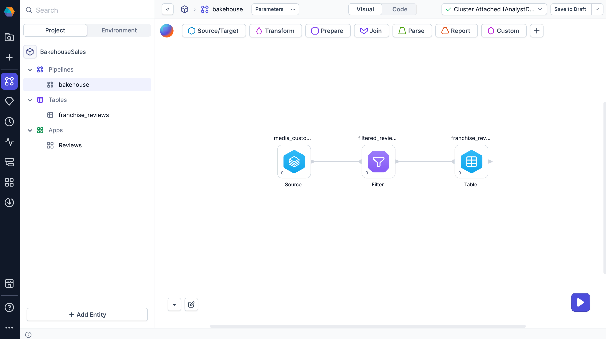
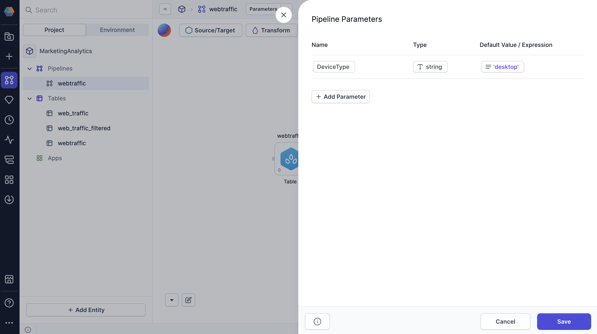
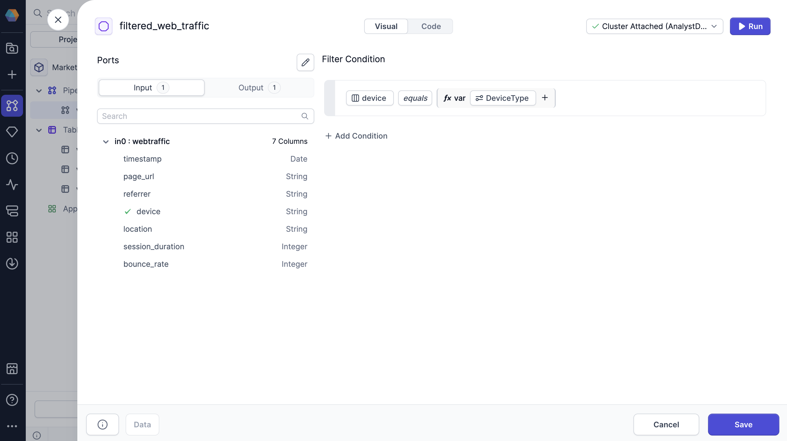

Business applications in Prophecy enable teams to create interactive and reusable workflows that simplify data processing. More specifically, these applications allow users to parameterize pipelines, interact with data, and schedule pipeline runs without modifying the underlying pipeline logic.

When creating a business application, structure it using [pipeline parameters](docs/analysts/development/pipelines/pipeline-params.md). Pipeline parameters allow applications to dynamically adjust values during execution. By adding [interactive components](/analysts/business-application-components) to your business apps, users can define parameter values while keeping the rest of the pipeline unchanged.

This guide walks you through the process of creating, configuring, and testing business apps.

## Objectives

Using this pipeline, you'll learn how to create a business application where users can:

- Upload their own data as a pipeline source.
- Filter the data based on device type.
- Preview the output data.

To do so, you will create a simple pipeline that:

- Ingests web traffic data from the SQL warehouse.
- Filters the data by device type (desktop, mobile, or tablet).
- Saves the filtered data to a table.



## Prerequisites

To complete this tutorial, you will need:

- Prophecy 4.0 or later.
- A SQL project.
- A Prophecy fabric.
- Web traffic data in your SQL warehouse. Import the following CSV data below.

```
timestamp,page_url,referrer,device,location,session_duration,bounce_rate
2024-02-09,/home,linkedin.com,desktop,India,489,1
2024-01-16,/about,direct,mobile,UK,204,0
2024-02-27,/blog,twitter.com,desktop,Canada,542,1
2024-02-12,/blog,direct,desktop,Germany,201,1
2024-01-06,/products,facebook.com,mobile,USA,529,1
2024-01-21,/about,facebook.com,desktop,Germany,308,1
2024-02-11,/about,google.com,mobile,USA,465,1
2024-02-25,/home,linkedin.com,desktop,USA,152,1
2024-02-10,/products,linkedin.com,mobile,USA,573,0
2024-01-25,/contact,direct,desktop,USA,162,0
2024-02-09,/contact,google.com,mobile,UK,355,1
```

## Create the pipeline

Before building a business app, you need to build the pipeline that will power it. This pipeline will include parameters that users can modify through the app interface. In the following sections, you will build a simple pipeline and leverage pipeline parameters that will drive the business app functionality.

### Create a pipeline parameter

[Pipeline parameters](docs/analysts/development/pipelines/pipeline-params.md) enable dynamic behavior within the pipeline and are scoped per pipeline. Follow these steps to create a new parameter:

1. Open the pipeline that will be used for the app.
1. Click **Config** in the project header.
1. Select **+ Add Parameter**.
1. Name the parameter `DeviceType`.
1. Set the parameter type to `string`.
1. Click **Select expression > Value**.
1. Enter `desktop` as the default value to be used during [interactive pipeline runs](docs/analysts/development/pipelines/execution.md).
1. Click **Save**.



The default parameter value can be overridden when you create the business app.

### Add source data

Create a table to provide the source data for the pipeline. This will serve as the input data that your business app will process.

1. Create a new table.
1. Choose the **Table** type.
1. Find the web traffic table in your environment.
1. Infer or define the schema of the data.
1. Save the Table gem.

### Add a filter

Next, add a Filter transformation to the pipeline. This filter will include the pipeline parameter to make the filter condition dynamic.

1. Add a **Filter** gem to the canvas.
1. Connect the output of the **Seed** to the input of the **Filter**.
1. Open the Filter gem configuration.

Build the visual expression to filter the dataset using values from the **device** column. If you switch to the code view, you can use the following expression as the filter condition `device = {{ var('DeviceType') }}`.



:::tip
Find your configured pipeline parameters by clicking on the **Configuration Variable** in the visual expression builder.
:::

### Add a target table

To preview your data in a business app, the pipeline must have a target table to write to. This table will store the filtered results that users will be able to view in the app.

1. Add another table to the canvas.
1. Assign a location where Prophecy will write the table.
1. Review the schema and save the gem.
1. Connect the output of the Filter gem to the input of the table.

## Create a new business app

Now that the pipeline has been built, you can create a business app to run it. Business apps are created directly within projects as project components.

1. In the project browser, hover over **Apps** and click the **+** icon.
1. Name the app `FilterWebTraffic`.
1. Add the description `Produce web traffic reports filtered by device type`.
1. Select the pipeline you just created for the app to run on.
1. Define where the app code will be stored. The default `apps` directory is sufficient.
1. Click **Create App** to open the App Builder.

### Add a Text component

To begin building the business app, add a Text component that will serve as the page title. This helps users understand the purpose of the app at a glance.

1. Open the **Content** dropdown and select **Text**.
1. In the **Inspect** tab of the right sidebar, enter `Filter Web Traffic` as the component text.
1. Choose **Heading 1** as the text format.

### Add a File Upload component

Next, add a component where users can upload their own data. This provides flexibility by allowing users to work with their own datasets rather than being limited to the default source.

1. Open the **Data Integration** dropdown and select **File Upload**.
1. In the **Inspect** tab, for the **Source component**, choose the Source gem that the uploaded data will override.

If no file is uploaded, the pipeline uses the default source data configured in the Source gem.

### Add a Dropdown component

Let's add a Dropdown component to let the user choose how to filter the data. This component will control the value of the pipeline parameter you created earlier.

1. Open the **Interactive** dropdown and select **Dropdown**.
1. In the **Inspect** tab, for the **Configuration field**, select **DeviceType**. This is the pipeline parameter.
1. For the **Label**, enter a descriptive label.
1. Next to **Options**, click **+** to add selectable values (`desktop`, `mobile`, `tablet`).

### Add a Data Preview component

Users that run the business app should be able to view and download the output data. The Data Preview component provides this functionality by displaying a sample of the result of the pipeline execution.

1. Open the **Data Integration** dropdown and select **Data Preview**.
1. In the **Inspect** tab, select the pipeline's output table.
1. For the **Label**, enter a descriptive label.

## Run the app

After building the app, you can execute it to validate its functionality. This process allows you to verify that all app components function according to specifications.

1. Navigate to the App Directory using the left navigation menu.
1. Review the apps associated with projects owned by your teams.
1. Select your **FilterWebTraffic** app.
1. Create a new app configuration. This configuration represents an instance of the app with a set of custom parameter values.
1. Test the app by uploading various datasets and initiating execution to observe the results.

To explore advanced configuration options and scheduling capabilities, refer to the documentation on [running apps](/analysts/run-apps).

## What's next

To address your specific business requirements, leverage more complex [components](/analysts/business-application-components) to construct robust business applications.

<!-- ## Publish

Once the application is complete, publish it to make it accessible.

1. Open any pipeline within the project.
1. In the project header, next to **Save to Draft**, click the dropdown arrow.
1. Select **Publish new version**.
1. Review Copilot's description of your changes and click **Save**.
1. Enter a description for the new published version.
1. Leave the **Select the fabric(s) to publish** field blank, as business apps do not require deployment.
1. Click **Publish**.

The application is now available in the App Directory.

### Share with other teams

To grant other teams access to run the business application:

1. Open the **Metadata** page in the left navigation bar.
1. Locate and open the project metadata.
1. Navigate to the **Access** tab.
1. In the **Teams** dropdown, select the team to share the project with.
1. Click **Send Invitation**.

The selected team can now run the business application but cannot edit the project. -->
