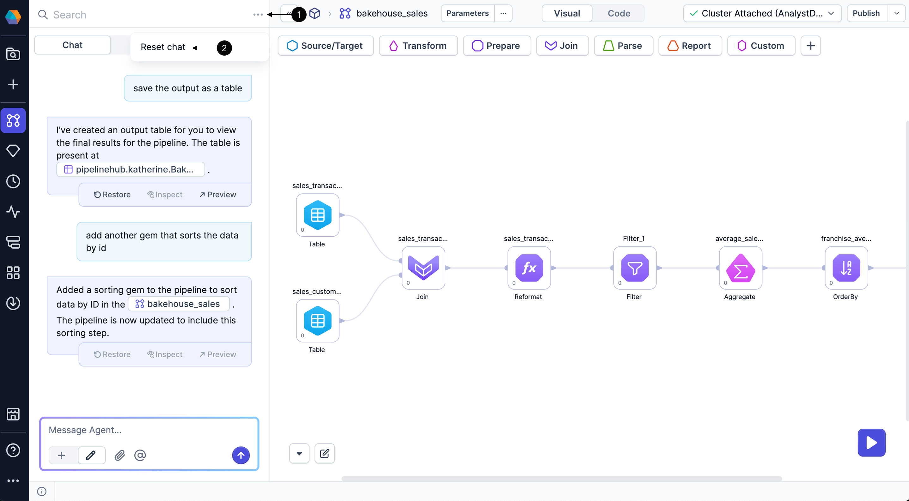

As you build out your pipelines in SQL projects, Prophecy's AI agent is available to help at each step of development. The AI agent helps you work faster by handling common tasks, such as:

- Finding and exploring data in your SQL warehouse to use as sources in the pipeline
- Adding gems to the canvas to create a data processing flow
- Providing previews of the input and output of suggested transformations
- Generating data visualizations you can publish to business apps

:::important
The AI agent cannot update pipelines that include [external sources and targets](/analysts/source-target).
:::

## Interact with the Prophecy agent

You can interact with the AI agent in the **Chat** tab on the left sidebar of your project.


The agent responds to your prompts and applies changes directly to your pipeline. To see these updates as they happen, make sure the **Visual** view is open. This view shows the pipeline canvas, where you can track any gems the agent adds or modifies in real time.

### Toggle

Use the toggle to control what the agent can change in your pipeline.

- **+** mode: The agent can add new gems but won’t change existing ones.
- ✏️ mode: The agent can rebuild or modify your existing pipeline.

### Attachments

Click the **paperclip** icon to upload files from your local system. This opens the **Upload file** dialog. Uploaded files are added to your SQL warehouse and can be used like any other table in your pipeline.

Uploading files this way is useful when:

- **You have data that isn't yet in the warehouse**. For example, ad hoc CSVs or test data exported from another tool.

- **You're testing transformations**. Use a small, local file to validate logic before applying it to large warehouse datasets.

- **You need to enrich warehouse data with external data**. Upload a file and join with existing tables to accomplish this.

Supported file types include CSV, Excel, and Parquet. See the [file upload](/analysts/upload-file) documentation for more details.

### Mentions

To refer to a specific dataset in your SQL warehouse, prefix the dataset name with an `@`. As you type, Prophecy suggests table names that match what you enter. This helps the agent understand which data you're referring to.

For example, to see how many records are in a table named `transactions`, enter `How many records are in the @transactions table?`.


:::tip
You can type `@` or click the @ button in the chat to mention a dataset.
:::

### Reset chat

To clear messages from the current conversation, click **... > Reset chat**.



## What's next

Deep dive into additional AI agent functionality in the following pages.

```mdx-code-block
import DocCardList from '@theme/DocCardList';
import {useCurrentSidebarCategory} from '@docusaurus/theme-common';

<DocCardList items={useCurrentSidebarCategory().items}/>
```
