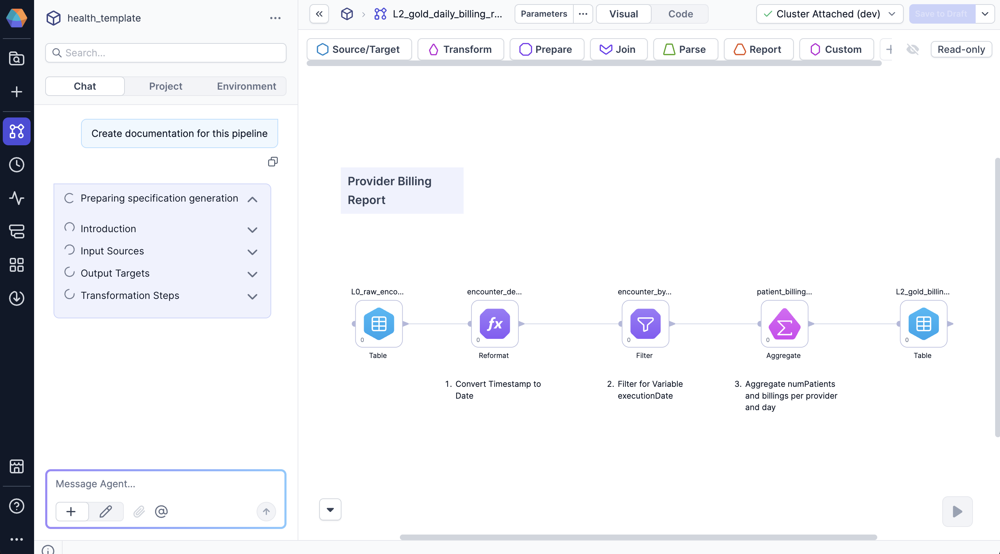
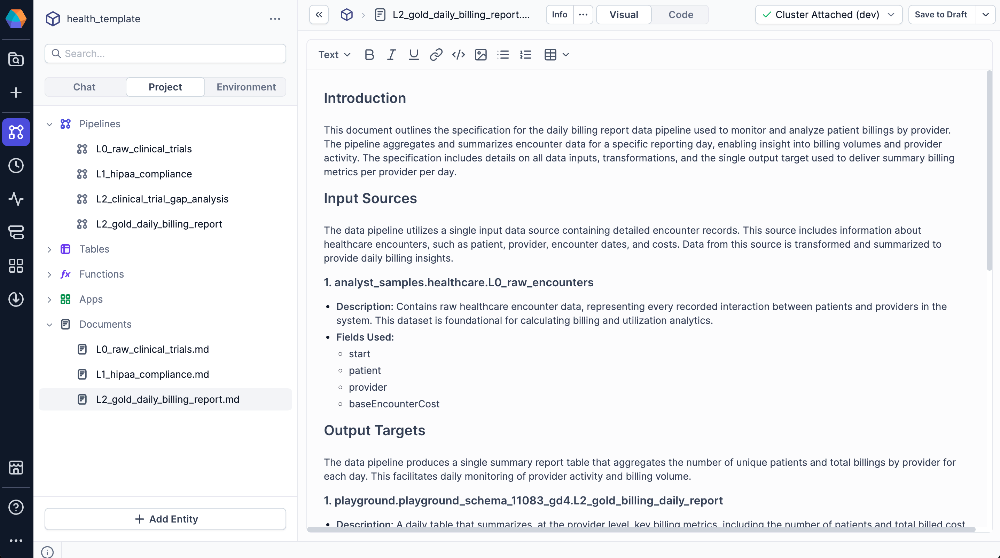

Use Prophecy's AI agent to generate documentation for pipelines or entire projects. The agent uses [templates](#documentation-templates) to structure the output as Markdown files that describe your data pipelines. You need to upload separate templates for pipeline and project documentation tasks.

## Generate documentation

You can generate documentation for a single pipeline or for an entire project.

### Generate pipeline documentation

To generate documentation for a pipeline, follow these steps:

1. Open your pipeline in Prophecy.
1. Click **Chat** in the left sidebar.
1. Prompt the agent to document your pipeline.

   For example: `Generate pipeline documentation using @custom_template`.

   This generates a document for the pipeline that you have opened in your project.

If you don't specify a template using an @ mention, the agent looks for a default template file in your project, which should have the name `pipeline-template.md`.

If the default template exists, the agent uses it. Otherwise, the agent asks you to upload or specify a template.

### Generate project documentation

To generate documentation for a project, including all of its pipelines, follow these steps:

1. Open your project in Prophecy.
1. Open any pipeline or document entity.
1. Click **Chat** in the left sidebar.
1. Prompt the agent to document your project.

   For example: `Generate project documentation using @custom_template`.

   This generates a document that describes your project.

If you don't specify a template using an @ mention, the agent looks for a default template file in your project, which should have the name `project-template.md`.

If the default template exists, the agent uses it. Otherwise, the agent asks you to upload or specify a template.

### How the agent generates documentation

During generation, the agent:

1. Displays a preparation checklist with progress.
1. Analyzes pipeline or project components.
1. References the template that defines the document structure.
1. Generates the documentation.
1. Saves the Markdown file to the `documents` directory in your project.

View the generated document in **Documents** in the project sidebar.

### Update generated documentation

After the agent generates your document, you can:

- Edit the document in the visual editor (recommended). The visual editor displays the rendered Markdown file, including special components like pipeline frames.
- Switch to the **Code** tab to edit the Markdown code. In the Code tab, you may see encoded or complex strings that contain embedded data. Don't edit them, as changes will break the visual output.

Since the document is stored in your project repository, all changes are version-controlled with your code.

## Documentation templates

Templates define how the agent structures documentation output. Templates use Markdown for standard formatting and [Copilot Template Language (CTL)](docs/analysts/development/ai-agent/ai-ctl-reference.md) markers to create special components that standard Markdown doesn't support. You might create your template such that the agent generates a completely static file, or you can incorporate components that allows users to fill in fields of the generated document.

Once you have written the template file, you need to upload the file to your project:

1. Open the project where you want to upload the template.
1. In the **Project** tab of the left sidebar, click **Add Entity**.
1. Click **Template**. Your file browser opens.
1. Select the Markdown file to upload.
1. Click **Open**.

:::note
To create a custom template, you must upload a file from your local file system. You cannot create a blank template from the project editor.
:::
