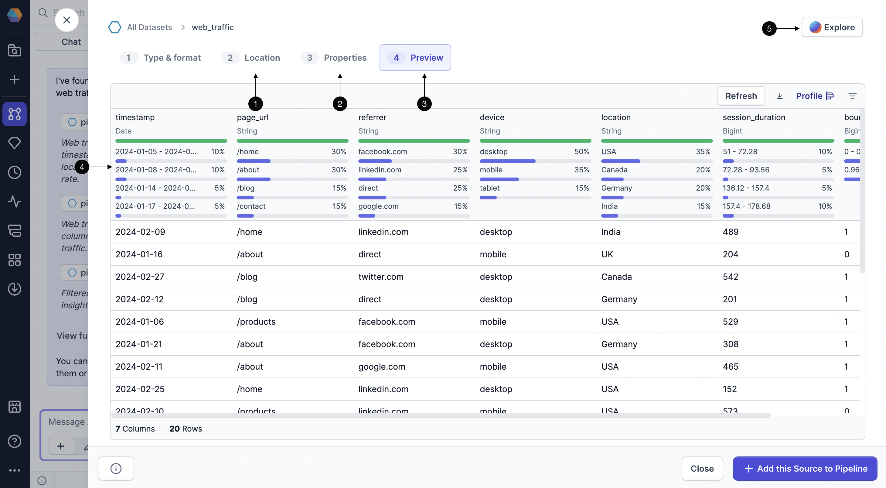
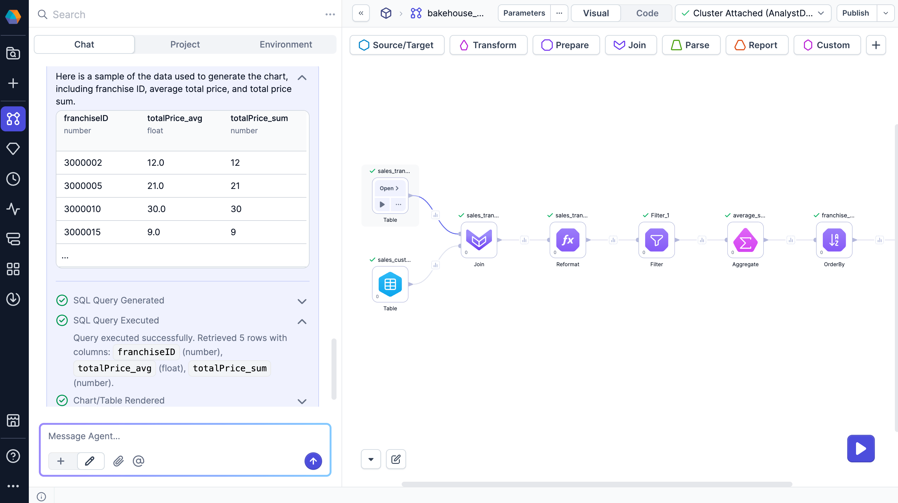
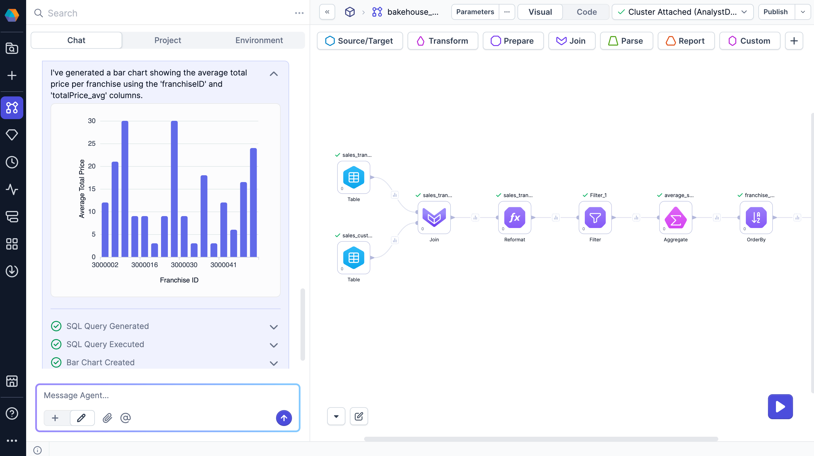

One way to leverage the Prophecy AI agent is to search your SQL warehouse, explore datasets, and generate insights with simple prompts. This allows you to add the appropriate sources to your pipeline that will undergo data processing. You must have source data in your pipeline to start building transformations.

The following sections describe the ways you can interact with the agent for data exploration.

:::note
Agent responses are dynamically generated and may vary slightly from one request to another.
:::

## Prerequisites

## Find tables in your SQL warehouse

Ask the agent to search for tables in your [primary SQL warehouse](docs/administration/fabrics/prophecy-fabrics/prophecy-fabrics.md). Based on your query, it returns:

- A short list of relevant datasets and their descriptions.
- A full list of datasets that match your criteria.

:::tip
You can add a dataset to the pipeline as a [Table gem](/analysts/table) directly from the chat.
:::

### Explore datasets

To learn more about a dataset, you can click on it inside the chat. This opens a dialog where you can:

1. Find the location of the dataset in the warehouse.
1. Look over the schema of the dataset.
1. Preview a sample of the data in the dataset.
1. Review the data profile of the sample.
1. Open **Explore** to chat with an agent that limits responses to the context of the dataset.

This helps you validate that your data is correct without having to manually browse through your data catalogs.

## Describe a dataset

If you want a summary of dataset information, you can ask the AI agent to describe a table.

The agent will provide a quick overview of key metadata, including the database and schema the table belongs to, as well as the names and data types of each column. This helps you understand the structure of the dataset without having to open or query it directly.

## Compare datasets

If you ask the AI agent to compare datasets, you can quickly assess which dataset is more suitable as a source for your pipeline by analyzing differences in schema structure, column names, data types, and size.

This allows you to identify which dataset aligns better with your pipeline’s requirements, such as having the right fields, consistent naming conventions, or expected formats, without needing to inspect the full data.

## View sample rows from a table

To preview data from a table, ask the agent to return a sample. You can request a random sample from the table or specific rows, such as “the ten most recent purchases over $100”.

The agent returns:

- A table showing the sample data
- A **Preview** option for a closer look
- SQL execution logs for transparency

If the dataset isn’t already part of your pipeline, you’ll also see an option to add it as a Table gem on the canvas.

### Table preview

Click **Preview** to open a larger view of the data sample. In this view, you can:

- Download the data as a JSON, Excel, or CSV file
- Show or hide columns
- Add the full dataset to the canvas (if not present already)

## Visualize table data

You can also ask the agent to generate charts for data visualization. The agent returns:

- An embedded chart directly in the chat
- A Preview button to open a detailed view
- SQL execution logs showing how the chart was generated

If the chart is based on a dataset that isn't yet in your pipeline, you'll see an option to add it as a Table gem.

### Chart preview

To see a larger version of the chart, click **Preview**. This opens the data visualization dialog, which has two tabs.

| Tab           | Available actions                                                                                                                                  |
| ------------- | -------------------------------------------------------------------------------------------------------------------------------------------------- |
| Visualization | <ul class="table-list"><li>View a larger version of the chart</li><li>Download the chart as an image</li><li>Copy the chart as an image</li></ul>  |
| Data          | <ul class="table-list"><li>View the underlying data</li><li>Download the data as a JSON, Excel, or CSV file</li><li>Show or hide columns</li></ul> |

:::info
To learn more about data visualization, see [Charts](/analysts/charts).
:::

## Sample prompts

Here are some sample prompts that you can ask to search, explore, and learn about the data.

| Scenario         | Prompt                                                                |
| ---------------- | --------------------------------------------------------------------- |
| Find dataset     | "Find the dataset that shows employee hiring information and history" |
| View data sample | "Return the top ten highest sales from @daily_orders"                 |
| Describe dataset | "Give me more details about @revenue_opportunities"                   |
| Visualize data   | "Plot the sales by country"                                           |
