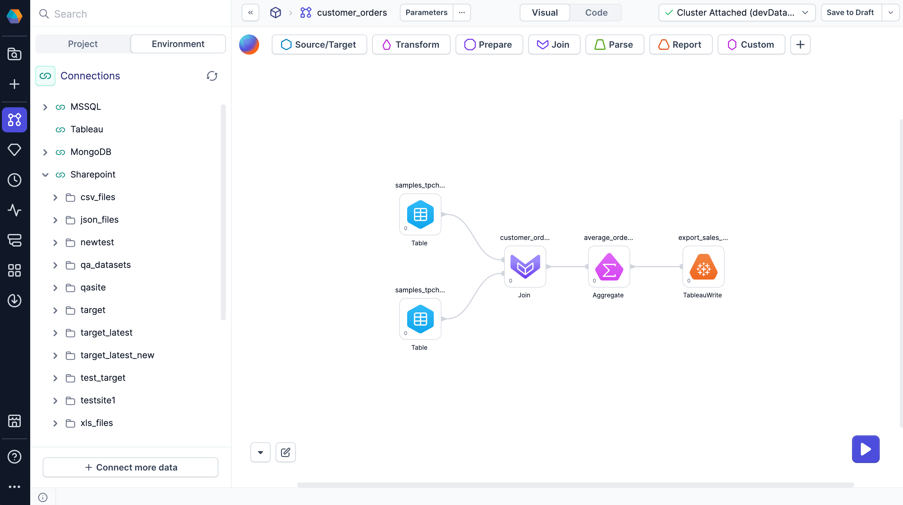

When you create a connection in a [fabric](docs/administration/fabrics/prophecy-fabrics/prophecy-fabrics.md), you can use it to access data from sources outside of the primary SQL warehouse defined in your fabric. While pipeline execution still occurs in the primary SQL warehouse, connections let you read and write data in other data providers.

After you attach to a fabric in a project, you'll be able to:

- Create connections from the Environment browser or from external Source and Target gems.
- Configure [secrets](#secrets-in-connections) for your connections that will encrypt your connection credentials.
- Reuse connections throughout your pipeline without needing to reconnect.
- Browse data from established connections in the Environment browser.

:::info
See the [list of connections](docs/administration/fabrics/prophecy-fabrics/connections/connections.md) in the Administration section of the documentation to find all available connections.
:::

## Connections in projects

In the following sections, let's explore how you will interact with connections inside of a project.

### Environment browser

Connections allow Prophecy to access specific data from external providers using your credentials. The data will appear in the [Environment browser](/analysts/project-editor) of the project sidebar, allowing you to easily locate data, explore data, and add data to your pipeline canvas. Data access permissions are inherited from your external user account.

When you attach a Prophecy fabric to your project, you will by default see the data from your [primary SQL warehouse](/administration/fabrics/prophecy-fabrics/) in the Environment browser. If you want to see more connections in your project, you can click **+ Connect more data** at the bottom of the Environment browser. Once you configure a connection, Prophecy will automatically save it to your attached fabric. To understand how to configure individual connection types, visit the [list of connections](docs/administration/fabrics/prophecy-fabrics/connections/connections.md).

To use data from the environment browser:

1. Drag a source from the environment browser to the pipeline canvas.
1. Open the gem configuration.
1. Notice Prophecy has configured the source gem for you.
1. Load and preview the data.
1. Add downstream gems to perform data transformations.

### External Source/Target gems

If you add an external Source or Target gem from the gem drawer to your pipeline canvas, you will need to configure the gem:

1. Add an external Source or Target gem to your canvas.
1. Open the gem to view the configuration dialog.
1. Select the correct **Type and Format**.
1. Open the **Location** tab.
1. Select an existing connection for your gem, or [create a new one](docs/administration/fabrics/prophecy-fabrics/connections/connections.md).
1. Open the **Properties** tab and verify the schema of your table.
1. Save the gem.

:::caution
When setting up external sources and targets, consider the primary SQL connection in your Prophecy fabric. Processing tables natively in the primary SQL warehouse will be fast. Processing external data is slower. **Do not create an external connection that duplicates your primary SQL warehouse connection.**
:::

## Secrets in connections

As you create connections, you will notice that credentials must be populated with [secrets](docs/administration/fabrics/prophecy-fabrics/secrets/secrets.md). Secrets keep your credentials encrypted and secure. Once you add your secrets to your connections, you can reuse the connections throughout the pipeline without having to reauthenticate or re-enter your credentials. This relationship between secrets and connections keeps Prophecy secure for your data processing needs.

## What's next

Now that you understand how to use connections in your pipelines, check out the following resources.

- To understand how to configure individual connection types, visit the [list of connections](docs/administration/fabrics/prophecy-fabrics/connections/connections.md).
- All connections require secrets to keep your credentials safe. View the documentation on [secrets](docs/administration/fabrics/prophecy-fabrics/secrets/secrets.md) to learn more.
