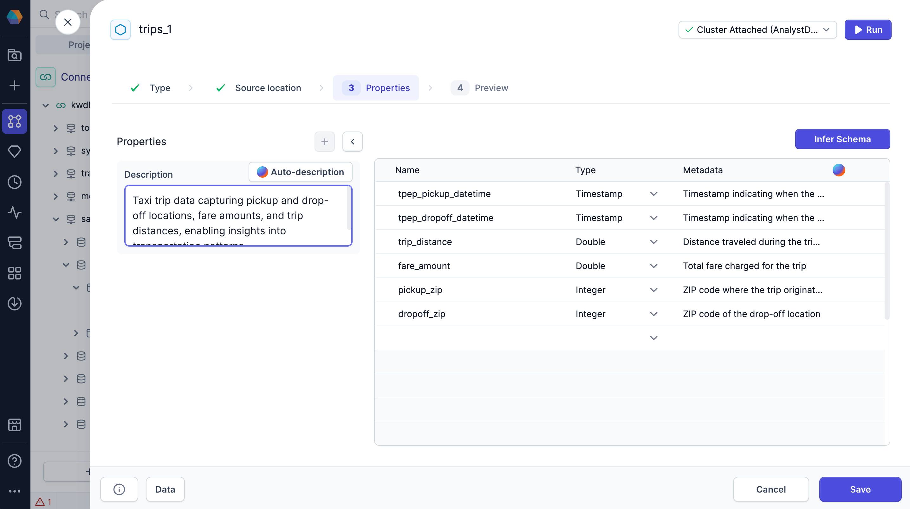
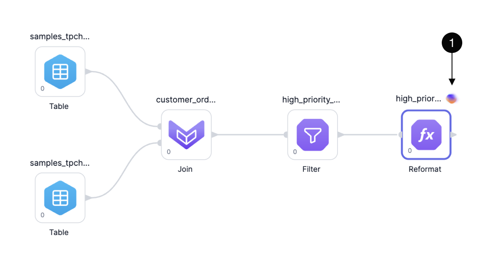

As pipelines scale, they can become harder to interpret and maintain. To improve clarity and collaboration, Prophecy allows you to add labels and descriptions to gems, helping others understand the purpose of each step in the pipeline. To streamline this process, Copilot can automatically generate or update labels and descriptions for you.

## Understand your data

Before diving into individual pipeline steps, it helps to understand the data itself. Copilot can automatically generate:

- **Table descriptions** for Source and Target gems
- **Column descriptions** (metadata) to provide field-level context

These descriptions offer a high-level view of your data, helping you and others quickly grasp what data the pipeline is working with.

## Understand each gem

When you want to know a specific gem's purpose in the pipeline, you can ask Copilot to explain it in plain language.

Find the **Explain** option in the gem action menu. To learn more, visit the documentation on [gems](/analysts/gems).

## Improve gem labels

Clear labels make pipelines easier to read. Copilot will automatically generate gem labels as you build you pipeline. If you update a gem, Copilot will ask for permission update the gem label.

You also have the option to add comments to gems. While Copilot doesn’t generate comments, you can still add them manually as tooltips to share helpful notes or warnings with others.

Find the **Label** and **Add Comment** options in the gem action menu. To learn more, visit the documentation on [gems](/analysts/gems).
