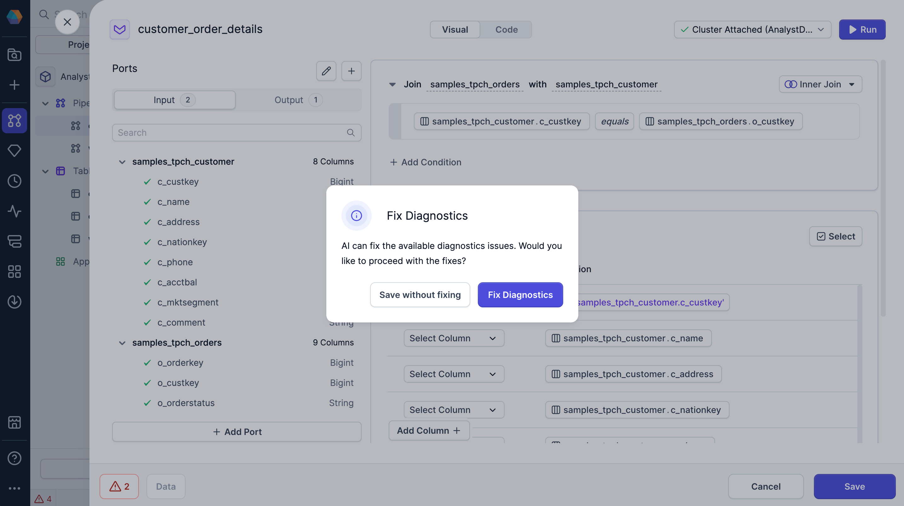
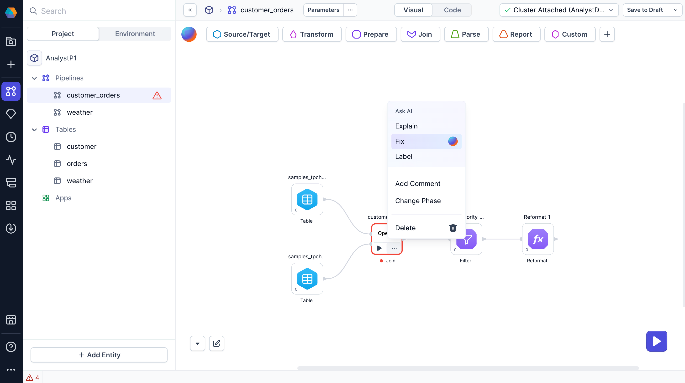

Troubleshooting pipeline errors manually can be time-consuming. Prophecy simplifies this process by offering multiple ways to detect and resolve issues quickly. After Copilot makes the fix, Prophecy will always provide a summary of the changes made.

## Inline fix

Click an expression inside a gem with an error and select **Fix it** to apply an automatic correction.

## Fix on save

When saving a gem with detected errors, Prophecy prompts you to either **Save without fixing** or **Fix Diagnostics**.

**Fix Diagnostics** triggers Copilot to resolve the issues for you.

## Gem-level fix

On the pipeline canvas, open a gem’s action menu and select **Fix** to automatically correct errors within that component.

