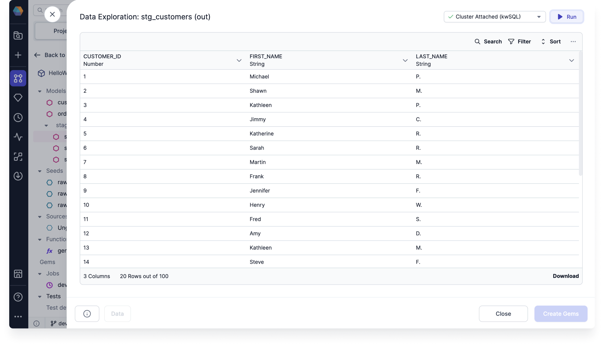

The Data Explorer can help you navigate your interim data samples and understand your data better. Use it to confirm the structure of each column, review data entries, and make sure the data types are correct.

## Generate samples

To use the Data Explorer, you need to [interactively run](/analysts/development/pipelines/execution/#interactive-execution) your pipelines to generate data samples. This lets you view a sample output of each gem. To load the Data Explorer, simply click on the table icon in between gems after a pipeline run.

## Explore the data

The **Data Preview** tab of the data explorer enables the following functionality.

- Sort the data
- Filter the data
- Search through the data
- Show or hide columns in the preview
- Export the data sample in CSV or JSON format
- Save the data transformation as a new gem

## Apply to all data

When you filter, sort, or search through the data, you are only working with the **visible sample** of the data. To apply these to the whole dataset in the preview, you must either:

- Load the whole dataset into the preview by clicking **Load More** after the last record in the preview until all records are shown.
- Click **Run** in the top right corner of the data preview. This will filter and sort based on all of the data in the backend (rather than a sample).

## Create gems

After analyzing the data, you can retain the filter and sort options in the pipeline by clicking on the **Create Gems** option. This action saves the applied filter and sort as a `Filter` and `OrderBy` gem in the pipeline.
