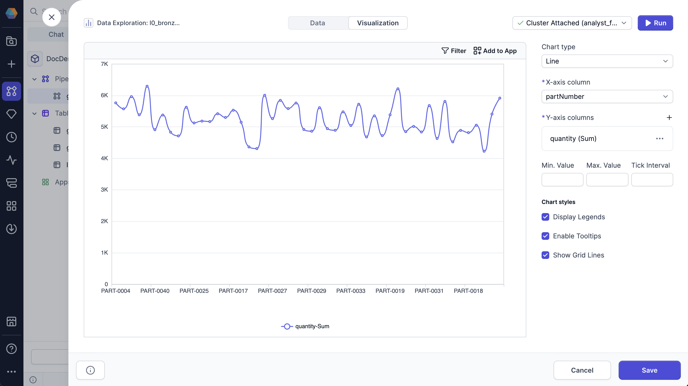
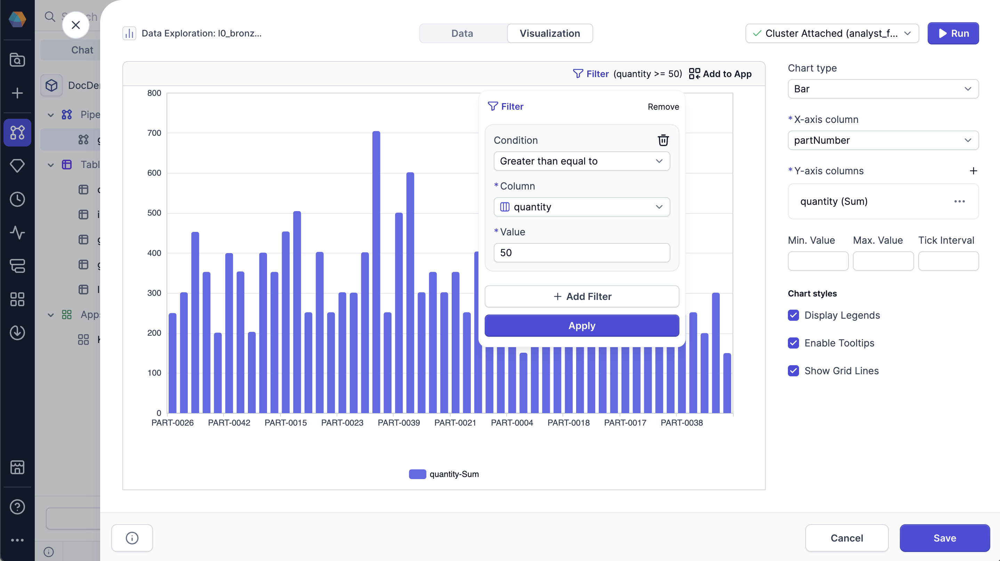
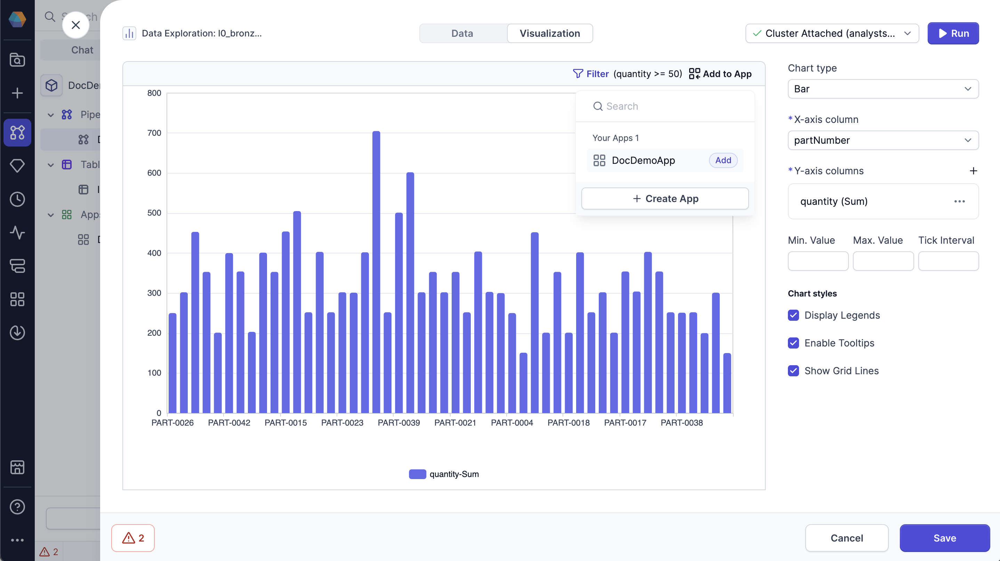
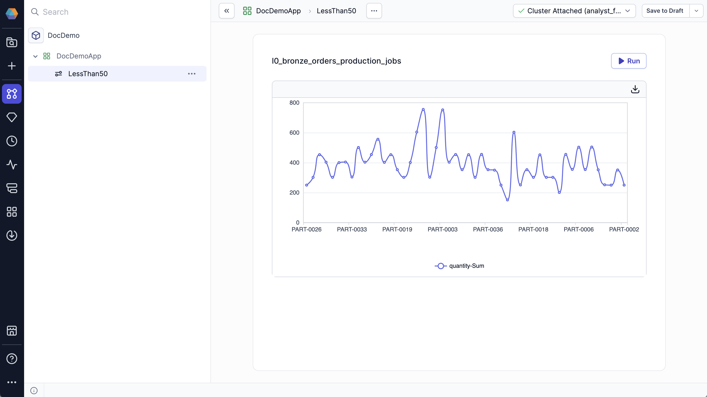

Charts let you visualize your data at different stages of the pipeline.

To view a chart, open a data sample and navigate to the **Visualization** tab of the [Data Explorer](/analysts/data-explorer). Charts are based on the data currently loaded in the sample.

## Chart types

You can create the following charts in the **Visualization** tab.

| Chart Type                                 | Description                                                                                                                 |
| ------------------------------------------ | --------------------------------------------------------------------------------------------------------------------------- |
| [Bar](/analysts/bar-chart)                 | Group your data by categories with rectangular bars with heights or lengths proportional to the values that they represent. |
| [Line](/analysts/line-chart)               | Visually represent your data over time or along a continuous range.                                                         |
| [Area](/analysts/area-chart)               | Line chart with filled areas under the lines to represent quantitative data over time or categories.                        |
| [Pie](/analysts/pie-chart)                 | Circular graph that divides into slices, where the arc length of each slice is proportional to the quantity it represents.  |
| [Candlestick](/analysts/candlestick-chart) | Financial chart that displays how prices change for an asset over time, such as stocks and currency.                        |
| [Map](/analysts/map-chart)                 | Uses a map to show how data is distributed across a geographic region.                                                      |
| [Scatter](/analysts/scatter-chart)         | Uses dots to show the relationship between two variables.                                                                   |

## Filter conditions

You can apply or remove filters to focus on specific parts of the visualized data. Filtering helps you explore subsets of the dataset without modifying or rerunning your pipeline. Filters apply only to the data currently loaded in the Data Explorer sample.

To apply a filter to your data:

1. Click **Filter** at the top of the chart.

1. Click **Add Filter**.

1. Configure your filter.

   Select the **Condition**, **Column**, and **Value** to filter for.

1. Click **Apply**.

:::info

Click the trashcan icon at the top right corner of the filter to remove it.

:::

## Add to Prophecy App

If you create a chart in the Data Explorer that would be useful in a Prophecy App, you can add it to an app template.

This way, end users can view your chart to visualize the data generated when they run the app.

To add your chart to a Prophecy App:

1. Click **Add to App** at the top of the chart.

1. Select the app you want to add it to.

1. Prophecy opens the app template in a new window. The chart element is added to the bottom of the app.

When someone creates a new app config, they will see the chart as part of the app.

To learn more about Prophecy Apps, see [Apps](/analysts/business-applications).
