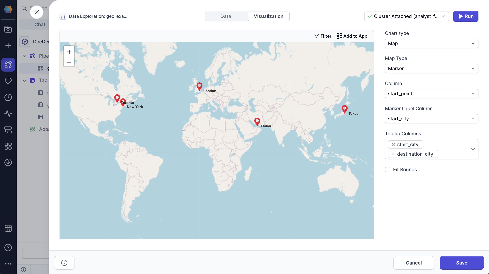
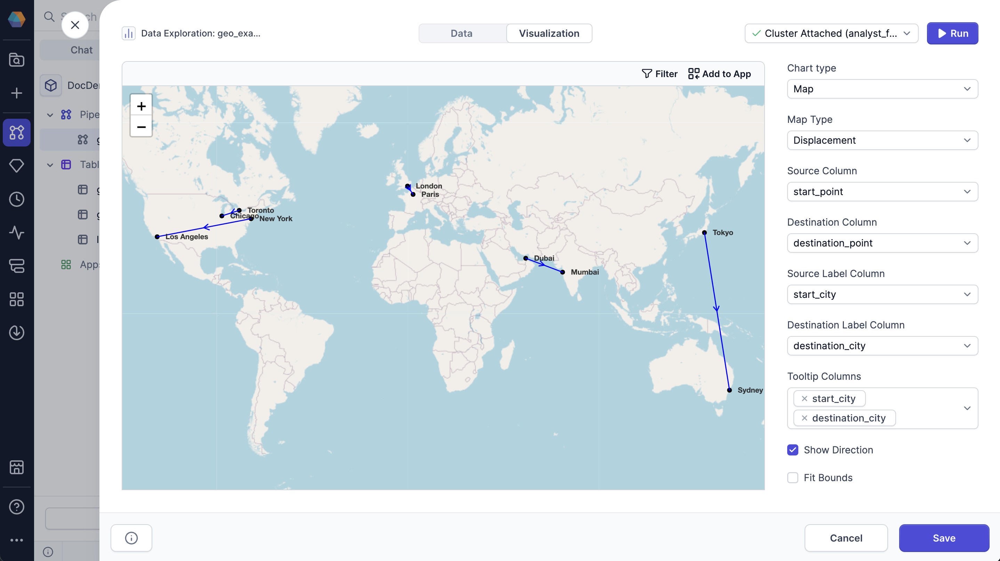

A map chart uses a map to show how data is distributed across a geographic region.

There are two types of map charts: [marker map](#marker-map-chart) and [displacement map](#displacement-map-chart).

## Marker map chart

A marker map chart uses pins to visually represent each data point on a map.

You can configure the following parameters for the chart:

| Parameter           | Description                                                                          |
| ------------------- | ------------------------------------------------------------------------------------ |
| Column              | Column that contains geo points in WKT format.                                       |
| Marker Label Column | Column that contains the name of each geo point (for example, a `city_name` column). |
| Tooltip Columns     | Column that contains information that will show up in the geo point tooltip.         |
| Fit Bounds          | Whether to fit the map to the bounds in the points.                                  |

## Displacement map chart

A displacement map chart shows the paths between points on a map.

You can configure the following parameters for the chart:

| Parameter                | Description                                                                                  |
| ------------------------ | -------------------------------------------------------------------------------------------- |
| Source Column            | Column that contains the starting geo points in WKT format for the map.                      |
| Destination Column       | Column that contains the destination geo points in WKT format for the map.                   |
| Source Label Column      | Column that contains an identifier for each starting point.                                  |
| Destination Label Column | Column that contains an identifier for each destination point.                               |
| Tooltip Columns          | Column that contains information that will show up in the geo point tooltip.                 |
| Show Direction           | Whether to include an arrow on that map that indicates direction from source to destination. |
| Fit Bounds               | Whether to fit the map to the bounds in the points.                                          |
