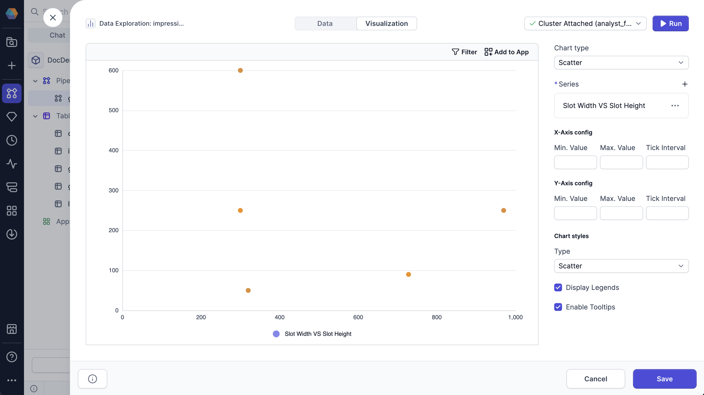

A scatter chart uses Cartesian coordinates to show the relationship between two variables.

You can configure the following parameters for the chart:

| Parameter       | Description                                                                      |
| --------------- | -------------------------------------------------------------------------------- |
| X-axis config   | Configuration for the X-axis, including min value, max value, and tick interval. |
| Y-axis config   | Configuration for the Y-axis, including min value, max value, and tick interval. |
| Chart style     | Style of the chart, either scatter or bubble.                                    |
| Display Legends | Whether to display the legend on the chart.                                      |
| Enable Tooltips | Whether to display tooltips on hover.                                            |
