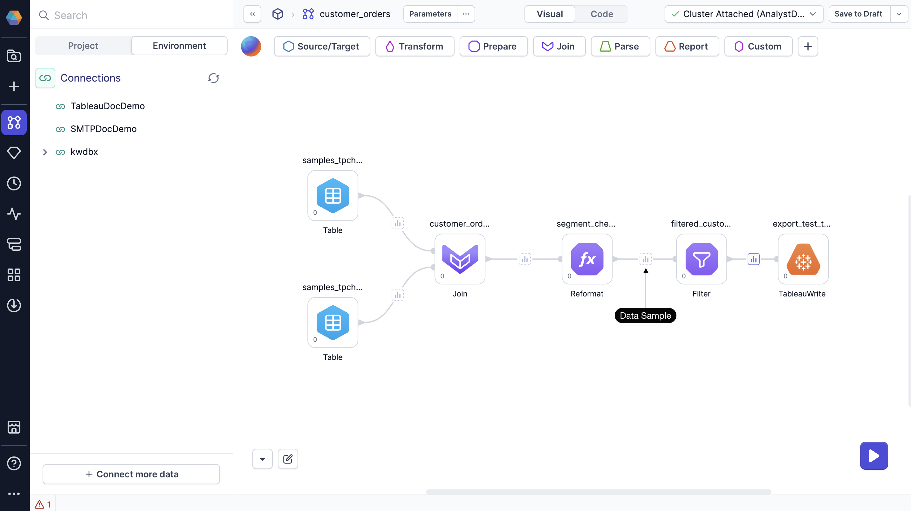
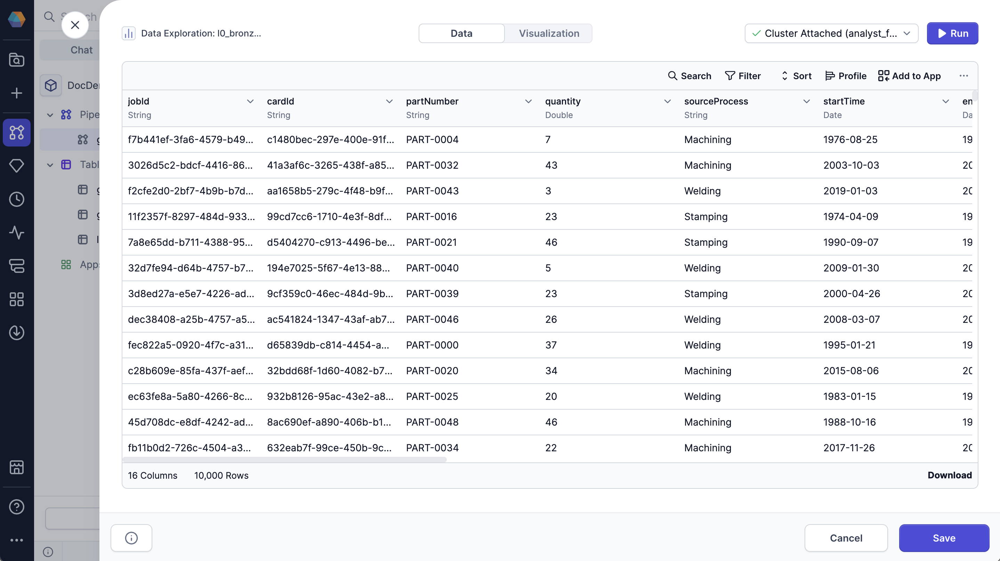

The Data Explorer helps you inspect interim data samples at each stage of your pipeline. You can catch issues early and ensure your pipeline is working as expected
by checking the column structure, reviewing the sample values, and confirming the data types.

## Open the Data Explorer

To use the Data Explorer, run your pipeline to generate data samples. Click on any data sample in your pipeline to open the Data Explorer.

## Leverage the Data Explorer

In the Data Explorer, you can:

- Sort data by columns
- Filter rows by specific values
- Search across all values
- Show or hide columns
- Export the sample as CSV or JSON file
- Save the transformation as a new gem
- View your data in a chart

## View complete dataset

The Data Explorer loads a sample of your data by default. When you sort, filter, or search, these actions apply only to the visible rows in the sample.

To work with the full dataset, do one of the following:

- Click **Load More** at the bottom of the table until all rows are visible.
- Click **Run** in the top-right corner of the preview. This refreshes the view and applies sorting and filtering to the entire dataset.

## Create gems

After analyzing the data, you can retain the filter and sort options in the pipeline by clicking on the **Create Gems** option. This action saves the applied filter and sort as a `Filter` and `OrderBy` gem in the pipeline.
