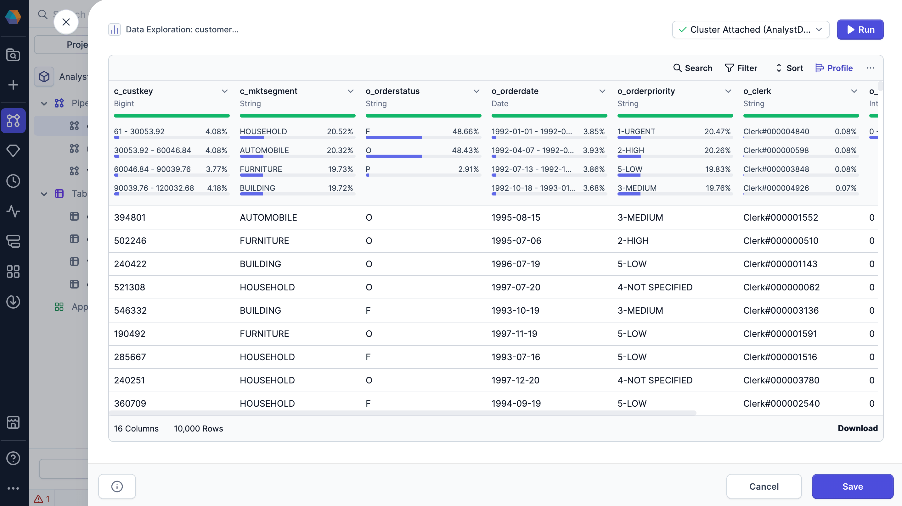
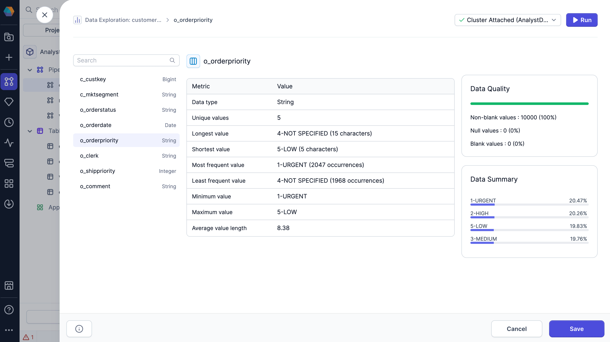
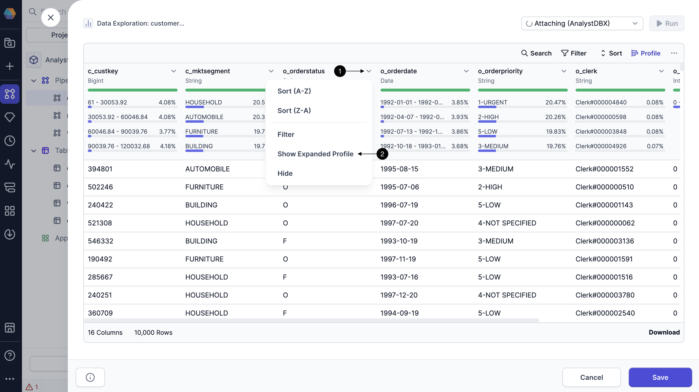

To quickly find a summary of your data statistics, view data profiles of your data samples in the Data Explorer. Use data profiling to:

- Find instant data insights
- Detect anomalies and inconsistencies early
- Visualize value distributions and data completeness

## Quick profile

The data explorer includes data profiles that are generated on your sample data. You'll be able to see high-level statistics for each column, including:

- **Percent of non-blank values:** The percentage of values in the column that are not blank.
- **Percent of null values:** The percentage of values in the column that are null.
- **Percent of blank values:** The percentage of values in the column that are blank.
- **Most common values:** Displays the top four most frequent values in the column, along with the percentage of occurrences for each.

To view these statistics for your sample data, click **Profile** in the Data Explorer.

## Expanded profile

When you open the data explorer, you'll only see the data profile of the data sample. When you load the expanded data profile, Prophecy generates a more in-depth analysis on **all of the records** in the interim dataset.

The expanded profile displays the following information:

- **Data type**: The data type of the column.
- **Unique values**: The number of unique values in the column.
- **Longest value**: The longest value in the column and its length.
- **Shortest value**: The shortest value in the column and its length.
- **Most frequent value**: The most frequent value in the column and its number of occurrences.
- **Least frequent value**: The least frequent value in the column and its number of occurrences.
- **Minimum value**: The minimum value in the column.
- **Maximum value**: The maximum value in the column.
- **Average value length**: The average length of each value in the column.
- **Null values**: The percent and number of null values in the column.
- **Blank values**: The percent and number of blank values in the column.
- **Non-blank values**: The percent and number of non-blank values in the column.
- **Data summary**: An overview of the most common values in the column.

To view the expanded profile:

1. Click the dropdown arrow on the column you want to expand.
1. Select **Show Expanded Profile**.

:::tip
You can click between columns in the expanded profile for quick access.
:::
