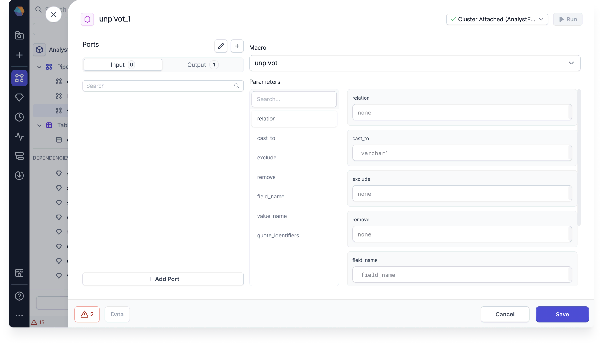

import SQLRequirements from '@site/src/components/sql-gem-requirements';

<SQLRequirements
  execution_engine="SQL Warehouse"
  sql_package_name=""
  sql_package_version=""
/>

The Macro gem lets you use a macro that you have defined or imported in your SQL project. Macros provide a simple interface where you can define the values of your macro parameters (arguments). Use the Macro gem when you:

- Import macros via DBT Hub dependency.
- Want to use a simple interface for custom gems.

## Parameters

| Parameter     | Description                                                                                                                                                                     |
| ------------- | ------------------------------------------------------------------------------------------------------------------------------------------------------------------------------- |
| Macro         | The macro that you wish to use. Note: You can only select a Gem macro. You cannot select a macro defined as a [function](docs/analysts/development/functions/functions.md). |
| Parameter `1` | A parameter that is defined in the macro. This is a value that is passed to the macro.                                                                                          |
| Parameter `N` | Additional parameters that are defined in the macro.                                                                                                                            |

## Example: dbt_utils

For this example, assume you want to use the `dbt_utils` package as a [dependency](/analysts/dependencies) in your project.

1. Open the **Options** (ellipses) menu in the project header.
1. Select **Dependencies**.
1. Click **+ Add Dependency**.
1. Choose the dependency type (Project, GitHub, or DBT Hub).
1. Add the package `dbt-labs/dbt_utils`.
1. Choose version `1.3.0`.
1. Click **Create**.
1. Click **Reload and Save** to download the package.
1. Review the functions and gems that are available in the dbt_utils package. You can click any function or gem to see the underlying macro code.

To use one of the imported gems in your pipeline:

1. Add the Macro gem to the canvas.
1. Open the gem configuration.
1. In the **Macro** field, choose the gem that you want to use. The gem parameters should appear.
1. Fill in the parameters. These are the arguments of the dbt macro.
1. Save and run the gem.

The following image shows the unpivot macro imported from `dbt_utils` in a Macro gem.

