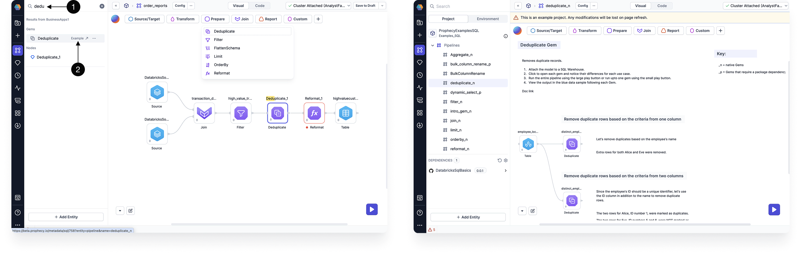
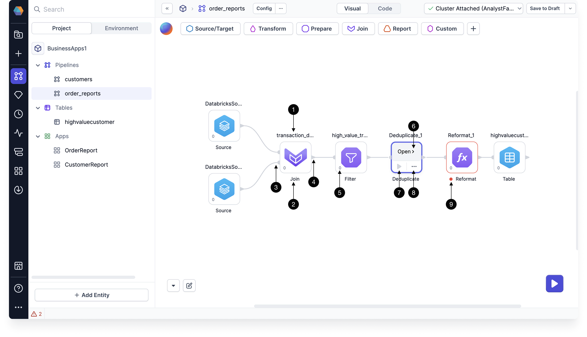

[Gems](/docs/getting-started/concepts/gems.md) are functional units in a pipeline that perform tasks such as reading, transforming, writing, or handling other data operations. When you build pipelines in a SQL project, some gems will be powered by [Prophecy Automate](/administration/architecture), and some gems will be powered by SQL dbt.

:::tip Copilot
Copilot can help you build, refine, and explain gems throughout your pipeline. See [Copilot](/analysts/copilot) for more information.
:::

## Categories

| Category          | Description                                                |
| ----------------- | ---------------------------------------------------------- |
| **Source/Target** | Read and write data from various data providers.           |
| **Transform**     | Modify, enrich, or reshape data during processing.         |
| **Prepare**       | Clean, structure, and optimize data for analysis.          |
| **Join**          | Merge, split, or link datasets.                            |
| **Parse**         | Interpret structured formats in columns like XML and JSON. |
| **Report**        | Share results through channels such as email or Tableau.   |
| **Custom**        | Enhance and extend Prophecy’s functionality.               |

<!-- | **Subgraph**      | Group gems into reusable components.                       |  -->

## Interactive gem examples

To test a gem hands-on, you can try the **interactive example** of the gem. If you search for a gem in the project sidebar, you can open the associated example and run the pre-configured pipeline!

## Gem instance

When you click on a gem from the gem drawer, an instance of that gem gets added to your pipeline canvas. Use the image and the table below to understand the UI of a gem.

| Callout | UI element    | Description                                                                                                 |
| :-----: | ------------- | ----------------------------------------------------------------------------------------------------------- |
|    1    | Gem label     | The name of this particular gem instance. It must be unique within a given pipeline.                        |
|    2    | Gem type name | The type of gem.                                                                                            |
|    3    | Input ports   | One or more ports that accept connections from upstream gems.                                               |
|    4    | Output ports  | One or more ports that connect to downstream gems.                                                          |
|    5    | Gem phase     | The [phase](#gem-phase) for this gem instance, which defines the order in which gem instances are executed. |
|    6    | Open          | The button that lets you open the gem configuration.                                                        |
|    7    | Run button    | A button that runs the pipeline up to and including the gem.                                                |
|    8    | Action menu   | A menu that includes options to change the phase of the gem, add run conditions, delete the gem, and more.  |
|    9    | Warning       | Indicator that the gem contains errors to be fixed.                                                         |

:::tip
If you select one or more gems, you can copy and paste them within the same pipeline or across pipelines. However, you cannot paste across projects that use different languages (for example, from SQL to Scala).
:::

## Gem configuration

When you open a gem, you can configure how the gem will work. Explore our individual gem documentation to understand each gem's parameters.

### Visual and code view

Some gems can be configured in the **visual** view or the **code** view. Use the visual expression builder to populate fields in the visual view. Prophecy will automatically convert visual expressions into SQL expressions. You can edit these SQL statements or write your own in the code view.

## Action menu

The action menu gives you more granular control over individual gems. When you expand the action menu, you see the following options:

| **Action**       | **Description**                                                       |
| ---------------- | --------------------------------------------------------------------- |
| **Explain**      | Copilot provides an explanation of what the gem does in the pipeline. |
| **Fix**          | Copilot resolves an error in the gem configuration.                   |
| **Label**        | Copilot renames the gem.                                              |
| **Add Comment**  | Manually write a comment that appears as a tooltip above the gem.     |
| **Change Phase** | Change the [phase](#gem-phase) of the gem.                            |
| **Delete**       | Remove the gem from the pipeline.                                     |

### Gem phase

In a data pipeline, the **phase** of a gem determines the sequence in which it runs. Here’s how it works:

- Gems are assigned a numerical phase (e.g., `0`, `1`, `-1`), where lower values run first. For example, a gem with phase `0` will execute before a gem with phase `1`.
- When a gem runs, all its upstream gems must also run. This means that if a downstream gem has phase `0` and an upstream gem has phase `1`, the upstream gem will be grouped into phase `0` to ensure proper execution.
- Because of this dependency, the phase assigned to the last gem in a branch determines the phase of the entire branch. This means that when configuring gem phases, you only need to focus on the _leaf nodes_—the final gems in each branch of the pipeline.
