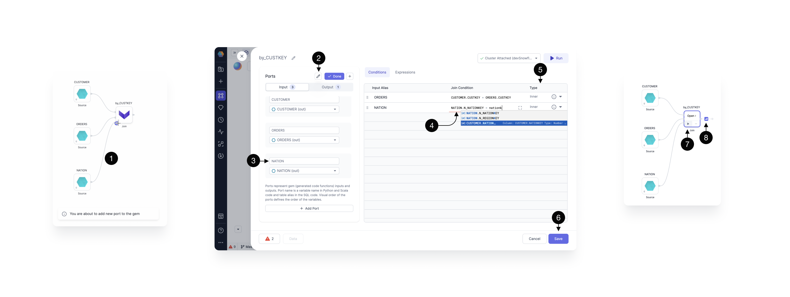

Combine data from two or more tables based on a shared column value.

Upon opening the Join gem, you can see a pop-up which provides several helpful features.


For transparency, you can always see the **(1) Input schema** on the left hand-side, **(2) Errors** in the footer, and have the ability to **(3) Run** the gem on the top right.

To fill-in our **(5) Join condition** within the **(4) Conditions** section, start typing the input table name and key. For example, if we have two input tables, `nation` and `customer`, type `nation.nationkey = customers.nationkey`. This condition finds a nation based on the nationkey feild for every single customer.

When you’re writing your join conditions, you’ll see available functions and columns to speed up your development. When the autocomplete appears, press ↑, ↓ to navigate between the suggestions and press tab to accept the suggestion.

Select the **(6)Join Type** according to the provider, e.g. [Databricks](https://docs.databricks.com/en/sql/language-manual/sql-ref-syntax-qry-select-join.html) or [Snowflake.](https://docs.snowflake.com/en/user-guide/querying-joins)

The **(7) Expressions** tab allows you to define the set of output columns that are going to be returned from the gem. Here we leave it empty, which by default passes through all the input columns, from both of the joined sources, without any modifications.

To rename our gem to describe its functionality, click on it’s **(8) Name** or try the **Auto-label** option. Gem names are going to be used as query names, which means that they should be concise and composed of alphanumeric characters with no spaces.

Once done, press **(9) Save.**

:::info
To learn more about the Join gem UI, see [this page](/docs/getting-started/concepts/gems.md) which illustrates features common to all gems.
:::

## Add a port

It's easy to add an extra source to a Join gem. Just connect and configure.



Once the source is **(1) connected**, click to **(2) edit** the ports.

Update the **(3) port name** from the default input `in2` to a more descriptive name such as the table name, in this case `NATIONS`.

Fill in the **(4) Join condition** for the new table and specify the **(5) Join type**.

Click **(6) Save**.

## Run

When your Join gem has the desired inputs, conditions and expressions, **(7) run** interactively to view **(8)[sample data](docs/analysts/development/data-explorer.md).**

## Types of Join

Suppose there are two tables Employees and Departments with the following contents:

### Employees

| EMPLOYEE_ID | EMPLOYEE_NAME | DEPARTMENT_ID |
| :---------- | :------------ | :------------ |
| 1           | Alice         | 10            |
| 2           | Bob           | 20            |
| 3           | Charlie       | 30            |
| 4           | David         | NULL          |
| 5           | Eve           | 20            |

### Departments

| DEPARTMENT_ID | DEPARTMENT_NAME |
| :------------ | :-------------- |
| 10            | HR              |
| 20            | Engineering     |
| 30            | Sales           |
| 40            | Marketing       |

### INNER JOIN

Inner Join will return columns from both the tables and only the matching records as long as the condition is satisfied.

For example, if the Join condition provided was `employees.department_id = departments.department_id`, the sample query would be:

```
SELECT e.employee_id, e.employee_name, d.department_name
FROM employees e
INNER JOIN departments d
ON e.department_id = d.department_id;
```

| EMPLOYEE_ID | EMPLOYEE_NAME | DEPARTMENT_NAME |
| :---------- | :------------ | :-------------- |
| 1           | Alice         | HR              |
| 2           | Bob           | Engineering     |
| 5           | Eve           | Engineering     |
| 3           | Charlie       | Sales           |

### LEFT JOIN / LEFT OUTER JOIN

Left Join (or Left Outer join) will return columns from both the tables and match records with records from the left table. The result-set will contain null for the rows for which there is no matching row on the right side.

For example, if the Join condition provided was `employees.department_id = departments.department_id`, the sample query would be:

```
SELECT e.employee_id, e.employee_name, d.department_name
FROM employees e
LEFT JOIN departments d
ON e.department_id = d.department_id;
```

| EMPLOYEE_ID | EMPLOYEE_NAME | DEPARTMENT_NAME |
| :---------- | :------------ | :-------------- |
| 1           | Alice         | HR              |
| 2           | Bob           | Engineering     |
| 3           | Charlie       | Sales           |
| 4           | David         | NULL            |
| 5           | Eve           | Engineering     |

### RIGHT JOIN / RIGHT OUTER JOIN

Right Join (or Right Outer join) will return columns from both the tables and match records with records from the right table. The result-set will contain null for the rows for which there is no matching row on the left side.

For example, if the Join condition provided was `employees.department_id = departments.department_id`, the sample query would be:

```
SELECT e.employee_id, e.employee_name, d.department_name
FROM employees e
OUTER JOIN departments d
ON e.department_id = d.department_id;
```

| EMPLOYEE_ID | EMPLOYEE_NAME | DEPARTMENT_NAME |
| :---------- | :------------ | :-------------- |
| 1           | Alice         | HR              |
| 2           | Bob           | Engineering     |
| 5           | Eve           | Engineering     |
| 3           | Charlie       | Sales           |
| NULL        | NULL          | Marketing       |

### FULL JOIN / FULL OUTER JOIN

Full Outer Join will return columns from both the tables and matching records with records from the left table and records from the right table. The result-set will contain NULL values for the rows for which there is no matching.

For example, if the Join condition provided was `employees.department_id = departments.department_id`, the sample query would be:

```
SELECT e.employee_id, e.employee_name, d.department_name
FROM employees e
FULL OUTER JOIN departments d
ON e.department_id = d.department_id;
```

| EMPLOYEE_ID | EMPLOYEE_NAME | DEPARTMENT_NAME |
| :---------- | :------------ | :-------------- |
| 1           | Alice         | HR              |
| 2           | Bob           | Engineering     |
| 3           | Charlie       | Sales           |
| 4           | David         | NULL            |
| 5           | Eve           | Engineering     |
| NULL        | NULL          | Marketing       |

### CROSS JOIN

Returns the Cartesian product of two datasets. It combines all rows from both tables. Cross Join will not have any Join conditions specified.

For example, the sample query would be:

```
SELECT e.employee_id, e.employee_name, d.department_name
FROM employees e
CROSS JOIN departments d;
```

| EMPLOYEE_ID | EMPLOYEE_NAME | DEPARTMENT_NAME |
| :---------- | :------------ | :-------------- |
| 1           | Alice         | HR              |
| 1           | Alice         | Engineering     |
| 1           | Alice         | Sales           |
| 1           | Alice         | Marketing       |
| 2           | Bob           | HR              |
| 2           | Bob           | Engineering     |
| 2           | Bob           | Sales           |
| 2           | Bob           | Marketing       |
| 3           | Charlie       | HR              |
| 3           | Charlie       | Engineering     |
| 3           | Charlie       | Sales           |
| 3           | Charlie       | Marketing       |
| 4           | David         | HR              |
| 4           | David         | Engineering     |
| 4           | David         | Sales           |
| 4           | David         | Marketing       |
| 5           | Eve           | HR              |
| 5           | Eve           | Engineering     |
| 5           | Eve           | Sales           |
| 5           | Eve           | Marketing       |

### NATURAL INNER JOIN

A natural join (or Natural Inner Join) is identical to an explicit Inner Join but it automatically joins columns with the same names in both tables. Natural Join will not have any join conditions specified.

For example, the sample query would be:

```
SELECT e.employee_id, e.employee_name, d.department_name
FROM employees e
CROSS JOIN departments d;
```

| EMPLOYEE_ID | EMPLOYEE_NAME | DEPARTMENT_NAME |
| :---------- | :------------ | :-------------- |
| 1           | Alice         | HR              |
| 2           | Bob           | Engineering     |
| 5           | Eve           | Engineering     |
| 3           | Charlie       | Sales           |

### NATURAL LEFT OUTER JOIN

A natural Left Outer join (or Natural Left Join) is identical to an explicit Left Outer Join but it automatically joins columns with the same names in both tables. Natural Left Outer Join will not have any join conditions specified.

For example, the sample query would be:

```
SELECT e.employee_id, e.employee_name, d.department_name
FROM employees e
NATURAL LEFT OUTER JOIN departments d;
```

| EMPLOYEE_ID | EMPLOYEE_NAME | DEPARTMENT_NAME |
| :---------- | :------------ | :-------------- |
| 1           | Alice         | HR              |
| 2           | Bob           | Engineering     |
| 3           | Charlie       | Sales           |
| 4           | David         | NULL            |
| 5           | Eve           | Engineering     |

### NATURAL RIGHT OUTER JOIN

A natural Left Right join (or Natural Right Join) is identical to an explicit Right Outer Join but it automatically joins columns with the same names in both tables. Natural Right Outer Join will not have any join conditions specified.

For example, the sample query would be:

```
SELECT e.employee_id, e.employee_name, d.department_name
FROM employees e
NATURAL RIGHT OUTER JOIN departments d;
```

| EMPLOYEE_ID | EMPLOYEE_NAME | DEPARTMENT_NAME |
| :---------- | :------------ | :-------------- |
| 1           | Alice         | HR              |
| 2           | Bob           | Engineering     |
| 5           | Eve           | Engineering     |
| 3           | Charlie       | Sales           |
| NULL        | NULL          | Marketing       |

### NATURAL FULL OUTER JOIN

A natural Full Outer join (or Natural Full Join) is identical to an explicit Full Outer Join but it automatically joins columns with the same names in both tables. Natural Full Outer Join will not have any join conditions specified.

For example, the sample query would be:

```
SELECT e.employee_id, e.employee_name, d.department_name
FROM employees e
NATURAL FULL OUTER JOIN departments d;
```

| EMPLOYEE_ID | EMPLOYEE_NAME | DEPARTMENT_NAME |
| :---------- | :------------ | :-------------- |
| 1           | Alice         | HR              |
| 2           | Bob           | Engineering     |
| 3           | Charlie       | Sales           |
| 4           | David         | NULL            |
| 5           | Eve           | Engineering     |
| NULL        | NULL          | Marketing       |
