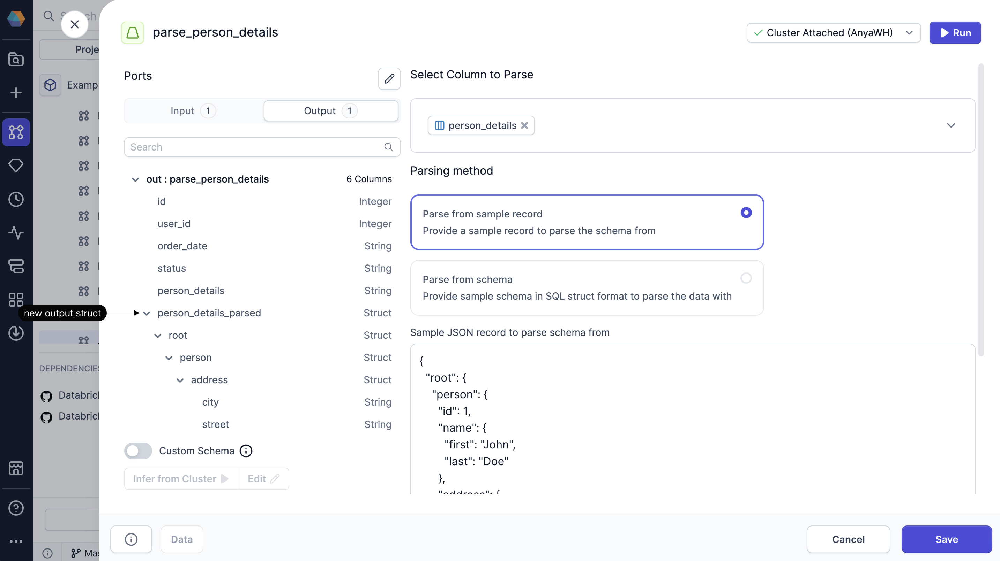

import SQLRequirements from '@site/src/components/sql-gem-requirements';

<SQLRequirements
  execution_engine="SQL Warehouse"
  sql_package_name=""
  sql_package_version=""
/>

The JSONParse gem lets you parse JSON that is included in a column of your table.

## Parameters

| Parameter              | Description                                                                                                                                                                                                                                                                                                     |
| ---------------------- | --------------------------------------------------------------------------------------------------------------------------------------------------------------------------------------------------------------------------------------------------------------------------------------------------------------- |
| Select column to parse | Specifies the input column containing the JSON data to be parsed.                                                                                                                                                                                                                                               |
| Parsing method         | Determines how Prophecy derives the schema used to parse the JSON structure.<ul class="table-list"><li>**Parse from sample record**. Prophecy uses the schema from the sample record you provide.</li><li>**Parse from schema**. Prophecy uses the schema you provide in the form of a schema struct.</li></ul> |

## Output

The output schema of the JSONParse gem includes all of the input columns and the parsed content as a **struct** data type.

