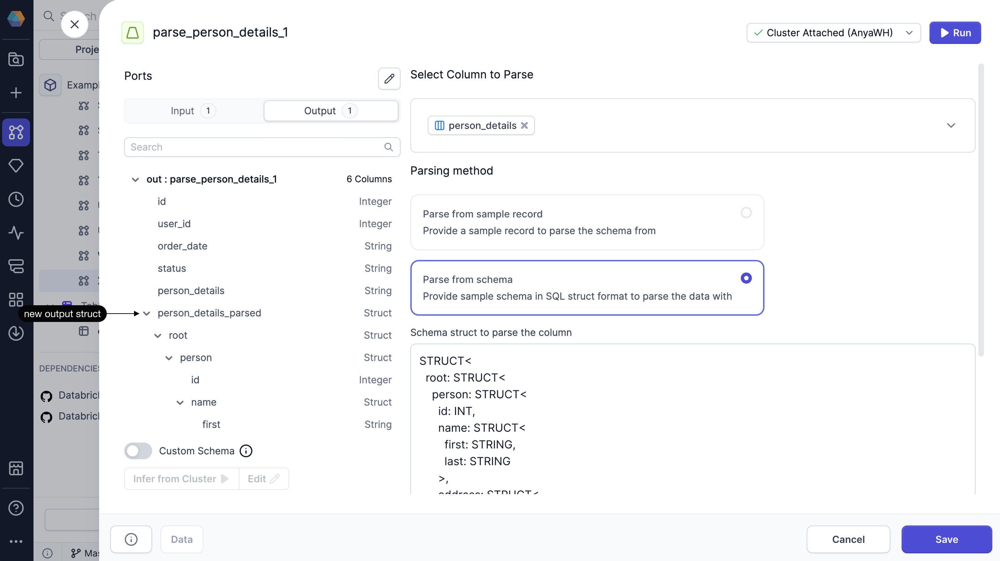

SQL  

The XMLParse gem lets you parse XML that is included in a column of your table.

## Parameters

| Parameter              | Description                                                                 |
| ---------------------- | --------------------------------------------------------------------------- |
| Select column to parse | Specifies the input column containing the XML data to be parsed.            |
| Parsing method         | Determines how Prophecy derives the schema used to parse the XML structure. |

When you select a parsing method, you have two options:

- **Parse from sample record**. Prophecy uses the schema from the sample record you provide.
- **Parse from schema**. Prophecy uses the schema you provide in the form of a schema struct.

## Output

The output schema of the XMLParse gem includes all of the input columns and the parsed content as a **struct** data type.

