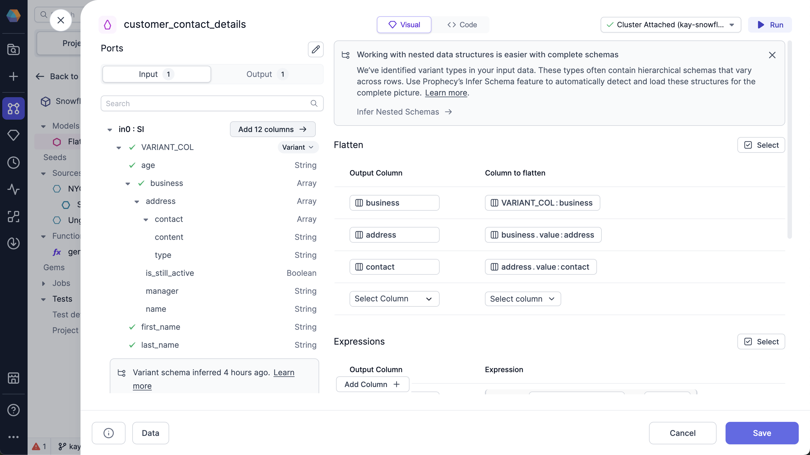
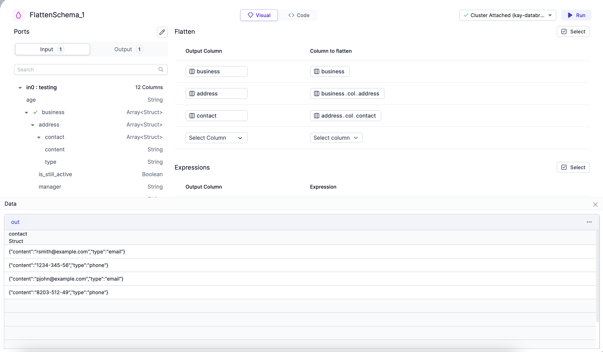

<span class="badge">SQL</span><br/><br/>

When you import tables with variant data into Prophecy, they become columns with a [variant data type](/analysts/variant-schema) and nested columns. A variant data type means that your data is an array of values with more than one data type.

You can use the FlattenSchema gem to transform your variant schema into a more consistent and digestible format. This allows your team to make subsequent steps in the pipeline more efficient and streamlined. This also makes your variant data easier to analyze, report, and integrate traditional systems without doing this manually yourself.

## Parameters

| Parameter   | Description                                                    | Required |
| ----------- | -------------------------------------------------------------- | -------- |
| Flatten     | Array **column to flatten** for each **Output Column**.        | True     |
| Expressions | **Expression** to compute each field in the **Output Column**. | True     |

## Example

Assume you have the following JSON file that includes variant data type that you would like to flatten.

````mdx-code-block
import Tabs from '@theme/Tabs';
import TabItem from '@theme/TabItem';

```json
[{
  "first_name":"Remmington", "last_name":"Smith", "age":"68",
  "business":[{
    "address":[{
      "manager":"Liara Andrew", "name":"RS Enterprises",
      "contact":[{"content":"rsmith@example.com","type":"email"},{"content":"1234-345-56","type":"phone"}],
      "is_still_active":false}]}]}, {
  "first_name":"Penny", "last_name":"John", "age":"57",
  "business":[{
    "address":[{
      "manager":"Bobby Frank","name":"PJ Enterprises",
      "contact":[{"content":"pjohn@example.com","type":"email"},{"content":"8203-512-49","type":"phone"}],
      "is_still_active":true}]}]}]
```
````

### Expressions

The FlattenSchema gem allows you to extract variant data into a flattened schema.

For example, to flatten your variant data:

1. In the **Input** tab, hover over the `in0` field and click the **Add 12 Columns** button.

   Now, all the nested lowest-level values of your object are visible as columns in the `Expressions` section.

   

1. (Optional) To change the name of the column in the output, change the value in the `Output Column` for the row.

1. Click **Run**.

### Output

After you run the FlattenSchema gem, click the **Data** button to see your schema based on the selected columns:



The FlattenSchema gem flattened all your variant data, which gives you individual rows for each one.

## Snowflake advanced settings

You can use advanced settings with your Snowflake source to customize the optional column arguments.

To use the advanced settings:

1. Hover over the column you want to flatten.
1. Click the dropdown arrow.

   You can customize the following options:

   | Option                              | Description                                                                                 | Default |
   | ----------------------------------- | ------------------------------------------------------------------------------------------- | ------- |
   | Path to the element                 | Path to the element within the variant data structure that you want to flatten.             | None    |
   | Flatten all elements recursively    | Whether to expand all sub-elements recursively.                                             | `false` |
   | Preserve rows with missing field    | Whether to include rows with missing fields as `null` in the key, index, and value columns. | `false` |
   | Datatype that needs to be flattened | Data type that you want to flatten. Possible values are: `Object`, `Array`, or `Both`.      | `Both`  |
