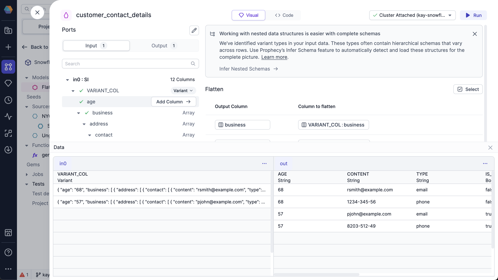

<span class="badge">SQL</span><br/><br/>

You can use the FlattenSchema gem on sources that have nested columns that you'd like to extract into a flat schema.

## Example

Assume you have the following JSON file that includes nested columns that you would like to flatten.

````mdx-code-block
import Tabs from '@theme/Tabs';
import TabItem from '@theme/TabItem';

```json
[{
  "first_name":"Remmington", "last_name":"Smith", "age":"68",
  "business":[{
    "address":[{
      "manager":"Liara Andrew", "name":"RS Enterprises",
      "contact":[{"content":"rsmith@example.com","type":"email"},{"content":"1234-345-56","type":"phone"}],
      "is_still_active":false}]}]}, {
  "first_name":"Penny", "last_name":"John", "age":"57",
  "business":[{
    "address":[{
      "manager":"Bobby Frank","name":"PJ Enterprises",
      "contact":[{"content":"pjohn@example.com","type":"email"},{"content":"8203-512-49","type":"phone"}],
      "is_still_active":true}]}]}]
```
````

When you load the data into Prophecy, the nested column will have a [variant schema](/analysts/variant-schema) data type.

### Expressions

The FlattenSchema gem allows you to extract nested fields into a flattened schema.

For example, to extract the `contact` field:

1. In the **Input** tab, navigate to the `contact` field.
1. Hover over the `contact` field and click the **Add Column** button.

   Now, the `contact` field is in the `Expressions` section.

   :::tip
   You can click to add all columns, which would make all nested lowest-level values of an object visible as columns.
   :::

   

1. (Optional) To change the name of the column in the output, change the value in the `Output Column` for the `contact` row.

1. Click **Run**.

### Output

After you run the FlattenSchema gem, click the **Data** button to see your schema based on the selected columns:



The FlattenSchema gem flattened the `contact` field, which gives you individual rows for each `content` type.

## Snowflake advanced settings

You can use advanced settings with your Snowflake source to customize the optional column arguments.

To use the advanced settings:

1. Hover over the column you want to flatten.
1. Click the dropdown arrow.

   

   You can customize the following options:

   | Option                              | Description                                                                                 | Default |
   | ----------------------------------- | ------------------------------------------------------------------------------------------- | ------- |
   | Path to the element                 | Path to the element within the variant data structure that you want to flatten.             | None    |
   | Flatten all elements recursively    | Whether to expand all sub-elements recursively.                                             | `false` |
   | Preserve rows with missing field    | Whether to include rows with missing fields as `null` in the key, index, and value columns. | `false` |
   | Datatype that needs to be flattened | Data type that you want to flatten. Possible values are: `Object`, `Array`, or `Both`.      | `Both`  |
