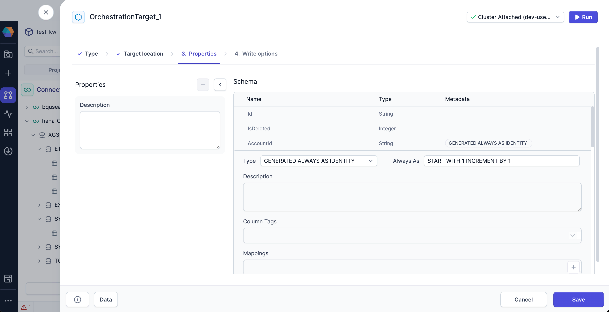

Generated columns automatically generate values for inserted rows. Configure the generation behavior based on your use case.

## Generated column types

### GENERATED ALWAYS AS IDENTITY

When a column has the `GENERATED ALWAYS AS IDENTITY` type, it:

- Accepts sequence parameters such as `START WITH` and `INCREMENT BY` to control how values are generated.
- Generates values automatically based solely on the sequence parameters.
- Creates an IDENTITY column managed entirely by SAP HANA.
- Ignores if a value is provided during an insert.

#### Example {#example-always-as}

Assume you need a column that auto-increments primary keys for users or products. You never want users or inserts to override the value.

- Column: `user_id`
- Type: `GENERATED ALWAYS AS IDENTITY`
- Always As: `START WITH 1 INCREMENT BY 1`

Here, `user_id` will automatically start at 1 and increment by 1 for every new row. Attempts to insert values will be ignored.

### GENERATED BY DEFAULT AS IDENTITY

When a column has the `GENERATED BY DEFAULT AS IDENTITY` type, it:

- Accepts sequence parameters such as `START WITH` and `INCREMENT BY` to control how values are generated.
- Generates values automatically _when no value is provided in an insert_.
- Creates an IDENTITY column that can accept manual values if they are included in the insert.
- Adjusts the internal sequence automatically if a manually provided value is higher (or lower, with negative increment) than the current sequence.

#### Example {#example-by-default}

Assume you need to migrate legacy data while keeping original IDs, but still allowing auto-increment for new rows.

- Column: `customer_id`
- Type: `GENERATED BY DEFAULT AS IDENTITY`
- Always As: `START WITH 1000 INCREMENT BY 1`

Suppose you have existing customers with IDs 1000–1050. When inserting these rows, you can provide the IDs explicitly. New customers inserted without an ID will automatically get the next sequence value (1051, 1052, ...) by default.

:::info
For more information on sequence parameters, see [CREATE SEQUENCE Statement](https://help.sap.com/docs/SAP_HANA_PLATFORM/4fe29514fd584807ac9f2a04f6754767/20d509277519101489029c064d468c5d.html). This includes reference information on syntax and default values.
:::

### GENERATED ALWAYS AS (expression)

When a column has the `GENERATED ALWAYS AS (expression)` type, it:

- Computes values using a defined expression based on other columns in the table.
- Updates automatically whenever referenced columns change.
- Cannot be manually overridden; all values are derived from the expression.

#### Example {#example-expression}

Assume you want a column that always concatenates the first and last name columns.

- Column: `full_name`
- Type: `GENERATED ALWAYS AS`
- Expression: `first_name || ' ' || last_name`

This ensures that `full_name` will always reflect the `first_name` and `last_name`. It cannot be manually changed.

## Define generated columns

To define a column as an IDENTITY column in a new target table:

1. Add a new Target gem to your pipeline canvas.
1. In the **Type** tab, select HANA as the target type.
1. In the **Location** tab, configure the location where the new table is written.
1. In the **Properties** tab, review the schema of the target table.
1. To define a column as an IDENTITY column:

   - Click on the dropdown arrow that appears on column hover. This expands the column metadata options.
   - Select a generated column type from the **Type** dropdown.
   - Provide a sequence parameter or expression in the **Always As** field.

1. Click **Save** to save your changes to the gem.

When you run the gem, Prophecy recognizes the column as generated and lets SAP HANA handle value generation automatically.

If your pipeline includes a field matching a `GENERATED ALWAYS AS IDENTITY` column, Prophecy automatically excludes it from insert operations to avoid conflicts with SAP HANA’s internal sequence generation.

For `GENERATED BY DEFAULT AS IDENTITY` columns, Prophecy can insert values when they are explicitly provided in your dataset. Otherwise, SAP HANA automatically generates the value.

## Write to tables with generated columns

If you write to a HANA table that already contains an IDENTITY column, the HANA Gem:

- Automatically detects the column in your target table
- Lets SAP HANA handle the auto-increment process

:::note
Prophecy does not label generated columns in metadata when the table originates from SAP HANA. This does not affect write behavior, but you might not catch that the column is generated.
:::

## What's next

For detailed information on functionality and constraints, see the `<col_gen_as_expression>` and `<col_gen_as_ident>` sections of the [CREATE TABLE Statement](https://help.sap.com/docs/SAP_HANA_PLATFORM/4fe29514fd584807ac9f2a04f6754767/20d58a5f75191014b2fe92141b7df228.html) page in the SAP HANA documentation.
