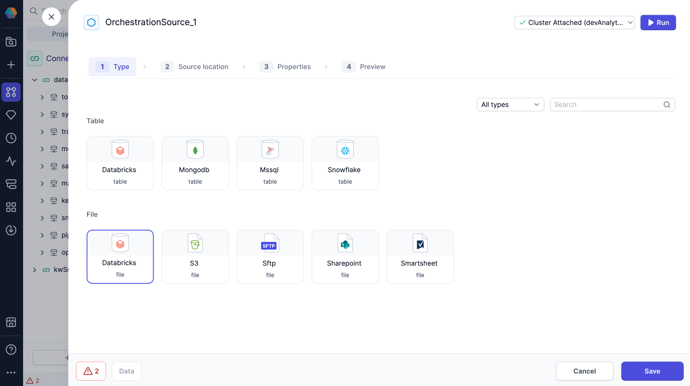

Source and Target gems define how Prophecy reads and writes data in your pipeline.

There are two types of sources and targets:

- [Tables in your SQL data warehouse](#tables)
- [Sources and targets from external systems](#external-sources-and-targets)

:::caution
When deciding between tables and external sources, consider the primary SQL connection in your Prophecy fabric. Processing tables natively in the SQL warehouse will be fast, and processing external data is slower. **Do not create an external connection that duplicates the primary SQL warehouse connection in your fabric.**
:::

## Tables

SQL  

Tables are natively read from and written to the SQL warehouse that is configured as your primary SQL connection in a Prophecy fabric. You can add existing tables from your data warehouse to Prophecy, or you can create new tables directly in Prophecy.

| Name  | Description                                                                                                   | Gem Type         |
| ----- | ------------------------------------------------------------------------------------------------------------- | ---------------- |
| Table | Persistent storage of structured data in your SQL warehouse. Faster for frequent queries (indexed).           | Source or Target |
| View  | A virtual table that derives data dynamically from a query. Slower for complex queries (computed at runtime). | Source or Target |
| Seed  | Small CSV-format files that you can write directly in Prophecy.                                               | Source only      |

Once you have used a table in a project, you can easily reuse that table as a source. Find you tables in the [project browser](/analysts/pipelines#sidebar) in the left sidebar.

## External Sources and Targets

Prophecy Automate  

To use data from outside of your SQL warehouse, you can use the following external sources and targets. This data is not persisted in Prophecy, but rather read through Prophecy.

### External connections

To use external sources and targets, you need to set up the corresponding [connections](docs/analysts/development/connections.md). Review the following connections that Prophecy provides.

#### Table connections

The following connections support tabular sources and targets.

- [Databricks](/administration/fabrics/prophecy-fabrics/connections/databricks)
- [Snowflake](/administration/fabrics/prophecy-fabrics/connections/snowflake)
- [MSSQL](/administration/fabrics/prophecy-fabrics/connections/mssql)
- [MongoDB](/administration/fabrics/prophecy-fabrics/connections/mongodb)

#### File connections

The following connections support file sources and targets.

| Connection type                                                                         | Supported file formats |
| --------------------------------------------------------------------------------------- | ---------------------- |
| [Amazon S3](/administration/fabrics/prophecy-fabrics/connections/s3)                    | CSV, JSON, XLSX, XML   |
| [SFTP](/administration/fabrics/prophecy-fabrics/connections/sftp)                       | CSV, JSON, XLSX, XML   |
| [Microsoft Sharepoint](/administration/fabrics/prophecy-fabrics/connections/sharepoint) | CSV, JSON, XLSX, XML   |
| [Databricks](/administration/fabrics/prophecy-fabrics/connections/databricks)           | CSV, JSON, XLSX, XML   |
| [Smartsheet](/administration/fabrics/prophecy-fabrics/connections/smartsheet)           | XLSX                   |
