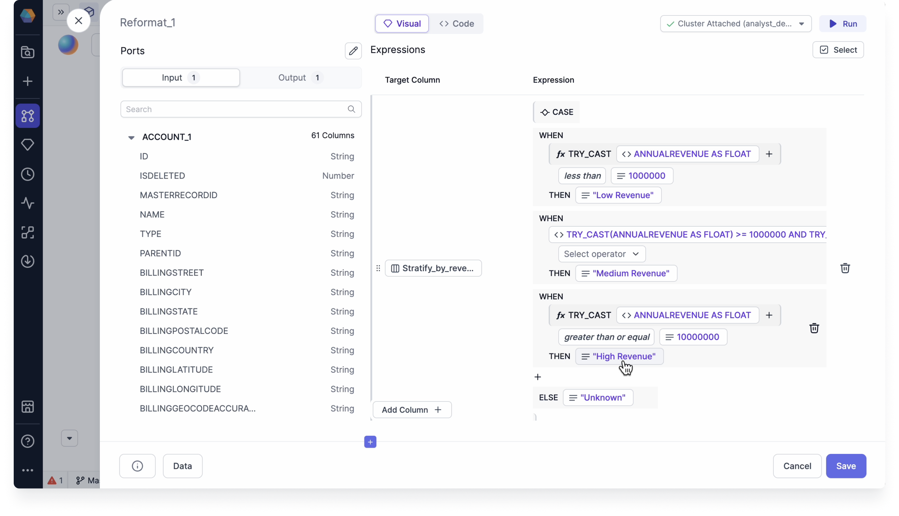
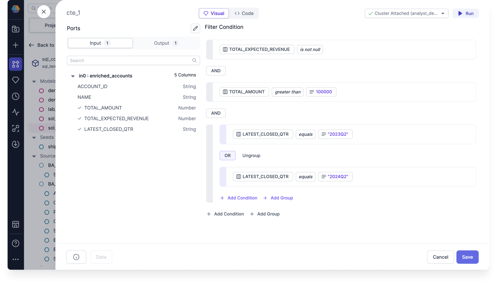
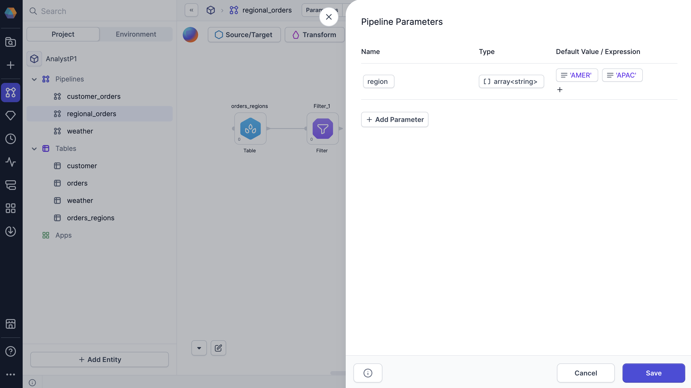
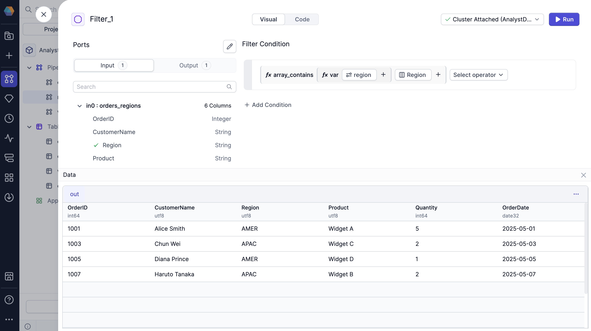

In additional to using the [expression options](/analysts/visual-expression-builder-reference) that appear when you open the visual expression builder, you can create additional configurations that add complexity to your expressions. Use this document to learn about advanced expressions that you can achieve with the visual expression builder.

## Key advanced features

The following table describes a few advanced options for the visual expression builder.

| Feature    | Description                                                                                                                                                                                                                                                    |
| ---------- | -------------------------------------------------------------------------------------------------------------------------------------------------------------------------------------------------------------------------------------------------------------- |
| Comparison | Lets you establish relationships between two simple expressions connected by an operator. This mode helps you perform comparisons or existence checks on your data that always evaluate to true or false.                                                      |
| Grouping   | Combine multiple comparison expressions into groups using logical operators like `AND` and `OR`. This structure enables you to express intricate business logic in a visual format.                                                                            |
| Parameters | Enables you to include variables in your expressions that may vary at runtime. Parameters only show up in the **Configuration Variables** of the visual expression builder after you have [created them](/analysts/pipeline-parameters) at the pipeline level. |

## Examples

### Use comparisons to stratify accounts

Let's say you want to stratify accounts based on their annual revenues. Each condition we set up is limited to one comparison. This example combines conditional logic with comparison operators.

#### Create a new conditional column

To set up the comparison expressions to match the image above, follow these steps:

1. In the Reformat gem, under **Target Column**, click **Select Column**.
1. Give the column the name `stratify_by_revenue`.
1. Click **Select expression > Conditional**. A `WHEN` clause appears.

#### Configure the WHEN clause

1. For `WHEN`, click **Select expression > Function**.
1. Select **Data type cast**, which converts a value of one data type into another data type.
1. Select **Throw error on failure** to ensure the pipeline doesn't run if the type cast fails.
1. Click **Select expression > Column** and select `ANNUALREVENUE`.
1. Click **Select data type > Float** to convert the column to a Float type.
1. Click **Select operator** and select `less than`.
1. Click **Select expression > Value** and enter `1000000` as the value.

#### Configure the THEN clause

1. For `THEN`, click **Select expression** and select **Value**. Enter `Low Revenue` as the value.
1. Click `+` on the next line and select **Add CASE** to add another `WHEN` clause.
1. Repeat steps 3 to 8 to set up the rest of the comparison expressions.
1. Click `+` on the next line and select **Add ELSE** to add an `ELSE` statement.
1. Click **Select expression** and select **Value**. Enter `Unknown` as the value.

This conditional expression will categorize your accounts based on revenue thresholds, making it easier to perform segment-specific analysis and reporting. When the pipeline runs, each account will be assigned to the appropriate revenue category based on the conditions you've defined.

### Use groupings to create complex filters

When filtering data, you often want the output data to meet multiple criteria. You can use Grouping for this by creating multiple `AND` and `OR` statements.

Assume you have a dataset where you want to filter for the following:

- Total expected revenue that `is not null`
- Total amounts that are greater than `100000`
- Latest closed quarters that equals `2023Q2` or `2024Q2`

:::tip
You can have any number of groups and nestings (a group within a group). You can also always change the grouping conditions between `AND` and `OR`.
:::

#### Set up base filter conditions

To set up the grouping expressions to match the image above, follow these steps:

1. After creating the Filer gem, click **Add condition**. An option to Select expression appears.
1. Click **Select expression > Column**.
1. Select `TOTAL_EXPECTED_REVENUE` from the list.
1. Click **Select operator** and select `is not null`.
1. Click **+ Add Condition** to add another condition expression.
1. Click **Select expression > Column**.
1. Select `TOTAL_AMOUNT` from the list.
1. Click **Select operator** and select `greater than`.
1. Click **Select expression > Value**.
1. Enter `100000` as the value.

#### Add grouped `OR` condition

1. Click **Add Group**. A grouped expression row appears.
1. Click **Select expression > Column**.
1. Select `LATEST_CLOSED_QTR` from the list.
1. Click **Select operator** and select `equals`.
1. Click **Select expression > Value**.
1. Enter `2023Q3` as the value.
1. Click **+ Add Condition** and repeat steps 2 to 6 to set up the other `OR` condition.

This complex filter will return only high-value opportunities from specific quarters that have valid expected revenue values. By combining AND and OR conditions in this way, you can create precise data subsets that match your exact business requirements.

### Create dynamic expressions with parameters

When you use a pipeline parameter in a visual expression, you can manipulate the value of that parameter using different configs at runtime. Let's review an example that leverages an array parameter in a Filter gem.

Imagine that you want to filter an `Orders` dataset based on the region where the order was placed. Specifically, you only want to keep rows where the region is included in the array parameter.

#### Create an array parameter

First, you'll set up a `region` parameter, which will be an array of strings that includes a subset of regions.

1. Open your project and select **Parameters** in the header.
1. Click **+ Add Parameter**.
1. Name the parameter `region`.
1. Select the **Type** and choose **Array > String**.
1. Click **Select expression > Value**.
1. Type `AMER` and click **Done**.
1. Select `+` to add another string to the array.
1. Type `APAC` and click **Done**.
1. Now, click **Save**.

#### Use the parameter in an expression

Now, you'll use the parameter in an expression inside a Filter gem.

1. Create and open the Filter gem.
1. Remove the default `true` expression.
1. Click **Select expression > Function** and select `array_contains`.
1. In the **array** dropdown of the function, click **Configuration Variable** and select the `region` parameter.
1. In the **value** dropdown of the function, click **Column** and select the order region column.

The output of this gem will only include rows where the order region matches at least one value in the `region` array. When you run the pipeline interactively, it will use the values of the default array that you set up in the previous section.

## Validate your expressions

Run the pipeline up to and including the gem with your expression, and observe the resulting data sample. To do so, click the **play** button on either the canvas or the gem. Once the code has finished running, you can verify the results to make sure they match your expectations. You can explore the result of your gem in the [Data Explorer](docs/analysts/development/data-explorer.md).

## Tips

Here are some additional tips to keep in mind when using the visual expression builder:

- The expression dropdowns support search.
- Each argument of your function is another expression since you have the same expression options to choose from.
- You can drag and drop your comparison expressions to rearrange them.
- Just as with conditions, you can also drag and drop your grouping expressions to rearrange them.
- You can delete individual expressions, conditions, and groupings by clicking the trash icon at the end of the rows.
