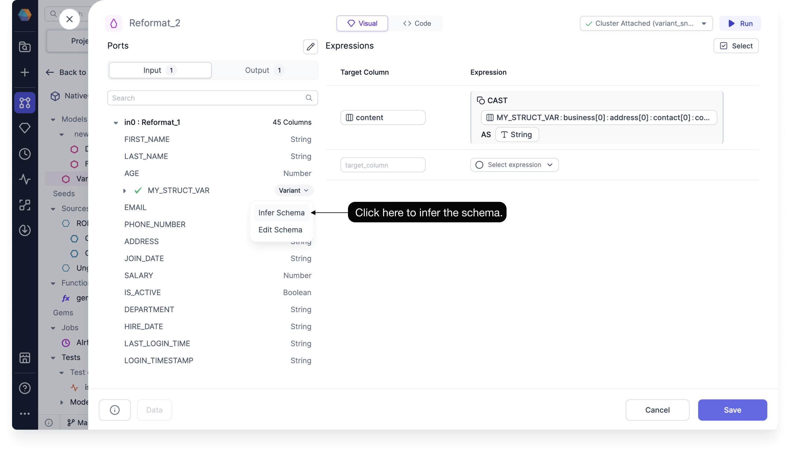
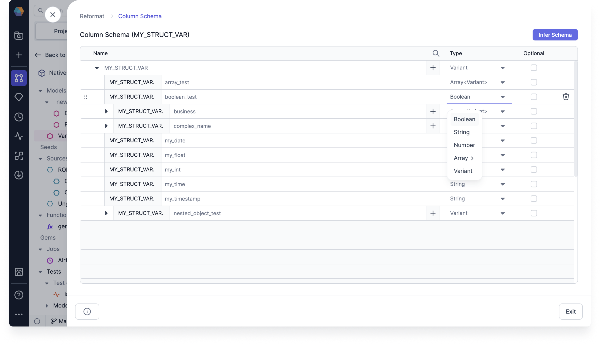
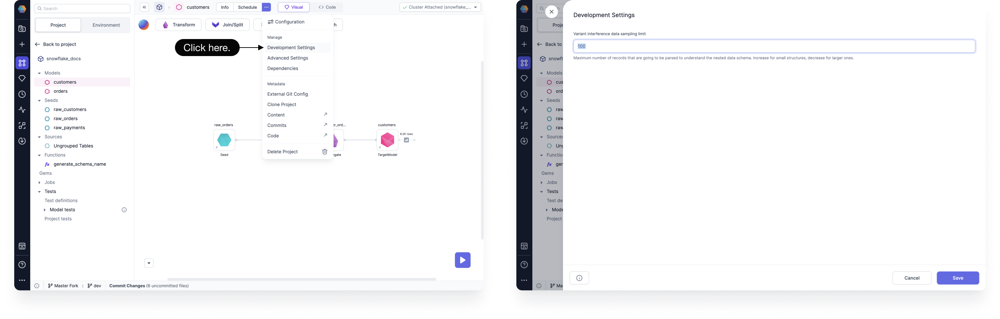
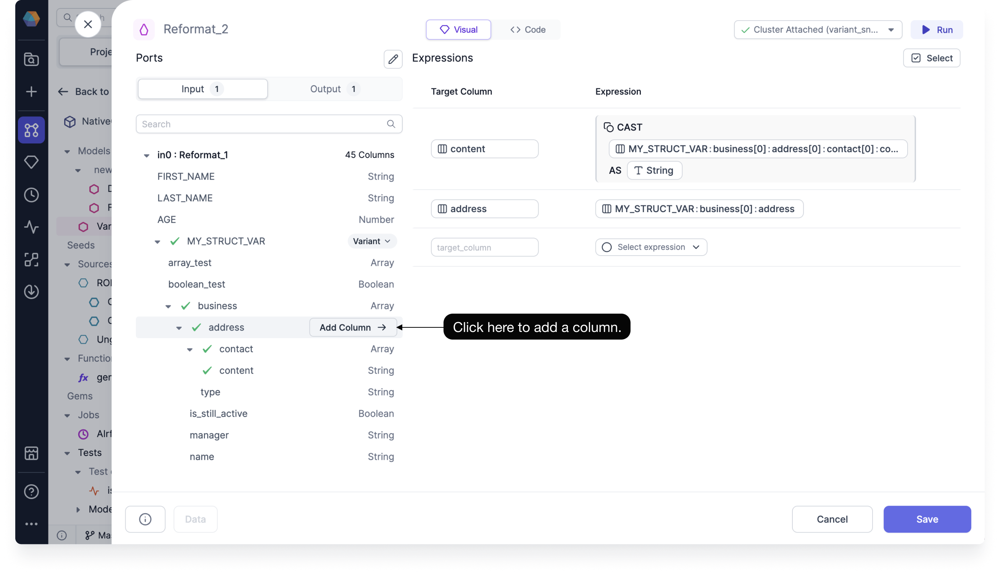

A variant data type is an array of values with more than one data type and provides flexibility to handle diverse and unstructured data from multiple sources without enforcing a rigid schema. This adaptability accommodates data that evolves or comes from different environments, enabling seamless integration and storage.

You can use Prophecy to convert your variant data into flat, structured formats to make them easier to understand and use for analytics. This helps you determine the data types of each value in your Snowflake array or object.

In Prophecy, you can do the following with variant data:

- Infer the variant schema
- Configure the parsing limit for inferring the column structure
- Use a nested column inside of the visual expression builder

## Infer and edit variant data types

Prophecy does not store variant data types within the table definition. Each row can vary in data types, which makes them difficult to infer and use. Fortunately, you don't have to infer the schema yourself. You can use the column selector inside of your gems to automatically infer the variant data type, explore the multi-type variant structure, and later select a nested column to use in your transformations.

To automatically infer the variant data type:

1. Open a gem that uses a variant column input, such as the [FlattenSchema gem](/analysts/flatten-schema).

1. Click the **Variant** dropdown, and click **Infer Schema**.

   Prophecy automatically detects and identifies the variant data types in your input data.

   

   :::note

   Prophecy caches the inferred schema so you can use it again in the future whenever you reopen the model, gem, or another gem connected to the same input port.

   To see the last time your variant data type was inferred, see the box at the bottom of the column selector.

   To refresh the schema, click **Infer Schema** again.

   :::

### Edit the variant data type schema

If Prophecy missed certain schema cases while sampling the records, you can make edits yourself.

To edit the variant data type schema:

1. Click the **Variant** dropdown, and click **Edit Schema**.
1. Use the data type dropdowns to manually choose the data type of each nested schema.

   

## Variant sample setting

When Prophecy infers the variant data type, it samples the records to identify all potential iterations of keys and values within the schema. The default number of records that Prophecy parses to understand the nested data schema is 100.

To update this limit:

1. Click on `...` at the top of the page.
1. Click **Development Settings**.
1. Put in the number of records you want Prophecy to parse to understand the nested data schema.

   We recommend that you increase the limit for small structures, or decrease it for larger ones.

   

:::note
This setting does not rely on the ratio of the data since that would require a complete count of the data records.
:::

## Use a nested column in an expression

In the column selector, you can add a nested column by clicking **Add Column** when you hover over the input field name.

When you add a column nested within a variant data type, Prophecy automatically generates several fields according to the following rules:

| Field       | Rule                                                                                                                                                                                                                                                                                                              |
| ----------- | ----------------------------------------------------------------------------------------------------------------------------------------------------------------------------------------------------------------------------------------------------------------------------------------------------------------- |
| Column name | The column name matches the input field name, and is prefixed with the parent field path. If there's a conflict, Prophecy appends numbers starting with `_0` until it becomes unique.  For example, if the column name `customers_name` already exists, Prophecy might name the new field `customers_name_0`. |
| Expression  | The expression represents the full path to the selected field, and uses existing flattened subpaths.                                                                                                                                                                                                              |
| Data type   | The data type is automatically `CAST` to the closest inferred type.                                                                                                                                                                                                                                               |

### Default casting

Prophecy automatically adds a `CAST` to any column you add from a nested type. By default, the column is cast using the standard `CAST(x AS y)` syntax.

In some cases, a path within a variant data type may hold different value types across rows. For example, a dataset can contain different data types, such as integer, object, and boolean for each row’s value key.

Prophecy supports this scenario by presenting each detected data type for a given key, array, or object as a separate item in the column selector. When you add one of those columns to the expression, Prophecy uses explicit casting, which may error out if the cast is not possible. You can change this behavior by using `TRY_CAST`, which returns `null` if the cast is not possible.
