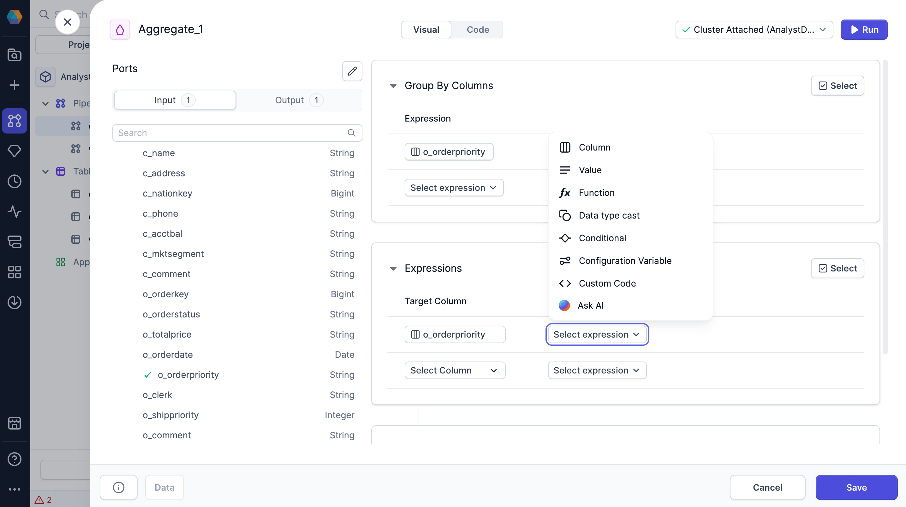

Use the visual expression builder to write complex SQL expressions without worrying about syntax. The visual expression builder can help you to better understand the relationships between different functions and their arguments. You can use visual expressions in gems and data tests.

:::info
To understand how to build expressions with the visual expression build, see the [reference guide](/analysts/visual-expression-builder-reference).
:::

## Build with Copilot

You can use Copilot from the visual expression builder for additional help. Whether you're exploring functions, learning what's possible, or writing expressions with prompts, Copilot supports your workflow.



## Code view

To view the SQL expressions generated by the visual expression builder, you can switch to the Code view of a gem or of the project. If you update any expressions in the Code view, they will be converted back to visual expressions in the Visual view.


You can also ask Copilot to generate SQL expressions directly in the Code view.

## What's next

To continue developing with the visual expression builder, see the following pages:

```mdx-code-block
import DocCardList from '@theme/DocCardList';
import {useCurrentSidebarCategory} from '@docusaurus/theme-common';

<DocCardList items={useCurrentSidebarCategory().items}/>
```
