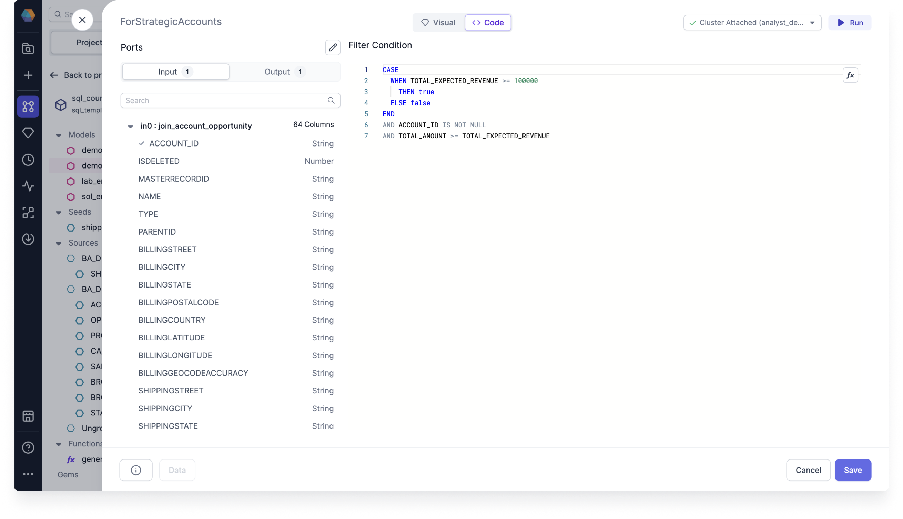
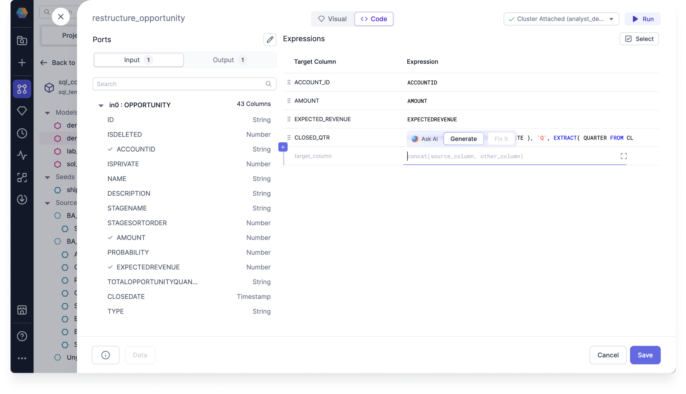

The Visual Expression Builder helps you build SQL expressions visually by handling the syntax for you.

Using the Visual Expression Builder can save you time and effort when constructing complex expressions, and can help you to better understand the relationships between different functions and their arguments. You can use visual expressions in SQL gems, as well as in the Data Explorer and for data tests.


## Expression types

### Static

These types of expressions are SQL-native.

| **Type**         | **Example**                                                   |
| ---------------- | ------------------------------------------------------------- |
| Column selection | `customer_id`, `amounts`                                      |
| Hardcoded value  | `15`, `Poland`                                                |
| Function call    | `concat(amount, " ", currency)`                               |
| Case statement   | `WHEN active_flag = True THEN first_name OTHERWISE last_name` |

### Dynamic

These types of expressions are Prophecy-native.

| **Type**            | **Example** |
| ------------------- | ----------- |
| Configuration value | `$currency` |
| Secret value        | `$jdbc_url` |

## Code view

If you wish to view the SQL expressions generated by the Visual Expression Builder, you can switch to the Code view of the project. If you update any expressions in the Code view, they will be converted back to visual expressions in the Visual view.



While viewing the Code view of your expressions, you can click **Ask AI** to generate your expressions using an English text prompt. You can then review the code expressions, view them on the Visual view, and test them by running the model up to and including the gem with the expressions.



## What's next

To continue developing with the Visual Expression Builder, see the following pages:

```mdx-code-block
import DocCardList from '@theme/DocCardList';
import {useCurrentSidebarCategory} from '@docusaurus/theme-common';

<DocCardList items={useCurrentSidebarCategory().items}/>
```
