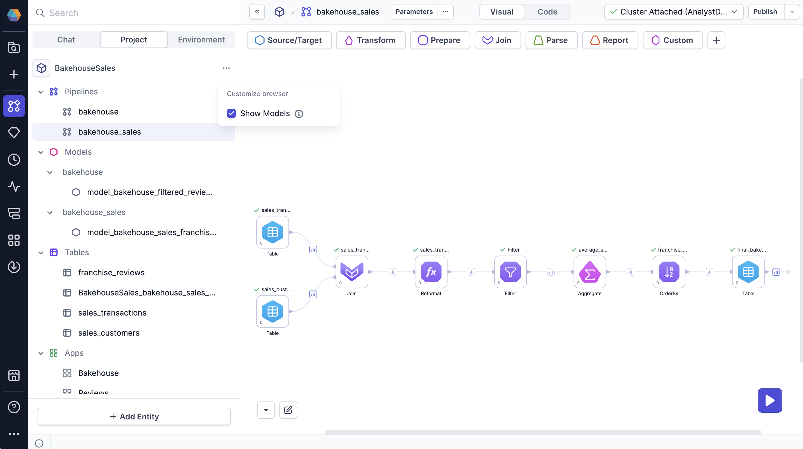

In Prophecy, a model comprises a set of gems that processes data into **one** output. Each model corresponds to a **single table** in your database.

Models follow the dbt build system and can run on either SQL fabrics or Prophecy fabrics. To work with the dbt build, each visual model is a SQL file stored in your project repository in Git.

## Model language

Prophecy’s visual interface supports SQL models only. If you’d like to define Python models, you can still do so within the code interface.

## Create models

To add a new model to your project:

1. Click **+ Add Entity** from the bottom of Project tab of the left sidebar.
1. Click **Model**.
1. In the Add Model dialog, add a **Model Name**.
1. Review the path where the model will be saved in the project repository. In most cases, the default `model` path is sufficient.
1. Click **Create**.

This opens a new model canvas that is prepopulated with a target model. Note that the dbt framework restricts models to one target output.

:::tip
While you can develop models visually using gems, you can also write models directly in the code view, which is automatically synced with the visual view.
:::

## Compatible gems

Each gem in a model maps to a SQL statement. As you configure gems on the visual canvas, Prophecy automatically generates the corresponding SQL, determines whether to use a CTE or subquery for each step, and integrates your changes into the overall model.

Models run exclusively in your SQL warehouse and can only use gems supported in that environment.Gems that can run in SQL are marked with the following badge: <a href="https://docs.prophecy.io/administration/fabrics/prophecy-fabrics/">SQL Warehouse</a>

## Models vs pipelines

Models and pipelines are two different SQL project components. The following table describes the key differences between models and pipelines.

| Feature             | Models                                         | Pipelines                            |
| ------------------- | ---------------------------------------------- | ------------------------------------ |
| Execution           | SQL Warehouse                                  | SQL Warehouse + Prophecy Automate    |
| Sources and Targets | Native Tables/Models                           | Native Tables/Models + External Data |
| Outputs             | Limited to one output                          | No limitation                        |
| Orchestration       | External Only (Databricks Jobs, Airflow, etc.) | External OR Prophecy Automate        |

:::note
Pipelines run on both a SQL warehouse and Prophecy Automate, making a broader set of gems available compared to models.
:::

### Show underlying models

Many visual transformations in pipelines are compiled into models under the hood. If you are working on a pipeline, you can view and edit the code of [underlying dbt models](/analysts/pipeline-execution#execution-environment) in a pipeline. However, you cannot visually edit these underlying models.

To view these models, select **Show Models** from the **...** menu in the left sidebar of a project.

