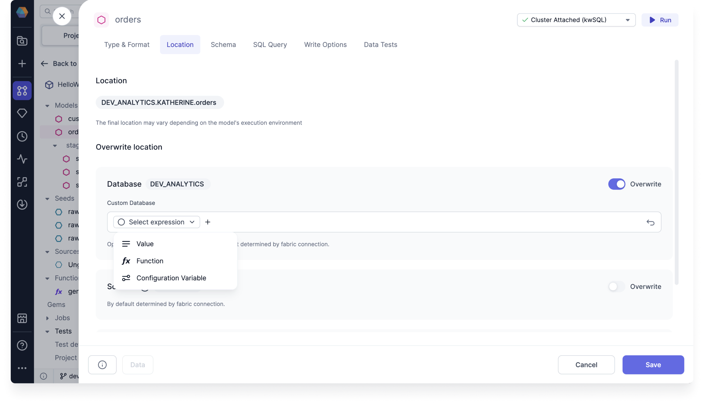

By default, your target model is written to the database and schema defined in the attached fabric. You can update the location of the target model in the **Location** tab of the gem dialog. This page includes an example of how you can make the write location of the table dynamic.

## Use case

Assume you want to use one database location during development and interactive execution, but you want to write to a different database for schedules jobs running in production. You can use a configuration variable to do so.

### Create the variable

First, you will have to create the variable:

1. Click **...** in the project header and select **Configuration**.
1. Make sure you are in **Project Configuration**.
1. Create a variable and make the default value the name of the development database you want to use during interactive execution. The value should be a string.

### Overwrite the default model location

Next, you need to add the variable to your target model location.

1. Open a target model gem.
1. Click on the **Location** tab.
1. Enable the **Overwrite** toggle for the database.
1. Click on **Advanced Mode** on the right side of the database field.
1. From the dropdown that appears, select **Configuration Variable**.
1. Choose the configuration variable you created in the previous section.
1. **Save** your changes.

### Assign the variable a value

Then, let's change the variable to save to a **production** database.

1. Create a job that includes your model.
1. Open the model configuration and add the **Supply variables to project** dbt property.
1. Add your project variable and assign it the name of the production database. This will override the default value you provided in the Project Configuration.

Now, when the job runs, your model should be stored in the production database.

:::note
You can also run a dbt command using the --vars flag to override the default value of the variable.
:::
