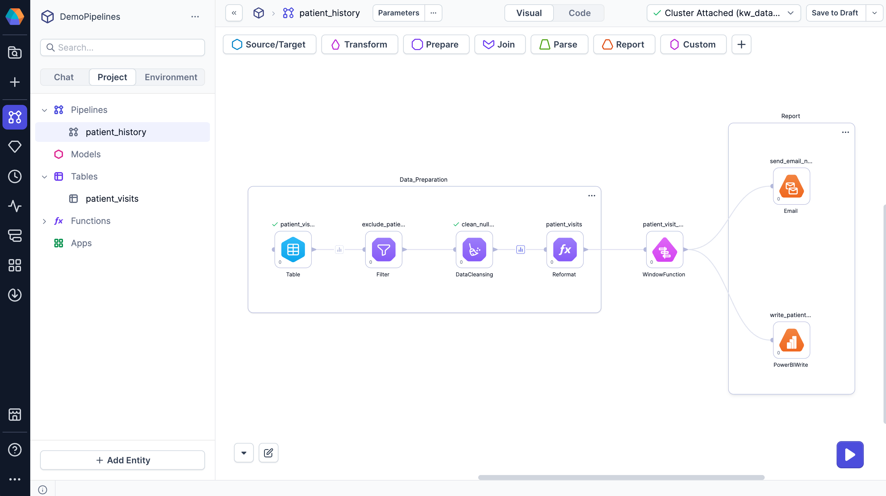
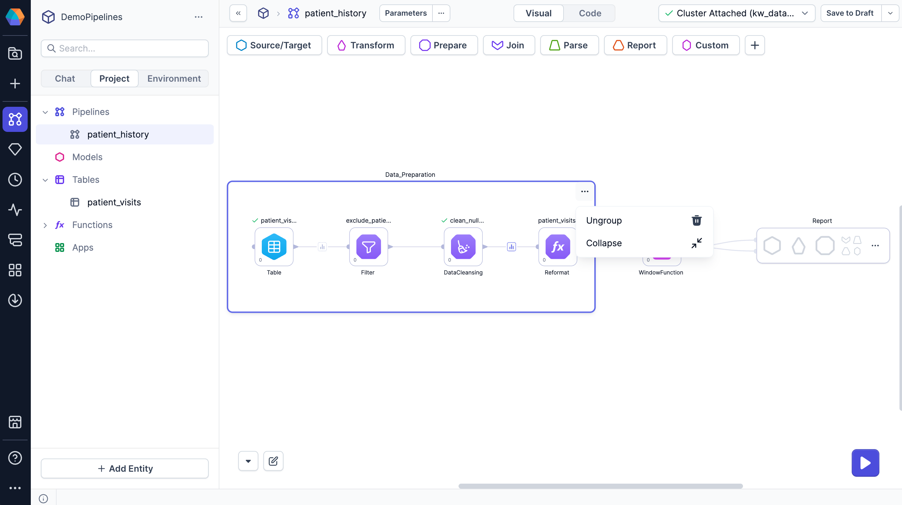

Containers allow you to divide your pipeline into logical sections. They help you visually organize related gems, making pipelines easier to read and understand.

For example, you can use containers to group transformations by:

- Pipeline stage: Separate input preparation, transformation logic, and output writing into distinct sections.
- Gem phase: Group transformations that execute together to reflect the sequential flow of the pipeline.
- Input source: Organize steps that prepare data from different sources before they are joined downstream.

## Create a container

To create a container:

1. Drag to select multiple gems on the canvas.
1. At the bottom of the canvas, click **Group**.

The selected gems are added to a new container.

## Manage containers

To manage your created containers:

- **Rename containers** — Click on the container name and enter a new one to clarify its purpose.

- **Move gems in or out of a container** — Drag the gem in and out across the container boundary.

- **Edit container size** — Drag the container edges or corners to resize.

- **Collapse containers** — Click **⋯ > Collapse** to hide the container's gems and simplify the canvas.

- **Remove a container** — Click **⋯ > Ungroup** to remove the group and keep its gems on the canvas.

