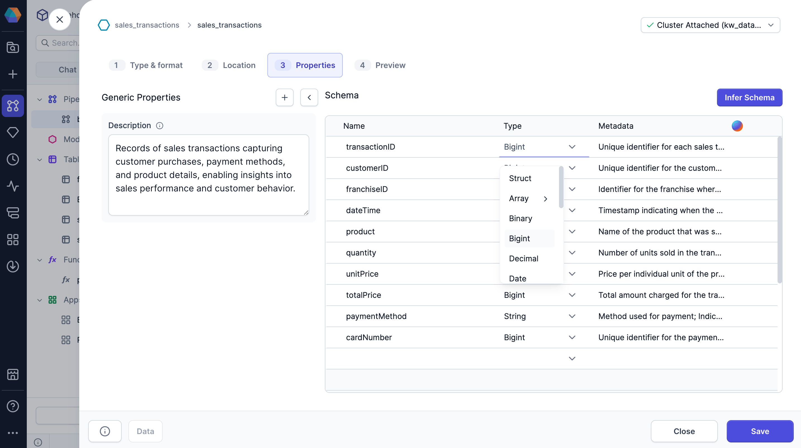

import Tabs from '@theme/Tabs';
import TabItem from '@theme/TabItem';

When processing data in Prophecy, the available data types depend on which SQL warehouse your organization uses. This guide outlines which data types are supported in Prophecy for each platform. You'll work with data types when reading data sources and defining their schemas.

## Data types

The tables below list the data types Prophecy supports depending on the [SQL warehouse](/administration/fabrics/prophecy-fabrics/) you use for processing.

<Tabs>
<TabItem value="Databricks" label="Databricks">

The data types you see in Prophecy correspond to [data types in Databricks SQL](https://docs.databricks.com/aws/en/sql/language-manual/sql-ref-datatypes).

| Data type | Description                                                                               |
| --------- | ----------------------------------------------------------------------------------------- |
| Array     | Represents values comprising a sequence of elements.                                      |
| Bigint    | Represents 8-byte signed integer numbers.                                                 |
| Binary    | Represents byte sequence values. Only partially supported in the Prophecy UI.             |
| Boolean   | Represents true and false values.                                                         |
| Date      | Represents values comprising year, month, and day, without a timezone.                    |
| Decimal   | Represents numbers with maximum precision and fixed scale.                                |
| Double    | Represents 8-byte double-precision floating point numbers.                                |
| Float     | Represents 4-byte single-precision floating point numbers.                                |
| Integer   | Represents 4-byte signed integer numbers.                                                 |
| Smallint  | Represents 2-byte signed integer numbers.                                                 |
| String    | Represents character string values.                                                       |
| Struct    | Represents values with the structure described by a sequence of fields.                   |
| Timestamp | Represents values comprising year, month, day, hour, minute, and second, with a timezone. |
| Tinyint   | Represents 1-byte signed integer numbers.                                                 |
| Variant   | Represents semi-structured data. Only partially supported in the Prophecy UI.             |
| Void      | Represents the untyped NULL. Only partially supported in the Prophecy UI.                 |

</TabItem>

<TabItem value="BigQuery" label="BigQuery">

These data types you see in Prophecy correspond to the [data types in BigQuery](https://cloud.google.com/bigquery/docs/reference/standard-sql/data-types).

| Data type  | Description                                                                                                                                         |
| ---------- | --------------------------------------------------------------------------------------------------------------------------------------------------- |
| Record     | Represents a column with [nested data](https://cloud.google.com/bigquery/docs/nested-repeated). SQL type name: **STRUCT**                       |
| Array      | Represents a list of non-array values of the same data type. SQL type name: **ARRAY**                                                           |
| BigNumeric | Represents a decimal value with precision of 76.76 digits.  SQL type name: **BIGNUMERIC** SQL aliases: **BIGDECIMAL**                       |
| Numeric    | Represents a decimal value with precision of 38 digits. SQL type name: **NUMERIC** SQL aliases: **DECIMAL**                                 |
| Datetime   | Represents a Gregorian date and a time, independent of time zone.  SQL type name: **DATETIME**                                                  |
| Time       | Represents a time of day, independent of a specific date and time zone.  SQL type name: **TIME**                                                |
| Date       | Represents a Gregorian calendar date, independent of time zone.  SQL type name: **DATE**                                                        |
| Timestamp  | Represents an absolute point in time, with microsecond precision and no timezone context.  SQL type name: **TIMESTAMP**                         |
| Boolean    | Represents true and false values. SQL type name: **BOOL** SQL aliases: **BOOLEAN**                                                          |
| Float      | Represents an approximate double-precision numeric value. SQL type name: **FLOAT64**                                                            |
| Integer    | Represents a 64-bit integer. SQL type name: **INT64** SQL aliases: **INT**, **SMALLINT**, **INTEGER**, **BIGINT**, **TINYINT**, **BYTEINT** |
| Bytes      | Represents variable-length binary data. SQL type name: **BYTES**                                                                                |
| String     | Represents variable-length character strings.  SQL type name: **STRING**                                                                        |

:::info

Prophecy does not support BigQuery `Interval`, `Geography`, or `JSON` data types directly.

- **Geography / JSON:** Serialized and stored as strings.
- **Interval:** Converted to a month-day-nano interval type for display and processing.

:::

</TabItem>
</Tabs>
