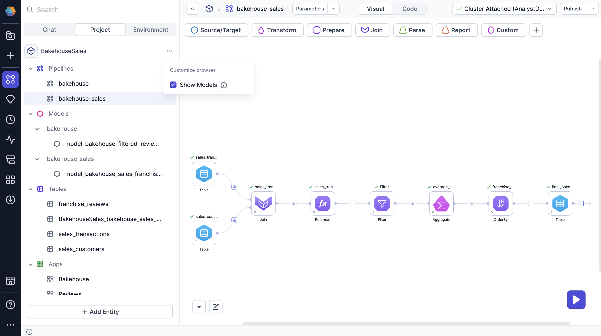

While SQL projects leverage [dbt](https://docs.getdbt.com/docs/build/models) for data transformations, pipeline execution is a hybrid process. This page describes how Prophecy executes pipelines in different scenarios.

## Execution environment

The execution environment defined in a [Prophecy fabric](/administration/fabrics/prophecy-fabrics/) consists of multiple compute engines.

- **SQL warehouse**: Your own external SQL environment used to store tables, create tables, and execute queries.
- **Prophecy Automate**: Runtime that handles orchestration and the flow of external data from systems like Salesforce and Tableau in and out of the pipeline. To learn more, jump to [External data handling](#external-data-handling).

To view the underlying dbt models that drive pipeline transformations, select **Show Models** from the options menu in the left sidebar of a project.

:::info
Learn more about the relationship between these components in [Architecture](docs/administration/architecture.md).
:::

## Methods of pipeline execution

### Interactive runs in the canvas

Prophecy lets you interactively run your pipeline in the pipeline canvas and preview data transformations at every step. This helps you understand and validate your data transformations during development. There are two ways to start an interactive run:

- **Click the large play button on the bottom of the pipeline canvas.** The whole pipeline runs.
- **Click the play button on a gem.** All gems up to and including that gem run. This is a partial pipeline run.

As gems run in your pipeline, sample outputs will appear after those gems. When you click on a data sample, Prophecy loads the data and opens the [Data Explorer](/analysts/data-explorer). The Data Explorer lets you sort, filter, and search through the gem output.

### Scheduled runs

Scheduling allows you to automate your data pipelines at predefined intervals. For each pipeline in your project, you can configure independent schedules that specify how often a pipeline runs and whether to send alerts during the automated runs. The execution environment of the scheduled run is determined during project publication.

To learn more about deploying projects to specific execution environments, see [Versioning](/analysts/versioning) and [Scheduling](/analysts/scheduling).

### Executing pipelines via apps

You can also run pipelines with [Prophecy Apps](/analysts/business-applications) in Prophecy. These apps enable non-technical users to run data pipelines through intuitive, form-based interfaces. By restricting access to pipelines themselves, you can provide proper guardrails for pipeline execution via Prophecy Apps.

## External data handling

Prophecy supports external sources and targets through [connections](/analysts/connections). Because SQL transformations require structured [tables](/analysts/source-target/#tables), Prophecy Automate dynamically creates temporary tables in your SQL warehouse to process this data.

Temporary tables act as intermediaries that allow external data to be processed using SQL logic. In other words, they enable dbt and SQL to transform external data as if it were native to the warehouse.

Prophecy creates these tables during the pipeline run and removes them from the SQL warehouse after the run finishes. Temporary tables don’t appear in the canvas.

:::info
Temporary tables use the following naming convention:  `prophecy_tmp__{RUN_ID}__{PIPELINE_NAME}__{GEM/SOURCE_LABEL}[_{SUFFIX}]`
:::
