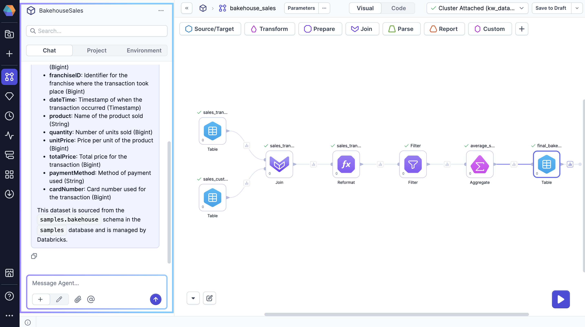
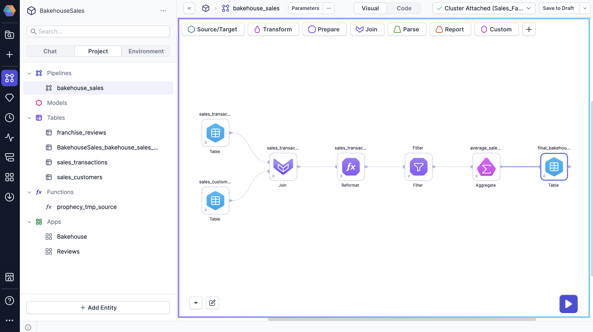
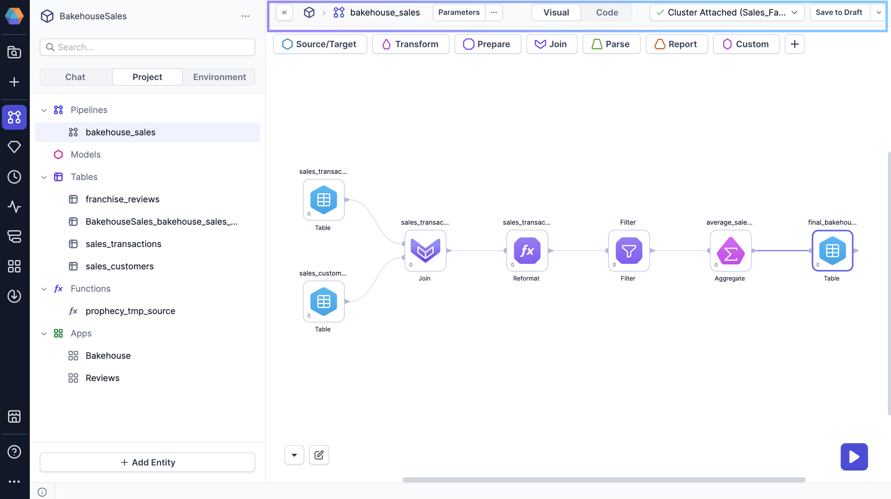
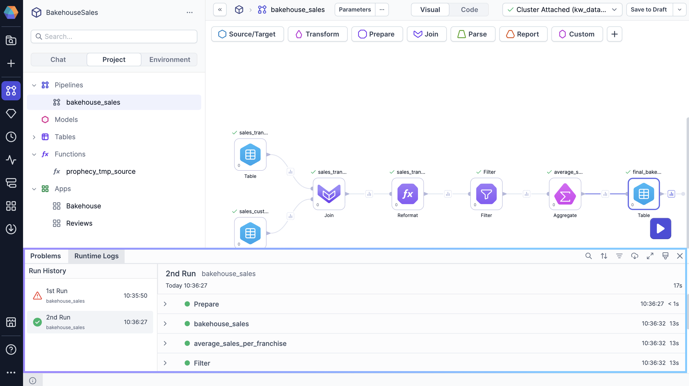

When you build a pipeline, it helps to be familiar with the project editor interface. The following sections describe each area of the project editor.

## Sidebar

The left sidebar includes the following tabs.

### Chat

The Chat tab lets you interact with Prophecy's [AI Agent](/analysts/ai-chat). Start a conversation to accomplish tasks like:

- Finding datasets in your data warehouse
- Visualizing sample data
- Adding new transformations to your pipeline
- Writing tables to your data warehouse

### Project

The Project tab allows you to manage all of your project entities. In other words, you can view, add, edit, or remove entities from your project, such as pipelines, tables, apps, functions, and more.

### Environment

The Environment tab lets you access data directly in Prophecy from connections defined in your attached fabric. More specifically, you can:

- Expand each connection to view available datasets
- Find data in your connections using the search bar
- Drag datasets directly onto the visual canvas
- Add new connections to the attached fabric
- Refresh tables to sync table metadata to the [knowledge graph](/knowledge-graph)

---

## Visual canvas

The visual canvas is the workspace where you can add and connect various gems to build your pipeline. It provides a drag-and-drop interface for designing your data flow.

### Gem drawer

At the top of the visual canvas, you see different gem categories such as Transform and Join. This is the Gem drawer, which contains all the gems available for use in your pipeline.

### Run button

The canvas also includes Run button that triggers interactive pipeline execution. This allows you to test and run the pipeline in real-time, which makes it easier to troubleshoot and verify the pipeline's performance before deployment. To learn more, visit [Pipeline execution](/analysts/pipeline-execution).

---

## Header

The project header includes the following features.

### Parameters

Click on Parameters to open settings that dynamically define how your pipeline behaves at runtime. To find more information, visit [Pipeline parameters](/analysts/pipeline-parameters).

### Options ... menu

Access various settings and metadata for your pipeline. Options include:

- **Project Configuration**: Define key-value pairs for model configs
- **Development Settings**: Choose the maximum number of records that will be parsed to understand nested data schema
- **Advanced Settings**: Edit dbt project settings
- **Dependencies**: Manage project dependencies such as Prophecy packages or dbt Hub packages
- **Schedule**: Add a schedule for the pipeline to run on a regular basis after project deployment
- **Metadata**: Open project metadata for more details
- **Delete project**: Delete your project from your environment

### Visual-Code toggle

Switch from the visual canvas to the code view to see your visual pipeline compiled into code. This view helps users who prefer working with code to understand the underlying logic.

### Fabric dropdown

Use the fabric dropdown to select the fabric to attach to. This is the fabric that will be used for interactive execution. In most cases, you will connect to a development environment for interactive execution while you build your pipeline.

### Version menu

If you create your project using the [simple Git storage model](docs/analysts/version-control/version-control.md), you will see the version menu in the project header. Use this menu to save your project, publish your project, or view your project history.

---

## Footer

The project footer includes the following elements.

### Diagnostics

The Diagnostics panel highlights any issues or errors in your pipeline that need attention. It provides detailed feedback on what needs to be fixed to ensure that your pipeline runs successfully.

### Runtime logs

Runtime [logs](/analysts/logs) offer detailed insights into the status and progress of your pipeline executions. They show real-time information, errors, and other diagnostic messages, which helps you monitor and troubleshoot pipeline performance.

### Git workflow

If you create your project using the [normal Git storage model](docs/analysts/version-control/version-control.md), you will see the Git workflow in the project footer. Open the Git workflow to perform actions like committing, merging, or deploying the project.

