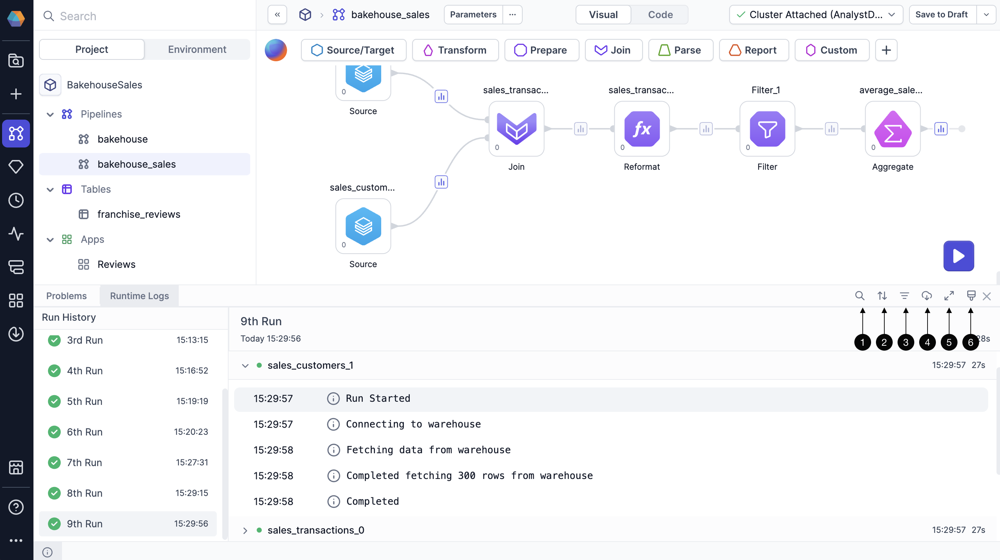
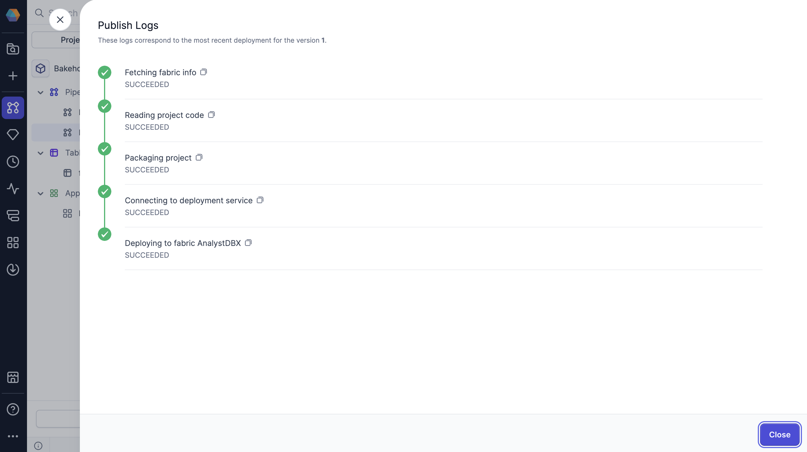

Logs are an essential tool for debugging and optimization. There are two types of logs in Prophecy projects:

- [Runtime logs](#runtime-logs) provide detailed information about each operation performed during a pipeline run.
- [Publish logs](#publish-logs) present the status of each project publication step, outlined below.

## Runtime logs

Runtime logs are generated in real time during pipeline execution and provide a step-by-step trace of how each transformation or action was performed. These logs help analysts quickly identify which step failed, how long each step took, and whether the execution followed the expected sequence. They're also useful for reviewing pipelines you didn’t build yourself, so you can see what happened during the run.

Runtime logs are available from the information footer at the bottom of the project editor. When you open the Runtime Logs tab, you'll see the following details for each log entry.

- **Pipeline steps**: View the execution details of each processing step, which maps to corresponding gems in your visual pipeline
- **Execution sequence**: Track the precise order in which operations were executed
- **Timestamp**: See the exact time when each step began
- **Duration**: Find the execution duration for each step to identify performance bottlenecks or unusually long-running operations

:::info
You can also see runtime information by hovering over each gem in the pipeline canvas. This shows the duration and success/failure status of that step in the most recent run. Use this to quickly spot bottlenecks, failed operations, or unusually slow steps without opening the full log view.
:::

### Log UI

In the Runtime Logs tab, you have several tools to help you navigate and analyze your logs effectively.

1. **Filter logs by keywords**: Find specific information by entering search terms
1. **Sort logs**: Organize logs chronologically
1. **Filter logs by log level** (info, warning, error): Focus on specific types of messages
1. **Download logs**: Save logs to your machine as a text file
1. **Expand log screen**: Display a larger view of your logs
1. **Clear all logs**: Remove log information for previous runs

### SQL warehouse logs

You can find additional logs specific to pipeline queries in your SQL warehouse. If you are connected to a Databricks SQL warehouse, you can find these logs directly in Databricks. This extra visibility into query execution in Databricks helps you troubleshoot pipeline behavior and improve performance.

If you have access to your Databricks workspace:

1. Navigate to **SQL > Query History** in the Databricks sidebar.
2. Locate the SQL queries run during your pipeline's execution window.
3. Click on a query to see:
   - Full SQL query
   - Status (Success or Error)
   - Start and end times
   - Error messages
   - Execution plan or profile

## Publish logs

When you publish a project, Prophecy provides logs for each publication step to help you troubleshoot if anything goes wrong during the deployment process. You see a success or failure status for each step in the publish logs, making it easy to identify exactly where issues may have occurred.

The publication process follows these steps.

1. **Fetching fabric info**: Gather information about the currently attached fabric
1. **Reading project code**: Review code elements
1. **Packaging project**: Bundle all components together
1. **Connecting to deployment service**: Establish connection to deployment tool
1. **Deploying to fabric**: Build project in the target fabric

## What's next

Now that you know about runtime and publish logs, you might want to learn about [audit logs](/administration/saas/audit-logging) and [system logs](/getting-help/prophecy-details), which provide visibility into platform-level and administrative activity.

- **Audit logs** track events across entities like projects, pipelines, jobs, and fabrics. These logs help administrators understand who did what and when. For example, these logs can capture who creates a pipeline, releases a project, modifies a dataset, etc.

- **System logs** capture backend infrastructure details to support platform monitoring and troubleshooting. These include Kubernetes cluster configuration (such as resource quotas and node settings), cluster custom resources, config maps and files, and resource consumption metrics.

Unlike runtime logs, which focus on the execution of a specific pipeline run, audit and system logs provide a broader view of how users and the platform are operating over time.
