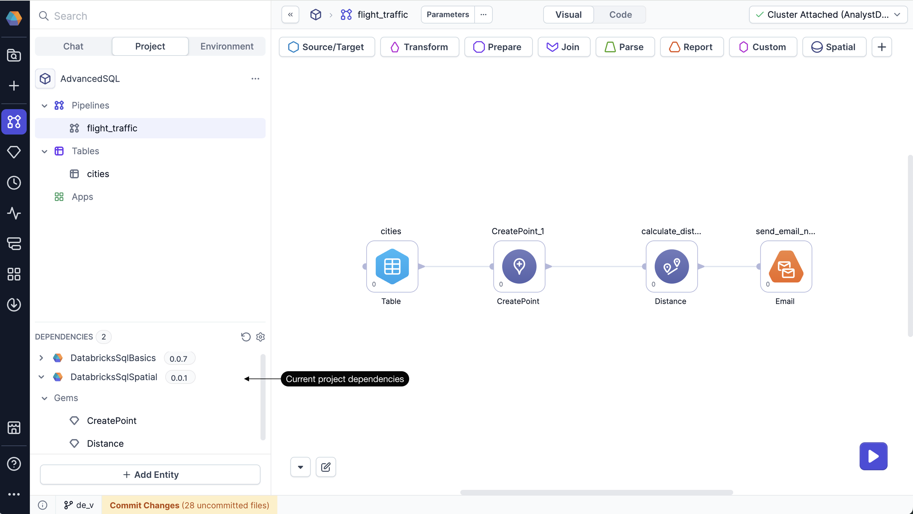
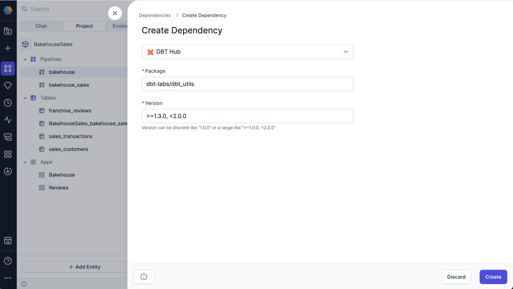

Dependencies allow you to reuse logic in your SQL projects, so you can build on work that’s already been tested and versioned. Dependencies are scoped at the project level, and can include [packaged Prophecy projects](/engineers/package-hub), as well as external packages from GitHub or the dbt Hub.

Because packages can be improved over time, you can update your project dependencies whenever a new version is published. Your project will continue to use the current version until you choose to upgrade.

## Dependency types

There are three types of dependencies for SQL projects.

### Prophecy Project

When you import a project from the Package Hub as a dependency, you gain access to all its components, including pipelines, gems, and functions for use in your own project. If a new version of the project is [published](docs/analysts/version-control/version-control.md), you can update your dependency version to take advantage of the latest changes.

Prophecy Project dependencies have the following parameters:

| Parameter            | Description                                                                               |
| -------------------- | ----------------------------------------------------------------------------------------- |
| Project Dependencies | Choose from a dropdown list of compatible projects that are published in the Package Hub. |

### GitHub

Dependencies can be saved to GitHub repositories and imported from there.

GitHub dependencies have the following parameters:

| Parameter      | Description                                                                                                                                                                                       |
| -------------- | ------------------------------------------------------------------------------------------------------------------------------------------------------------------------------------------------- |
| Git Repository | Link to the GitHub repository containing the dependency.                                                                                                                                          |
| Revision       | Git tag, commit hash, or branch name that points to the version that you want to import.                                                                                                          |
| Sub Directory  | Path of the subdirectory in the repository that contains the dependency (if not in the root directory).                                                                                           |
| Warn unpinned  | Whether to point to your repository without specifying any version, commit, or branch. Enabling this option may result in unexpected behavior if there are changes to your latest default branch. |

### dbt Hub

Packages in the [dbt Hub](https://hub.getdbt.com/) can be used to extend typical SQL functionality. If the package contains macros, you can use them via the [Macro](docs/analysts/development/gems/custom/macro.md) gem.

dbt Hub dependencies have the following parameters:

| Parameter | Description                                        |
| --------- | -------------------------------------------------- |
| Package   | Package name or path (e.g., `dbt-labs/dbt_utils`). |
| Version   | Package version or version range.                  |

## Manage dependencies

To manage your project dependencies, there are two options:

- A) Open the **Manage Dependencies** dialog by clicking **... > Dependencies** in the project header.
- B) Open the **Manage Dependencies** dialog from the bottom left of the canvas, in the **Dependencies** panel.

From here, you can add, edit, update, or remove dependencies from your project.

## Create a new dependency

To add a dependency to your project:

1. Open the **Options** (ellipses) menu in the project header.
1. Select **Dependencies**.
1. Click **+ Add Dependency**.
1. Choose the dependency type (Project, GitHub, or DBT Hub).
1. Fill in the required fields to import the correct package version.
1. Click **Create**.
1. Click **Reload and Save** to validate and download the new dependency.

:::tip
You can also browse packaged projects in the [Package Hub](/engineers/package-hub) and import them from there.
:::

## Component usage

Depending on the dependency type, components may appear in the project differently. For example, if you add a project from the Package Hub as a dependency, new gems may appear automatically in the gem drawer.

However, all of the dependencies and their components should appear in the **Dependencies** panel in the bottom left of the project editor. Expand a dependency to view the various functions, gems, and other components that it may contain. You can drag these components directly onto the visual canvas.

## Storage

Dependencies are stored at the project level within the `packages.yml` file of the project code.
