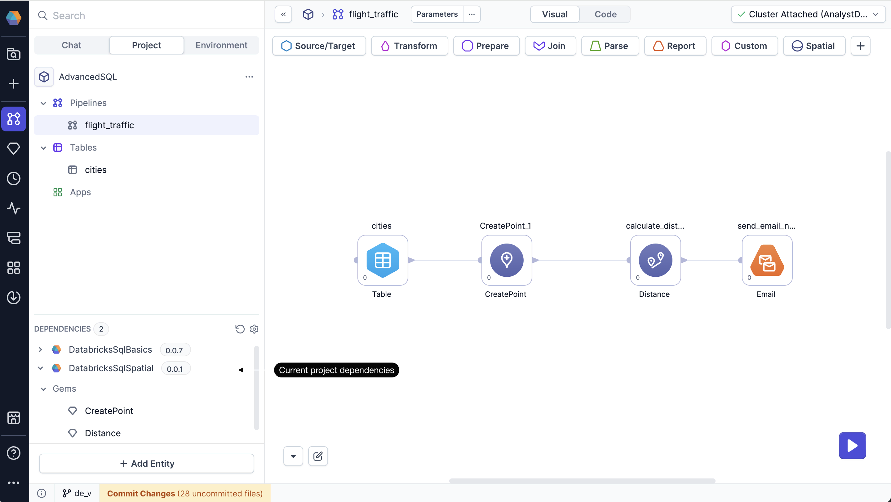

SQL projects are highly extensible, meaning you can add additional capabilities and functionalities beyond our out-of-the-box offerings. When you build new components in Prophecy, you can package, version, and share them for collaboration and control. You can accomplish this using the following features.

## Dependencies

[Dependencies](/analysts/dependencies) allow you to import external or custom packages into your project.

## Package Hub

The [Package Hub](/engineers/package-hub) is a catalog of versioned projects that contain shareable components, such as pipelines, gems, user-defined functions, business rules, macros, and more. Browse the Package Hub to view available add-ons for SQL projects.

## SQL Gem Builder

Use the [SQL Gem Builder](/analysts/gem-builder) to develop custom gems for individual or shared use. SQL gems are dbt macros that have a visual (UI) layer.

