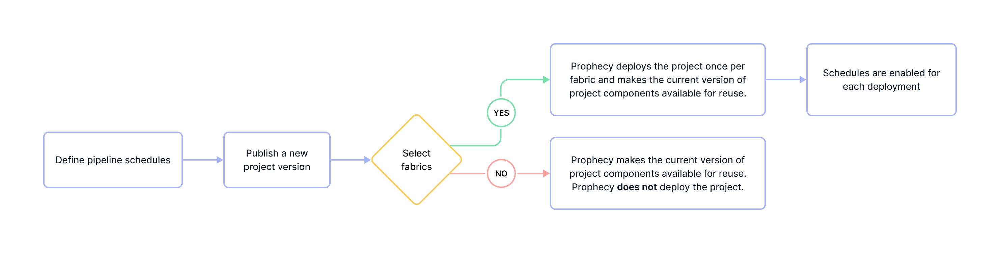
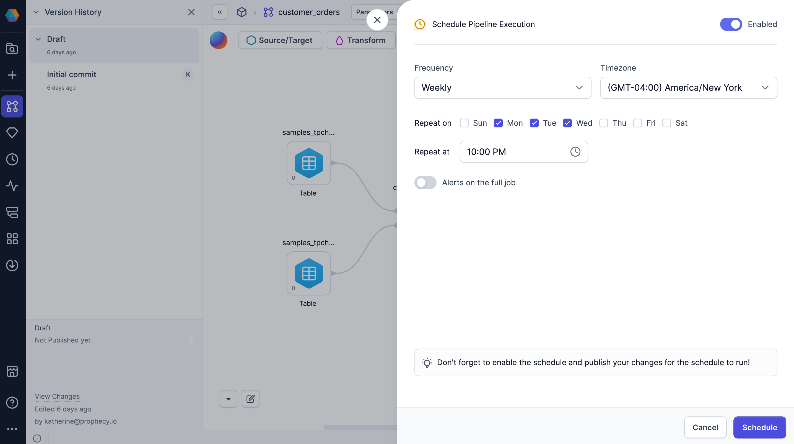

Prophecy lets you schedule and automate your data pipeline runs. Once you have developed a pipeline, you can run it at specific frequencies using Prophecy's native scheduler.

Schedules define when the pipeline will run and whether to send alerts about the pipeline run. For a summary of the pipeline scheduling workflow, review the diagram below.

## Parameters

The following table describes schedule parameters for a pipeline. You will create independent schedules per pipeline.

| Parameter              | Description                                                                                     | Default                                   |
| ---------------------- | ----------------------------------------------------------------------------------------------- | ----------------------------------------- |
| Frequency              | How often the pipeline will run.                                                                | Daily                                     |
| Repeat at              | When the pipeline run will repeat. Example: Repeat every Monday and Friday at 2:00AM.       | Varies depending on your chosen frequency |
| Timezone               | The timezone of **Repeat at** time.                                                             | The timezone where you are located        |
| Alerts on the full job | Toggle that enables sending an email on the start, success, and/or failure of the pipeline run. | Off                                       |
| Enabled                | Toggle that enables or disables the schedule                                                    | Off                                       |

## Schedule a pipeline

To run a pipeline on a recurring basis, you need to configure a schedule and publish your project. Let’s walk through both.

### Configure the schedule

To create a new schedule:

1. Open a pipeline in the project editor.
1. Expand the **Options** (ellipses) menu in the project header.
1. Click **Schedule**.
1. Fill in the schedule frequency.
1. Enable the schedule using the toggle in the top right.
1. Click **Schedule** to save the schedule.

### Activate the schedule

After configuring the schedule, complete the following steps to ensure the schedule runs:

1. Save your project as a draft.
1. [Publish your project](/analysts/project-publication) to one or more fabrics.

:::tip
If using Databricks connections in your fabric, [consider using a service principal](/administration/fabrics/prophecy-fabrics/connections/databricks#authentication-methods) for authentication. This helps scheduled pipelines run reliably.
:::

#### Why publish?

Publishing is required for scheduled pipelines to run. This is because during project publication, you:

- Define the execution environment (fabric)
- Determine the pipeline version for execution

When you publish a project, you select one or more fabrics that serve as the execution environments for deployed projects. A separate deployment is created for each fabric. Pipeline schedules only run on deployed projects.

:::caution
If you do not select any fabrics during project publication, no deployments will be created. As a result, no scheduled executions will occur, even if a schedule has been configured. Project deployments are isolated per fabric—publishing to one fabric does not affect others.
:::

Publishing also determines which version of the pipeline will run during scheduled executions. Each time you publish a new version, scheduled runs automatically use the updated version on the selected fabric(s).

### Disabling a schedule

To stop scheduled pipeline runs:

1. Open the pipeline schedule.
1. Use the toggle to disable the schedule.
1. Click **Schedule** to save.
1. Save your project as a draft.
1. Publish the project.

Disabling a schedule also requires publishing your project. Since schedule status is part of the deployment configuration, changes won't take effect until the next project version is published.

## Monitor scheduled pipelines

You and your team members might have many scheduled pipelines in your Prophecy environment. To see a list of deployed projects, scheduled pipelines, and pipeline run history, open the [Monitoring](/analysts/monitoring) page in Prophecy.

## External schedulers

By default, SQL projects utilize a Prophecy-native scheduler to automate pipeline runs. While we recommend using the Prophecy scheduler, you can also use external schedulers like Databricks Jobs or Apache Airflow if preferred. Additionally, you can use the [Trigger Pipeline API](/api/trigger-pipeline/trigger-pipeline-api) to leverage other orchestration tools.

To learn more about external schedulers, visit [Orchestration](docs/Orchestration/Orchestration.md).
