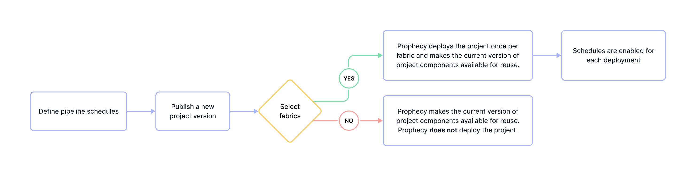

Prophecy supports the following ways to automate pipeline execution.

- **Built-in scheduler**: Use [Prophecy Automate](/administration/architecture/) to orchestrate pipelines directly in the UI.
- **PipelineTrigger gem**: Configure the [PipelineTrigger gem](/analysts/pipeline-trigger-gem) to start pipeline runs from a gem in the canvas.
- **API-based automation**: Call the [Trigger Pipeline API](/api/trigger-pipeline/trigger-pipeline-api) to start pipelines from external systems.

This page describes how to use the **built-in scheduler** in SQL projects.

## Overview

In Prophecy, a schedule automates the execution of a single pipeline in a project. Scheduled pipelines run in [fabrics](/administration/fabrics/prophecy-fabrics/) (execution environments) that are defined during project publication. Each schedule defines:

- When the pipeline should run. Prophecy supports time-based or file-based [triggers](/analysts/triggers).
- Optional [email alerts](/analysts/schedule-email-alerts) to report the outcome of the pipeline run.

To schedule multiple pipelines, create a separate schedule for each one. You can enable or disable schedules individually, but enabling a schedule doesn’t activate it. An enabled schedule becomes active only when the parent project is published. Similarly, disabling a schedule also requires republishing the project, since schedule status is part of the deployment configuration.

## Schedule activation

Enabling a schedule in your project doesn't immediately activate it. For a schedule to take effect, you must first [publish the project](/analysts/project-publication). This is because publishing defines how and where scheduled pipelines are deployed and executed.

When you publish a project, you do two key things:

- Select one or more fabrics. These are the environments where scheduled pipelines will run. A separate deployment is created for each fabric — publishing to one fabric does not affect other deployments.

  If you do not select any fabrics during project publication, **no deployments will be created**. As a result, no scheduled executions will occur, even if a schedule has been configured.

- Specify the project version. This version will be deployed to the fabric. You can either create a new version or deploy a previously published version.



## Monitor scheduled pipelines

You and your team members might have many scheduled pipelines in your Prophecy environment. The [Observability](/analysts/monitoring) interface in Prophecy includes the following information:

- List of deployed projects
- List of pipeline schedules per fabric
- History of pipeline runs and run status

You'll only see information about projects owned by your teams.

## Authentication lifespan

Scheduled pipelines run without human intervention, which makes them vulnerable to failures caused by expired or invalid credentials. If Prophecy cannot authenticate a connection used by the pipeline due to an error such as an expired token or deleted user, the pipeline run will fail.

This risk increases in complex environments where:

- Pipelines depend on multiple external data sources.
- The same schedule is deployed across multiple fabrics.
- Fabrics store different credentials for the same connection.

To ensure reliable scheduled runs, only deploy to fabrics that use connection credentials that won’t expire unexpectedly. For Databricks connections, [consider using a service principal](/administration/fabrics/prophecy-fabrics/connections/databricks#authentication-methods) for authentication. Service principals are designed for authorizing access to Databricks resources when running unattended processes.

## What's next

To learn more about using the Prophecy-native scheduler, explore the following pages.

```mdx-code-block
import DocCardList from '@theme/DocCardList';
import {useCurrentSidebarCategory} from '@docusaurus/theme-common';

<DocCardList items={useCurrentSidebarCategory().items}/>
```
