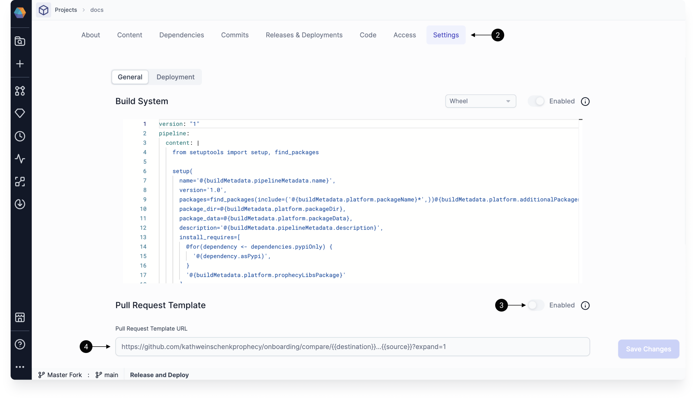
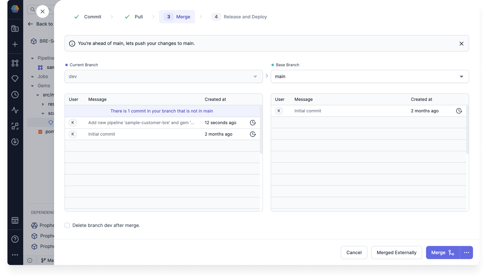

By default, Prophecy lets you merge changes from a development branch directly into the base branch. This is fast and works well for smaller teams or rapid iteration. However, in larger teams or production environments, you may want more control over how code is reviewed, approved, and integrated. Enabling pull requests allows you to:

- Review and approve changes before they are merged
- Enforce branch protection rules on repositories like GitHub or Bitbucket

When pull requests are enabled for a project, Prophecy generates a merge URL based on your configured template. This lets you open external pull requests directly within Prophecy projects. This page describes how to enable and use pull requests in more detail.

:::note
Pull request support is only available for projects connected to an external Git provider. It’s not supported for Prophecy-managed Git.
:::

## Enable pull request template

To use pull requests in a project, you need to enable pull request templates for that project.

1. Open your project metadata.
1. Open the **Settings** tab.
1. Next to **Pull Request Template**, toggle on the **Enabled** button.
1. Review the template URL.



The PR template URL requires two variables which are used to build a URL string. The `{{source}}` variable represents the active development branch, and the `{{destination}}` variable represents the base branch to which the development branches need to be merged to, like `main`.

### Template examples

````mdx-code-block
import Tabs from '@theme/Tabs';
import TabItem from '@theme/TabItem';

<Tabs>

<TabItem value="github" label="GitHub">

Using this template:

```shell
https://github.com/exampleOrg/exampleRepo/compare/{{destination}}...{{source}}?expand=1
```

An example pull request URL generated from the above template for merging a branch named `feature`
to branch `main` would look like:

```shell
https://github.com/exampleOrg/exampleRepo/compare/main...feature?expand=1
```

</TabItem>
<TabItem value="bitbucket" label="Bitbucket">

Using this template:

```shell
https://bitbucket.org/exampleOrg/exampleRepo/pull-requests/new?source={{source}}/1&dest={{destination}}
```

An example pull request URL generated from the above template for merging a branch named `feature`
to branch `main` would look like:

```shell
https://bitbucket.org/exampleOrg/exampleRepo/pull-requests/new?source=feature/1&dest=main
```

</TabItem>
</Tabs>

````

## Open pull request in Prophecy

After you have enabled pull requests for a project, you will see the option to create pull requests directly in Prophecy.

When you open the Git dialog of a project:

- The **Merge** step will be replaced by an **Open Pull Request** step.
- The **Open Pull Request** button on this screen will open an external pull request in a new tab.

:::note
If you run into issues, ensure that your PR [template](#enable-pull-request-template) is configured correctly.
:::

Once you merge the branch remotely in the pull request, you need to let Prophecy know that this step is complete.

1. Return to the **Open Pull Request** step of the Git dialog.
1. Click **Merged Externally**.
1. Click **Confirm**.



## Set Version Before Merge

When your base branch (such as `main`) is protected, direct commits are not allowed. This can interfere with release processes that rely on version bumps made directly on the main branch after merging.

To support these workflows, Prophecy now allows you to set the next version **before** merging your development branch.

When **Pull Request Template** is enabled for a project:

1. In the **Git** dialog, go to the **Open Pull Request** step.
1. Select the **Incremental Project Version** checkbox.
1. Select a version or type a new version. This sets the version of your development branch.
1. Open the pull request and merge your changes. The base branch now has the correct version.

Once merged, Prophecy will auto-fill the release version on the **Release** screen of the Git dialog based on the version you set. You can directly proceed to release and no additional changes will be committed to the base branch.
